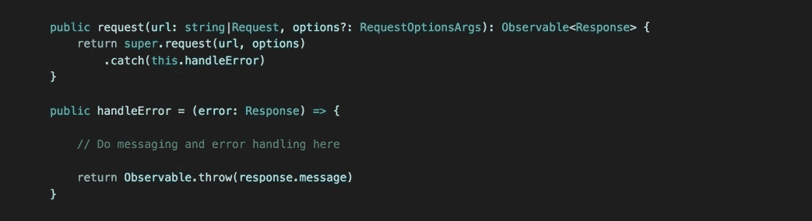

# 在 Angular 2 中捕获全局 HTTP 请求时出错

> 原文：<https://medium.com/hackernoon/global-http-request-error-catching-in-angular-486a319f59ab>

每当你做一个 HTTP 请求时，都有可能出错。如果事情出错，请求将返回一个带有错误代码的响应。例如，基于这个错误代码，您想要通知用户哪里出错了。

**寻找有角度的 4.3+解决方案？**改为读这个:[https://medium . com/@ luukgruijs/global-http-error-catching-in-angular-4-3-9 e 15 cc 1e 0 a6b](/@luukgruijs/global-http-error-catching-in-angular-4-3-9e15cc1e0a6b)

只有在您的请求中附加了一个`catch`之后，您才能处理错误。这可能看起来像这样:

I’d like to use a class which contains all the api calls for a specific module

当应用程序增长时，HTTP 请求的数量也会增加。给每个请求附加一个`catch`并不完全是枯燥的。我们可以通过扩展来自 [Angular](https://hackernoon.com/tagged/angular) 的 HTTP 类并给`request`方法附加一个`catch`来解决这个问题。

# 创建 HTTPInterceptor 类

你可能已经在你的 Angular 项目中有了这样一个类，因为我们也可以使用这样一个类来为每个请求附加特定的头。如果您还没有，让我们现在创建一个:

在这个类中，我们用自己的实现覆盖了`request`方法。我们的实现为每个请求附加了一个 catch 并公开了一个`handleError`方法。在`catch`中结束的每个响应都将被传递到这个方法中。这个方法必须返回一个`Observable`才能工作。

现在重要的是让每个请求使用我们的`HttpInterceptor`类，而不是默认的`Http`类。幸运的是，这很容易:

如你所见，我们更新了构造函数。`http`现在属于`HttpInceptor`类。我们还删除了请求中的 catch，因为它现在由`HttpInterceptor`处理。

## 结论

使用`HttpInterceptor`类，我们可以很容易地将 catch 附加到所有请求上，并确保潜在的错误得到适当的处理。

感谢阅读。有反馈吗？让我知道。

*关注我上* [*中*](/@luukgruijs) *让我们连接上*[*LinkedIn*](https://www.linkedin.com/in/luukgruijs/)

> [黑客中午](http://bit.ly/Hackernoon)是黑客如何开始他们的下午。我们是 [@AMI](http://bit.ly/atAMIatAMI) 家庭的一员。我们现在[接受投稿](http://bit.ly/hackernoonsubmission)，并乐意[讨论广告&赞助](mailto:partners@amipublications.com)机会。
> 
> 如果你喜欢这个故事，我们推荐你阅读我们的[最新科技故事](http://bit.ly/hackernoonlatestt)和[趋势科技故事](https://hackernoon.com/trending)。直到下一次，不要把世界的现实想当然！

