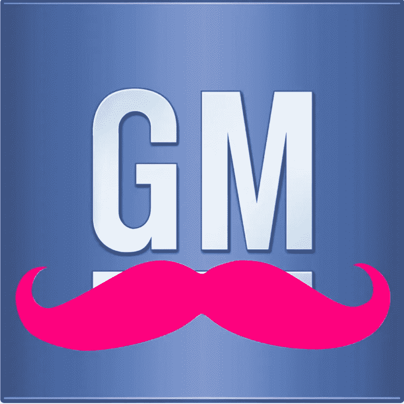

# 通用汽车和 Lyft:汽车行业的变脸

> 原文：<https://medium.com/hackernoon/gm-and-lyft-the-changing-face-of-the-automobile-industry-8c46ee2be63>

今年 1 月，Lyft 组织了一轮投资，通用汽车以 5 亿美元参与其中，[拒绝了汽车公司](http://www.reuters.com/article/us-lyft-m-a-gm-idUSKCN10N2BJ)的全面收购要约，这一场景有助于描绘出[汽车](https://hackernoon.com/tagged/automobile)行业的以下前沿:人们购买的汽车越来越少，交通将不再关乎所有权，而是第三方提供的服务。

主要参与者现在正在各就各位:戴姆勒与 Europcar 一起创建了 [Car2go](https://en.wikipedia.org/wiki/Car2Go) ，而打车应用市场通过 Hailo 和 MyTaxi 的合并得到了巩固，而宝马与 Sixt 一起推出了 [DriveNow](https://en.wikipedia.org/wiki/DriveNow) ，特斯拉表示其自动驾驶汽车将能够“T10”为其所有者工作“在所有者不需要时运送其他人，通用汽车在推出 Maven 的同时对 [Lyft](https://hackernoon.com/tagged/lyft) 感兴趣

很明显，车龄是一个历史性的错误，多年来我们一直在为这个错误的后果付出代价。每个家庭都拥有一些车辆，这些车辆的使用时间约为 3%，通常只载有一两个人，使用一吨金属来移动一个人，这种想法是荒谬的，最重要的是不可持续的。

我们必须开始思考拥有一辆车没有任何意义，而且花费太多。为人们重新设计城市，去掉停车场和可以用于其他用途的空间，转而选择高效的交通工具。[下一个从城市中淘汰私家车的实验可能不会低于曼哈顿](https://www.wired.com/2016/08/downtown-manhattan-new-frontier-car-free-city/)，而且[远不是唯一一个试图这么做的人](http://www.fastcoexist.com/3040634/7-cities-that-are-starting-to-go-car-free) …

通用汽车的举动很有道理:Lyft 对优步没有威胁，但它在管理这类服务方面有着宝贵的经验，尽管它在美国几个城市的发展非常有限，但通过一些投资来提高产能，它仍可能发挥有趣的作用。由于优步处于领先地位，滴滴出行打算征服世界，其他公司也在寻找合作伙伴，因此，收购莱夫特(Lyft)这样的公司来开发汽车共享市场的想法表明，这类战略绝不是褒奖:汽车公司可以选择收购这些公司，以试图减缓它们的发展速度，但当其他公司大举收购时，这似乎不太可能。

在拒绝通用汽车的提议后，莱夫特宣布了新一轮融资，但趋势很明显。甚至有可能你的车将是你最后一辆拥有的车，在那之后你将会是一个满意的用户，当你需要他们的时候，他们就在那里，当你到达你要去的地方的时候，他们就消失了。在不太远的地方，你甚至不会驾驶它们，它们会自动驾驶。

如果汽车制造商已经意识到这一点，那么真的没有什么好说的了……

*(西班牙语*[*AQí*](https://www.enriquedans.com/2016/08/gm-y-lyft-el-nuevo-panorama-de-la-industria-del-automovil.html)*)*

> [黑客午间](http://bit.ly/Hackernoon)是黑客们下午的开始。我们是 [@AMI](http://bit.ly/atAMIatAMI) 家族的一员。我们现在[接受提交](http://bit.ly/hackernoonsubmission)并很高兴[讨论广告&赞助](mailto:partners@amipublications.com)机会。
> 
> 如果你喜欢这个故事，我们推荐你阅读我们的[最新科技故事](http://bit.ly/hackernoonlatestt)和[趋势科技故事](https://hackernoon.com/trending)。直到下一次，不要把世界的现实想当然！

