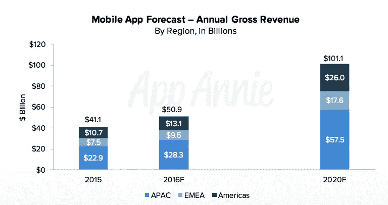

# 往前走，倍增——你的应用。

> 原文：<https://medium.com/hackernoon/go-forth-and-multiply-your-apps-a9bac5ea08c9>

新一波报道集中在后应用时代。记录宣布“[应用热潮结束](http://www.recode.net/2016/6/8/11883518/app-boom-over-snapchat-uber)”。Quartz 指出了为什么大多数用户[从不下载任何应用程序](http://qz.com/253618/most-smartphone-users-download-zero-apps-per-month/)。让我非常明确地说:**应用热潮还没有结束**。

关于这个话题的报道让我想到了一个想象中的瑜伽士贝拉的名言。

> 没人再下载应用了，太拥挤了。
> 
> -Yogi Berra(想象中的推特)

## 1000 亿美元 20%的 CAGR 市场

让我们从事实开始。真实数字令人惊讶——在应用收入方面，我们正处于一个前所未有的增长时代。

收入很难操纵，因为它与谷歌和苹果的财务申报有关，需要审计。

> 应用收入正在增长，预计到 2020 年将达到 1000 亿美元。
> 
> [来源:VentureBeat & App Annie](http://venturebeat.com/2016/02/10/the-app-economy-could-double-to-101b-by-2020-research-firm-says/)

Source: Venture Beat/ App Annie

## 谎言、该死的谎言和统计数据

流传的新闻和社论有许多缺点。

以应用程序下载新闻为例:它通过指出热门应用程序的数量来谈论应用程序下载如何停滞不前。

事实上，像优步、AirBnB、Snapchat 这样的较新应用都在快速增长，而预计大多数已经在那里呆了一段时间并让脸书这样的用户饱和的顶级应用都不会再增长了。

用这些数据来指出应用热潮的结束有点误导人。

## 应用从未如此美好

做应用程序开发人员是前所未有的好时机。数十亿用户可以使用廉价的新智能手机，数据计划正在全球范围内变得可用，苹果和谷歌等应用商店老板比以往任何时候都更加慷慨。

苹果支持降低订阅收入的费用——从第二年开始，从 30%到 15%。

作为一个 SaaS 人，让我告诉你，这是苹果公司一个非常有洞察力的决定——如果大多数开发者能被说服去考虑订阅，反过来让消费者每月支付更多的钱，你最终会有一个非常长期的、粘性的收入基础。更重要的是，这种收入更便宜，并导致虚拟锁定，因为拥有更多订阅的消费者更不可能改变生态系统。

往前走，乘法运算。您的应用程序。