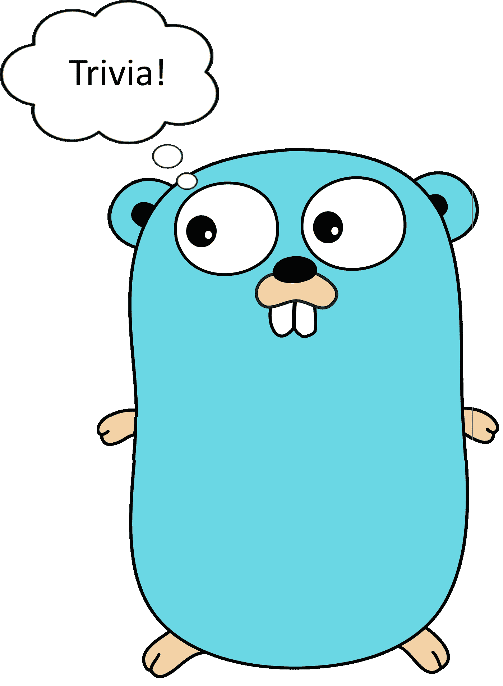

# 去比赛条件琐事

> 原文：<https://medium.com/hackernoon/go-race-condition-trivia-32cfe59df722>

## 有多私密



Trivia time!

我最近遇到了一个让我困惑了一段时间的 a -race 错误消息，所以我将在这里分阶段复述它，看看您是否能理解它。

# 代码

代码[的意图](https://hackernoon.com/tagged/code)是一个服务抽象，它在后台运行一个 goroutine，将运行时统计数据发送给[的 stats TD](https://github.com/etsy/statsd)。下面是代码的一个小示例:

你可以 100%确定我从来没有对同一个 Stats 结构运行 Loop()。
你 100%确定我在程序中只创建了一个 Stats{}结构。在继续阅读之前，检查一下上面的代码，看看是否可以找到我在使用 Stats 时遇到的[比赛](https://hackernoon.com/tagged/race)条件。

## 一个暗示

竞争情况发生在第 19 行。

```
p.prev = ms
```

这有助于发现竞态条件吗？

## 第二个更大的暗示

创建我的服务结构的代码如下所示。

## 私人并不意味着不可发现


当你试图用 Sprint 或 Println 系列操作在 Go 中打印一个结构时，它会检查它是否是一个格式化程序或 Stringer，并通常使用这些方法，否则它会使用反射来发明一种打印结构的方法。您可以检查在 print.go 中使用格式化程序或 Stringer [的条件。](https://github.com/golang/go/blob/release-branch.go1.7/src/fmt/print.go#L549)

这段特殊的代码难倒了我，因为我一直在查看 Stats{}，心想这不可能是一场比赛。我保持***prev****私有，从不引用它*。但是，使用 Go，您可以使用反射来检查私有变量。该检查创建了导致竞争条件触发的读取操作。这非常合理，特别是因为您可以通过获取结构的值来触发对私有变量的读取，即使没有反射

```
s := Stats{}
q := s // Will read stats to make a copy inside q
```

谢天谢地，我们不能使用反射来设置私有变量。参见[值。CanSet](https://golang.org/pkg/reflect/#Value.CanSet) 描述什么时候可以，什么时候不可以。

这个小细节的寓意是记住私有变量可以通过复制和反射导致读竞争错误，即使看起来结构本身是安全的。

[](http://bit.ly/HackernoonFB)[](https://goo.gl/k7XYbx)[](https://goo.gl/4ofytp)

> [黑客中午](http://bit.ly/Hackernoon)是黑客如何开始他们的下午。我们是 [@AMI](http://bit.ly/atAMIatAMI) 家庭的一员。我们现在[接受投稿](http://bit.ly/hackernoonsubmission)，并乐意[讨论广告&赞助](mailto:partners@amipublications.com)机会。
> 
> 如果你喜欢这个故事，我们推荐你阅读我们的[最新科技故事](http://bit.ly/hackernoonlatestt)和[趋势科技故事](https://hackernoon.com/trending)。直到下一次，不要把世界的现实想当然！

[](https://goo.gl/Ahtev1)