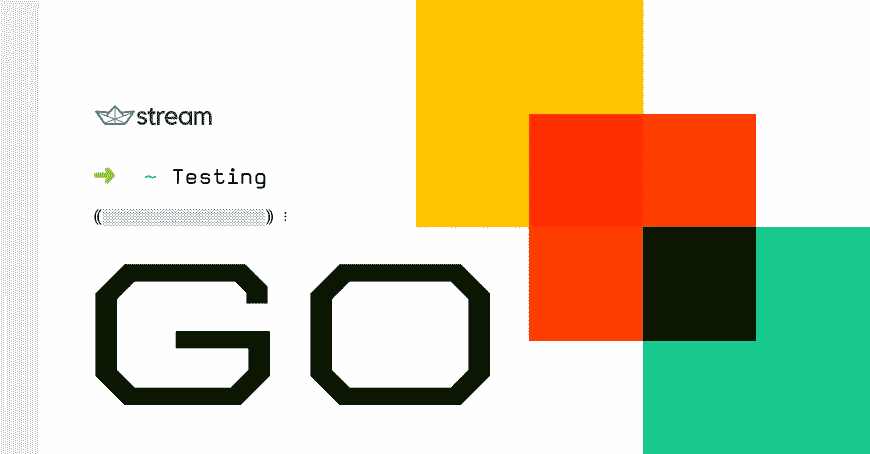
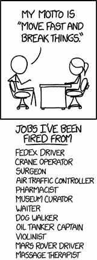

# 进行流测试

> 原文：<https://medium.com/hackernoon/go-testing-at-stream-bd361d0086e>



**Brought to you by** [**Stream**](https://goo.gl/LxzcfX)**.**



XKCD making fun of Facebook’s original Move Fast and Break Things motto

> 披露: [Stream](https://goo.gl/LxzcfX) ，可伸缩提要的 API，之前赞助过 Hacker Noon。

超过 500 家公司和 2 亿终端用户在生产中使用 Stream 的 API。虽然我们喜欢快速移动，但我们绝对不喜欢打破东西。

广泛的测试基础设施使我们能够快速行动并自信地部署代码。随着您的团队和[代码库](https://hackernoon.com/tagged/codebase)的增长，一个可靠的测试工作流程对于保持生产力是必不可少的。

大多数支持 Stream 的服务都是用 Go 编写的。这篇博文将详细介绍我们在为大型 Go 代码库编写测试时学到的东西。

## 我们的测试工作流程

测试是我们开发过程的核心部分。在正确测试和同行评审之前，没有一行代码被部署到实际系统中。我们的工作流程如下所示:

1.  使用 Go 的`testing`包和来自`stretchr/testify`的一些好东西实现 TDD 的新特性
2.  用`onsi/ginkgo`和我们自己即将发布的`bdd`库编写集成测试和验收测试
3.  等待来自[特拉维斯 CI](https://travis-ci.com/) 的绿灯
4.  检查 [Codecov](https://codecov.io/) 上的测试覆盖率
5.  将新功能发布到暂存区

## 单元测试

在编写代码时遵循 TDD 方法的同时，我们利用 Go 的标准库`testing`包来编写我们所有的测试:它的简单性与惯用的 Go 代码相匹配，更重要的是，它与我们广泛使用的表格测试完美配合。

正如有经验的程序员已经知道的那样，表测试是一种简单的方法，可以用很小的代码指纹对一个方法或行为执行多个输入/输出测试。此外，由于 Go 的匿名和内联结构，代码看起来简单且易于扩展:

```
testCases := []struct{
  input          string
  expectedOutput int
}{
  {
    input:          "aabbcc",
    expectedOutput: 3,
  },
  {
    input:          "abcdefg",
    expectedOutput: 1,
  },
  ...
}

for _, tc := range testCases {
  output := getRepetitions(tc.input)
  assert.Equal(t, tc.expectedOutput, output)
}
```

大多数地鼠都熟悉 Go 处理错误的模式，这种模式在编写测试时也会用到:调用一个方法，捕捉错误，检查它是否不是`nil`，然后采取相应的行动(向左的幸福之路！).

用`testing`包编写测试也是同样的方式，但是我们决定在它上面添加一些东西。

假设我们正在测试一个`IsValid(*http.Request) (bool, error)`函数，它检查一个 HTTP 请求的报头是否是格式良好的，并且我们正在使用一个基于表的测试:

```
func TestIsValid(t *testing.T) {
        ...
        for _, tc := range testCases {
                t.Run(tc.name, func(t *testing.T) {
                        valid, err := IsValid(tc.req)
                        if tc.shouldError && err == nil {
                                t.Fatal("expected error, got none")
                        }
                        if !tc.shouldError && err != nil {
                                t.Fatalf("expected no error, got %s", err)
                        }
                        if valid != tc.expected {
                                t.Errorf("expected valid to be %t, got %t", tc.expected, valid)
                        }
                })
        }
}
```

我们发现通常的 Go 习惯性错误检查在测试中增加了太多的噪音，这就是为什么我们在所有的单元测试中采用了[evidence](https://github.com/stretchr/testify)的`assert`和`require`包。

前面的代码片段变成了:

```
import (
        "github.com/stretchr/testify/assert"
        "github.com/stretchr/testify/require"
)

func TestIsValid(t *testing.T) {
        ...
        for _, tc := range testCases {
                t.Run(tc.name, func(t *testing.T) {
                        valid, err := IsValid(tc.req)
                        if tc.shouldError {
                                require.Error(t, err)
                        } else {
                                require.NoError(t, err)
                        }
                        assert.Equal(t, tc.expected, valid)
                })
        }
}
```

测试现在更加清晰，也更容易扩展。

一般来说，我们在测试前提条件时依靠`require`(即:在继续之前检查函数返回的错误)和`assert`来测试实际的逻辑断言。这确保了我们的测试总是返回有意义的结果，并且我们不必浪费时间调试我们自己的测试。

在我们代码库的某些地方，我们决定更进一步，使用完整的[evidence/suite](https://godoc.org/github.com/stretchr/testify/suite)包。这有助于我们更快地编写一些特殊的测试。

专业提示:当使用表格测试时，在你的表格中包含一个`name`字段，该字段包含被测试条目的简要描述:使用它作为`testing.T.Run`方法的`name`参数将使你和你的队友能够一眼就理解测试，无论是查看代码还是查看`test`命令输出。

```
func TestTable(t *testing.T) {
        testCases := []struct {
                name        string
                dividend    float64
                divisor     float64
                shouldError bool
        }{
                {
                        name:        "dividing by zero",
                        shouldError: true,
                        dividend:    42,
                        divisor:     0,
                },
                {
                        name:        "dividing by odd numbers",
                        shouldError: false,
                        dividend:    42,
                        divisor:     21,
                },
                ...
        }
        for _, tc := range testCases {
                t.Run(tc.name, func(t *testing.T) {
                        ...
                })
        }
}
```

## 嘲弄的

编写模拟和“沙盒”行为是单元测试的重要部分，随着代码复杂性的增加，这变得越来越重要。

我们决定使用两种方法来模仿，这取决于过程的“成本”:直接依赖注入或者 GoMock 框架。

# 依赖注入

[依赖注入](https://en.wikipedia.org/wiki/Dependency_injection)是 Go 中常见的软件设计模式，在处理嘲讽时派上了用场。通过使用接口——可以说是 Go 最强大的特性，阻止行为和模仿组件变得非常简单。

假设我们有这个在 [Redis](https://redis.io/) 上执行缓存的`DB`组件:

```
type DB struct {
        cache *redis.Client
}

func (d *DB) Get(query string) (string, error) {
        ...
        cached, err := d.cache.Get(query).Result()
        if err == redis.Nil {
                return cached, nil
        }
        ...
}
```

当测试`DB.Get`方法的实际行为时，我们可能不需要实际的 Redis 连接:我们需要在我们的`DB`结构中模拟`cache`字段的行为。我们可以轻松地重新排列前面的代码，以便使用我们可以重新实现的接口:

```
type DB struct {
        cache Cache
}

type Cache interface {
        Get(string) (string, error)
}

type RedisCache struct {
        client *redis.Client
}

func (c *RedisCache) Get(key string) (string, error) {
        v, err := c.client.Get(query).Result()
        if err == redis.Nil {
                return v, nil
        }
        return v, err
}
```

因此，我们也重新安排了`DB.Get`受影响的部分:

```
func (d *DB) Get(query string) (string, error) {
        cached, err := d.cache.Get(query)
        if err != nil {
                return "", err
        }
        if cached != "" {
                return cached, nil
        }
        ...
}
```

我们现在可以在测试中模拟缓存，只需用一个模拟结构实现`Cache`接口，它的行为符合我们的需要:

```
type mockCache struct{}

func (m mockCache) Get(string) (string, error) {
        return "", nil
}

func TestDBGet(t *testing.T) {
        mock := mockCache{}
        db := &DB{cache: mock}
        db.Get(...)
        ...
}
```

## golang/mock

在一些场景中，以前的方法会太复杂和/或浪费太多时间(或者，更糟糕的是，混淆了底层代码)。在这种情况下，我们用 [GoMock](https://github.com/golang/mock) 框架创建“适当的”模拟:通过一个命令`mockgen`，它生成完整类型的模拟，我们可以通过设置关于接收到的调用和输出的期望来在我们的测试中使用这些模拟。

我们典型的用例是在处理 gRPCs 时:重构我们的代码以获得简单的、基于接口的组件会增加太多的噪音，而使用 GoMock，我们基本上可以免费获得全功能的客户端和服务器模拟，这与您想要在 RPC 框架这样的输入输出系统上执行的测试完全匹配。

GoMock 是一个强大的工具，它极大地简化了 Gophers 的生活，我们鼓励您使用它，并看看项目 Github 库上的[示例。](https://github.com/golang/mock/tree/master/sample)

## 集成测试

我们不使用 Go 的默认库进行集成测试和验收测试。相反，我们将它们与代码库的其余部分分开，放在一个单独的存储库中，该存储库有自己的生命周期和专门的 CI 作业。这样做可以让我们执行非常仔细的功能测试、性能调优、与其他相关活动部件的集成、质量保证任务以及一般的端到端测试和基准测试。

起初，我们决定使用[银杏](https://onsi.github.io/ginkgo/)进行这类测试:银杏是一个伟大的开源贡献，它让 BDD for Go 变得非常方便。Go 的特性使得编写行为驱动的代码比其他语言(如 Python 和 Ruby)更复杂，但最终我们发现这是易用性和有效性之间的一个很好的平衡。

我们调整了我们的设置，并提出了以下结构:我们想要测试的每个特性/组件都存在于一个`features/`文件夹中的专用包中，我们可以通过一些 Makefile 魔术轻松地运行特定的测试。这包括许多针对特定测试的选项，包括正则表达式(使用`--focus`和`--skip`银杏标志)、触发并行执行、检测竞争等等。

但过了一段时间，我们得出结论，生银杏对我们的目的有一些缺点。最终，我们想要写出更好的“规格”，但是银杏测试对我们来说有以下问题:

1.  很快就会变得很吵
2.  当谈到 DSL 和 BDD [最佳实践](http://www.betterspecs.org/)时，不要鼓励强烈的观点
3.  没有(默认的)信息输出(但是可以用自定义的`Reporter`来扩展)
4.  有不适合文档的输出
5.  没有内置的报告功能
6.  对细粒度测试采取“不友好”的方法

因此，我们开始实验，并提出了一个自制的图书馆，部分建立在银杏和 Gomega matchers 之上。我们简单的叫它`bdd`，到处都用。它将尽快开源并公开发布，但现在还没有；就当这是偷偷摸摸的高峰吧！

`bdd`有两个目标:编写规范 a-là RSpec 和编写特性测试 a-làcumber，利用这两个著名工具的所有优点。它展示了我们喜欢银杏的特征，隐藏了我们不喜欢的特征，还对我们想要如何写“规格”做出了一些强有力的假设:

*   一个`Spec`功能是一整套逻辑连接的测试的容器(就像那些与一个单一的广泛特性相关的测试)。
*   一个`Spec`包含任意数量的`Describe`模块，定义“待测物”。
*   一个`Describe`块包含任意数量的`When`块(或其他`Describe`块)。
*   一个`When`块包含一个要对当前“事物”进行测试的场景。它也可以包含子场景作为`Describe`块。
*   所有断言都在一个`Should`函数中完成。

使用这种结构编写测试对于这些测试的正确“句子”表述非常重要，并且允许我们更快地编写测试，同时更好地理解正在发生的事情。

随着公司的快速发展，这意味着新员工的加入和更多测试的加入。我们是新的队友，对编写测试感到舒适，并且不必浪费时间考虑如何一致地编写它们(特别是在他们进入 Stream 的第一天)。我们简陋的测试库就是为他们而编写的！

我们现在有一个一致的、严肃的“测试语法”,为公司的每个开发人员所熟悉。拥有一个确保您的测试始终与您的团队成员的测试保持一致的库，可以带来更好的代码审查、更容易的报告检查，以及更快的开发周期。

撰写规格时，一切都从一个`Spec`功能开始:

```
var _ = Spec("Adding activities", func() {

        When("adding to a feed group that is not configured", func() {

                var err error

                BeforeEach(func() { feedGroup = "user_bogus_group" })

                JustBeforeEach(func() {
                        _, err = feed.AddActivity(&gestream.Activity{
                                Actor:  "john",
                                Verb:   "like",
                                Object: "apples",
                        })
                })

                Should("return a clear error", func() {
                        Expect(err).To(HaveOccurred())
                        Expect(err).To(BeFeedConfigExceptionError())
                        Expect(err).To(BeAnErrorWithDetailMsg("user_bogus_group feed group does not exists"))
                })
        })
})
```

如前所述，我们确保一个`Describe`块总是包含任意数量的`When`块，并且一个`When`块总是包含一些`Should`块。

我们还确保每个块的字符串描述不会因为它们所指的动词而断断续续，所以总是得到一个好的输出:我们认为阅读测试的输出是非常重要的，所以单个期望的语法应该总是用正确的英语来表达和阅读。

我们希望我们的测试在编写好几个月之后还能被人熟悉地阅读:你真的不想阅读像*这样糟糕的东西，当我登录时，有一个注销按钮*，但是

***当*** *我登录后，* ***注销按钮*** ***应该*** *可见*。

说到输出，我们受 [RSpec](http://rspec.info/) 文档格式的启发编写了一个定制的银杏报告，它在控制台中看起来像这样:

```
FlatFeeds Suite

  Flat Feeds
    ...
    adding activities:
      when verb field is missing
        should return an explicit error
      when verb field is too long
        should return an explicit error
      when no pagination is specified
        should return 25 activities by default
        when using the id_lt pagination parameter
          should have id_lt equal to the second activity from the top
        when using the id_gt pagination parameter
          should have id_gt equal to the second activity from the top
    ...

Finished in 3.8849 seconds
142 examples, 0 failures, 3 skipped

PASS
```

这与 HTML 报告相结合，并与我们的 CI 集成，因此我们总是知道发生了什么，何时、何地以及(很少😏)为什么会失败。

除此之外，我们正忙于`bdd`的第二个目的，即类似黄瓜的特性测试。这部分是完全自制的，没有使用银杏(虽然它确实使用了 gomega matchers)，并允许我们直接在 Go 中编写特征文件，同时尽可能接近你可能熟悉的整洁的特征文件。

```
Feature("sample feature", func() {
        Scenario("login",
                        Given("i am not logged in", givenNotLoggedIn()).
                                And("i am on the home page", givenOnHomePage()).
                                And("i am using a mobile browser", givenOnMobileBrowser()),
                        When("entering my email and password", enterEmailAndPassword()),
                        Then("i should be logged in",
                                func() {
                                        Expect(me).To(BeLoggedIn())
                                }),
                )
})
```

*这仍在积极开发中:在接下来的几周内，你会听到更多的消息……*

## 包扎

我们相信只有伟大的测试才能产生伟大的软件:编写测试是一项引人注目的任务，而且没有通用的规则。

我们的工作流程是一个不断改进和调整的过程，因为随着我们编写更多的代码，我们会发现新的测试方法。

由于语言的简单性，用 Go 编写测试通常是一种有趣的体验:标准库提供了一个简化的测试环境，活跃的 Gophers 社区提供了构建在其上的很好的工具。

然而，Go 是一种年轻的语言，当涉及到高级测试技术时，它远远不能提供你在 Python 或 Ruby 等其他语言中找到的商品:有很多实验和尝试新概念的空间，这就是为什么我们投入大量精力开发我们自己的测试工具。

现在你知道我们是如何处理 Go 测试的了，我们希望你能受到启发，写出更好的代码，也许还能调整你的编程程序。祝你好运！