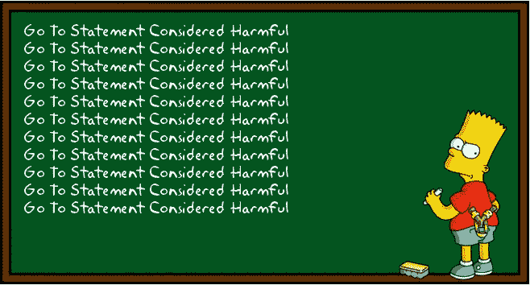
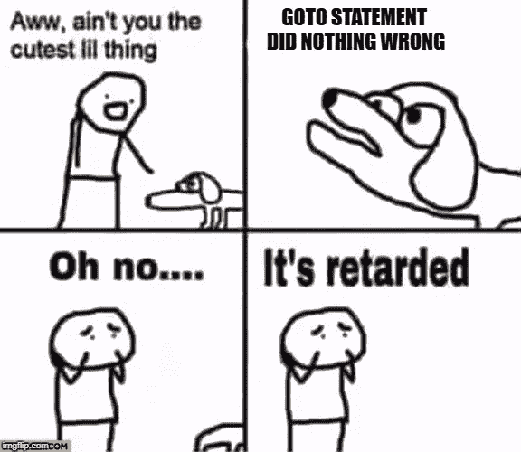

# Go To 语句没有任何错误

> 原文：<https://medium.com/hackernoon/go-to-statement-did-nothing-wrong-199bae7bda2e>



Go To Statement Considered Harmful

您可能不应该在代码中使用 goto 语句。

你不应该使用它们的主要原因是因为它们会让一些人抓狂。他们只是听说这是有害的。他们只知道这些。生活中有很多这样的事情——也许大多数事情都是这样的:你不会因为智取现状而赢得任何分数。

“转到被认为有害的声明”是 Edgser Dijkstra 写给 ACM 出版物的一封信。它变得如此著名“[某些]被认为是有害的”已经成为计算机科学界的一个强大的迷因。

在大多数语言中，goto 实际上是无害的。我一会儿会谈到这一点。但在我确立 goto 没那么糟糕之前，我想论证一下这没关系。重点是选择你的战斗。当你反其道而行之，智胜常识时，大多数人没有足够的知识深度来看出你是对的。有时候，有些人完全缺乏理解的认知能力。

在你的职业生涯中，重要的事情是给人们他们想要的和/或期望的。对于许多紧跟潮流的人来说，他们想要和期待的是马丁·福勒最新演讲的主题。其他人想要并期待一些真正古老的最佳实践形式，比如丰富的 UML 图。关键是，人们对什么是*聪明*形成了看法，他们完全期望所有聪明的人都那样做，并且所有这样做的人都是聪明的。如果你最终比某人对聪明的个人定义更聪明，他们不会理解你在增加赌注，他们不会理解你不同意的原因。有说服力的论点不会起作用，因为你的精神气质不会超过他们的想法来源。不管你能把你的情况说得多好，人们只会认为你*不明白*是因为你笨，而你笨是因为你*不明白。*



meme-based comic

Dijkstra 在 1968 年写了他的原创文章。那是非常不同的时代。像 Dijkstra 这样的计算机科学家仍然在努力建立编程和编程语言的基本原则。世界上所有的计算机都是以个人的名字命名的。即使是简单的程序也不得不费力地编写，在浪费时间运行程序之前，也要非常小心地试图证明代码是正确的。然后，Dijkstra 拒绝 goto，因为他提倡新生的程序结构，如子程序、函数、循环等。，它比通常使用的 if-then-goto 代码模式提供了更高级别的抽象。他认为这个问题是一分为二的，但它总是一个错误的二分法。他没有预料到结构化编程和 goto 可以共存，只要 goto 可以在某些关键方面受到限制。请看这段摘录:

> 无限制地使用 **go to** 语句有一个直接的后果，那就是很难找到一组有意义的坐标来描述流程进度。通常，人们也会考虑一些精心选择的变量的值，但这是不可能的，因为这是相对于理解这些值的意义的进展而言的！当然，使用 **go to** 语句，我们仍然可以通过一个计数器对程序启动以来执行的动作数量进行计数来描述进程。一种标准化的时钟)。困难在于，这样一个坐标虽然独特，却毫无用处。在这样一个坐标系统中，定义所有这些进度点变得极其复杂，比如说， *n* 等于房间里的人数减一！
> 
> ——埃德加·迪杰斯特拉

Dijkstra 关于 goto 与结构化编程不兼容的观点是基于 goto 混淆了“坐标”的想法。坐标到底是什么？他似乎在说循环计数器之类的东西。但这实际上没有意义。请允许我翻译一下:用现代的术语来说，我们有一个坐标系统，我们称之为调用栈。Dijkstra 说的是 goto 语句会搞乱调用栈。他实际上是在说 goto 被用来在不重置堆栈帧的情况下跳转到或跳出一个函数。限定了作用域的变量不会被清除，正确的变量也不会被分配。但实际上*在现代编译器和语言中，这是不可能的* —编译器像作用于变量一样作用于 goto 标签，并进行流分析以验证，例如，goto 不用于跳过变量声明。这就是为什么这是一个错误的二分法——我们有办法静态地验证 goto 没有以破坏程序结构的方式使用。

与 Dijkstra 的“被认为有害”的信相比，不太出名的计算机科学家 Donald Knuth 回复了一篇关于结构化编程的[论文，其中包括 goto 是实现预期结果的最有效方法之一的例子。](http://web.archive.org/web/20130731202547/http://pplab.snu.ac.kr/courses/adv_pl05/papers/p261-knuth.pdf) Knuth 表明，恰恰相反，goto 和结构化编程可以和谐共处。而且，如前所述，现代编译器可以防止 goto 被用来破坏“坐标”系统。

但是很多人知道“转到被认为有害的声明”迷因，很少有人知道 Knuth 的反驳。更少的人理解其中任何一个。当被问及 goto 为什么不好时，大多数人会说它使程序流难以阅读。(大多数人也认为迪杰斯特拉的文章是这么说的，即使他们读过之后也是如此！)那是废话。典型的 1968 年以前的 goto 代码流如下所示:

```
if ($WAITING) then goto INPUT
```

在 2017 年，同样的代码会是这样的:

```
if (isWaiting){ 
    GetUserInput();
}
```

无论哪种方式，代码流都是完全一样的！另一方面，当谈到 goto 的大多数现代有效使用时(读:作用于单个函数内)，人们仍然在进行“goto”编程，他们只是用更冗长和昂贵的布尔标志和 **if** 语句来这样做。任何用 **if** 语句重写的 goto 代码都将会大大降低*的可读性，有时甚至会降低性能。*

考虑这段代码，goto 语句的合理使用，如果满足某个条件，它会中断嵌套循环并跳过一些代码。

```
/* find a marker in a matrix if one exists or place a default */
int row = 0;
int col = 0;
while (row < height) {
    while (col < width) {
        if (matrix[row][col] == MARKER_VAL) {
            goto FOUND;
        }
        col++;
    }
    row++;
}NOT_FOUND:
//place marker in approx. middle as default
row = height / 2;
col = width / 2;FOUND:
compute_distances(matrix, row, col);
```

根据您使用的语言，有许多替代方法来编写这段代码。它们都不再可读，也不再安全。特别是使用`if`语句，可读性会大大降低。

Dijkstra 原始论文的基本背景——结构化编程——已经成功地融入到我们所有的结构良好的第三代编程语言中。但是在这个框架内，goto 没有任何问题，在大多数适当限定其范围的语言中。检查你的语言手册。如果 gotos 被直接编译成跳转或分支指令，你可能会遇到问题。在大多数语言中，情况并非如此。如果你用 goto 语句做一些不安全的事情，比如跳过一个变量声明，或者试图跳到一个不同函数内的标签，C++、C#和 Java 的编译器都会正确地拒绝编译。在这些语言中，goto 可能导致的唯一问题是与任何控制流结构(如`if`)100%相同。这里主要的例外是 C，它老了几十年。如果您在嵌入式系统上使用普通 C 语言，可能既没有编译器也没有其他工具来帮助您静态验证 gotos 的安全性，所以请保持距离。

事实是，后藤是一个不合理禁忌的受害者。围绕后藤的公共话语受到如此严重的限制，以至于在讨论它的时候，演讲者都不得不脱口而出这有多糟糕。导致最不可读的意大利面条式代码的现代编程结构是面向对象的继承，它很容易被滥用，变得不可读的速度比 goto 快一个数量级，并且有自己独特的反模式分类，这可能导致错误。但是对于继承来说，不存在这样的禁忌，相反，我们只是指出，以那些方式误用它是糟糕的编程，是程序员的错，而不是构造本身的错。那么，为什么同样的逻辑不适用于 goto 呢？因为一开始就不理性。这是一个禁忌。Goto 很好。

但是不要告诉别人。他们会认为你很笨。

## *附录*

正如我在文章前半部分预测的那样，许多读者有强烈的膝跳反应，甚至拒绝接受关于后藤的任何替代信仰，即使是暂时的和假设的。对此我无能为力，因为正如我所料——禁忌很强烈，大多数人在精神上无法打破它。但是有一个问题我可以回答。有一个相当粗鲁的读者坚持说我错了，或者说 Dijkstra 的著名文章是关于`goto`搞乱调用栈的。

它**绝对是**。本来应该链接 [Dijkstra 的随笔](http://www.u.arizona.edu/~rubinson/copyright_violations/Go_To_Considered_Harmful.html)的。这里有一段引文，在靠近开头的地方，他清楚地确立了我们所知的调用堆栈是他的论文的中心前提。我知道他的语气很难理解，但如果你集中注意力，你会明白的。原文在链接中，但我会用省略号来缩短摘录，以简化他重复、过度辩护的学术写作风格。重点我的:

> 现在让我们考虑如何描述一个过程的进展。[……]如果程序文本是一个纯粹的连接，比如说，赋值语句[……]在程序文本中指向两个连续动作描述之间的一个点就足够了。[……]让我们把这种指向文本中适当位置的指针称为“文本索引”
> 
> […]
> 
> 一旦我们在语言过程中包含了，我们就必须承认单一的文本索引已经不够了。在文本索引指向过程主体内部的情况下，只有当我们也给出我们引用的过程的哪个调用时，动态进程才被表征。**通过包含过程，我们可以通过一系列文本索引来描述过程的进展，该序列的长度等于过程调用的动态深度。**

过程调用的深度？是调用堆栈。这个调用栈就是“转到被认为有害的语句”的真正含义。不了解那么多，就不可能理解 Dijkstra 的文章，因此也不可能理解他反对`goto`的论点。而且，正如我在上面的文章中所说，Dijkstra 的观点已经过时，因为现代语言中的`goto`明显局限于调用堆栈的一个层中。