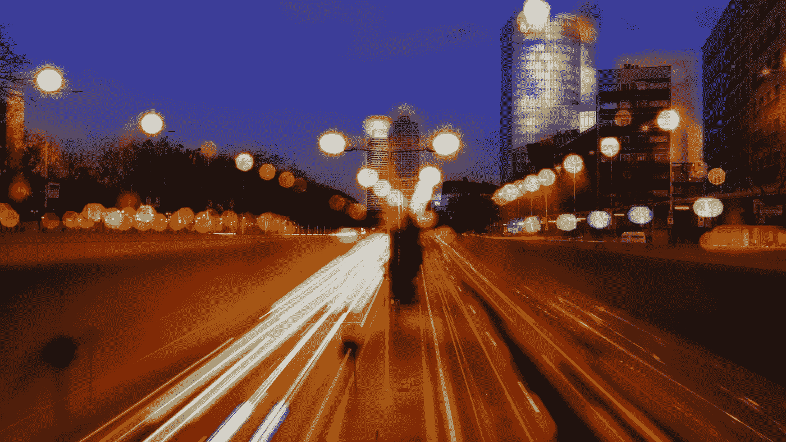

# 随波逐流:

> 原文：<https://medium.com/hackernoon/go-with-the-flow-55c332987e7b>

**帮助您的工程师提高工作效率**

**迈克尔·索罗门，10x 管理创始人**

(原载于 [10x 放大博客](http://www.10xmanagement.com/blog/))

我每天都和世界上一些最聪明的人一起工作。已经签约允许 [10x Management](http://www.10xmanagement.com/) 代表他们的编码员、设计师和数据科学家与构建 [Linux](https://hackernoon.com/tagged/linux) 和[比特币](https://hackernoon.com/tagged/bitcoin)的代码库的人是同一批人，或者是用于构建从 Pinterest 到 Ebay 的一切的语言的核心贡献者。他们太棒了。

当我问他们成功的秘诀是什么时(除了异常高的智商和一流的职业道德)，他们都说一件事:**心流**。他们是如何进入心流的？下面有许多建议，但有一点他们都提到了，那就是远程工作中的零干扰。

Mihály Csíkszentmihályi 已经写了大量关于[心流状态](http://en.wikipedia.org/wiki/Flow_(psychology))以及它与快乐和充实生活的关系的文章。根据维基百科，“积极心理学 [*中的*](https://en.wikipedia.org/wiki/Positive_psychology)*****心流*** *，又称* ***区*** *，是一个人在进行一项活动的过程中，完全沉浸在一种精力充沛的专注、全情投入和享受的感觉中的精神运作状态*”**

**在我与我们才华横溢的工程师的交谈中，我有一个惊人的发现，对于这个群体来说，在与人类交流(电子邮件、即时消息、短信、会议、电话等)之间切换。)而与机器对话(编写代码、算法等)需要付出巨大的代价。研究表明，中断后回到流动状态或区域可能需要 30 分钟到两小时。**

**但是为什么流量如此重要呢？**

1.  ****生产力** —“在流动中”的工程师比那些处理干扰的工程师多很多倍的生产力和对工作的专注。相反，如上所述，中断会导致数小时的生产力损失。**
2.  ****创造力**——心流状态与许多作曲家和作家在创造力巅峰时的“创造力高潮”联系在一起。**
3.  ****满足感**——许多人报告说进入心流是一种欣喜若狂的体验。当我们花更多的时间在心流中时，我们实际上会对我们的生活和工作感到更快乐和更满意。**

**那么，公司和管理者如何帮助开发者实现这种神话般的心流状态呢？幸运的是，这里有一些直接来自我们的 10xers 的提示，可以让你的程序员“跟上潮流”**

1.  **启用远程工作——“我远程工作。我租了一个独立于我房子的专业工作室。没有什么能打败紧闭的门。它帮助我创造了一个不受外界干扰的高效环境。”—阿克谢·阿加瓦尔**
2.  ****尊重耳机**——“如果你看到一个开发人员戴着耳机，最好假设他们在流中；尊重这一点，不要拍他们的肩膀，不要在他们面前挥手，也不要用其他普通的方式来引起别人的注意。”—杰森·鲁宾斯坦**
3.  ****更多的私人空间**——“如果我不得不在办公室，私人或半私人的办公室可以让你集中注意力(也有一点与高水平成年人相称的隐私)，再加上在走廊里偶然遇到的会议，这是我喜欢的环境。”—大卫·斯特里特**
4.  **创造安静时间——“公司需要建立一个安静的时间段，不允许开会、打电话或发信息。我建议从上午 11 点到下午 4 点，把会议减少到每周一次或两次。”艾哈迈德·阿洛库什**

**这些都不奇怪，办公室通常充满了干扰。37Signals 的 Jason Fried 的这个 Ted 演讲正面解决了这个问题，并强调指出，当人们真的想把事情做完时，他们通常会离开工作场所，去一个不受干扰的地方。现在是时候让我们的技术团队认识到这一点，并给他们他们需要的东西，给我们我们需要的东西。**

****如果你喜欢这篇文章，请推荐和/或分享。我将感谢任何意见和反馈。谢谢你。****

**

Share on StumbleUpon** ************

> **黑客午间是黑客们从下午开始的时间。我们是 [@AMI](http://bit.ly/atAMIatAMI) 家庭的一员。我们现在[接受提交](http://bit.ly/hackernoonsubmission)并乐于[讨论广告&赞助](mailto:partners@amipublications.com)机会。**
> 
> **如果你喜欢这个故事，我们建议你读一读我们的[最新科技故事](http://bit.ly/hackernoonlatestt)和[趋势科技故事](https://hackernoon.com/trending)。直到下一次，不要把现实世界视为理所当然！**

****