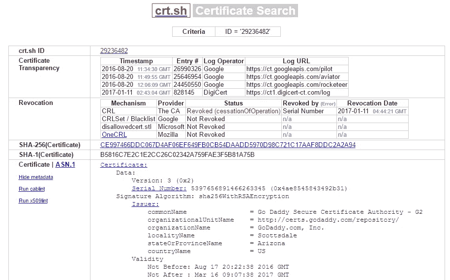

# GoDaddy 在没有请求的情况下吊销然后取消吊销证书

> 原文：<https://medium.com/hackernoon/godaddy-revoked-and-then-un-revoked-a-certificate-without-request-11f86074bbf8>

**更新** : [GoDaddy 已经确认](https://groups.google.com/d/msg/mozilla.dev.security.policy/Htujoyq-pO8/uMONEYAsBgAJ)他们重新验证了所有最初被撤销的证书，并删除了从 CRL 中通过的证书。

> 当我们得知这个问题时，我们重新验证了每个受影响的证书。如果我们无法正确验证，我们会吊销证书。这就是为什么我们总共有 8951 个被吊销的证书。
> […]
> 我们一发现这个漏洞，就运行了一个报告来识别在漏洞活跃期间没有通过域验证检查的每个证书。然后，我们开始扫描网站，看看哪些网站能够重新通过适当的验证检查。如果他们通过了，我们从列表中删除证书。如果我们无法使证书重新生效，我们就撤销它。如果对证书是否被正确验证有任何疑问，我们就撤销它。

我仍然非常怀疑他们会修改 CRL。

2017 年 1 月 11 日，GoDaddy 宣布他们犯了一个错误。GoDaddy 提供了几种在颁发证书之前验证域所有权的方法。其中一种方法是通过 HTTP 验证:他们生成一个 nonce，您确保对“yourdomain.com/nonce”的 HTTP 请求响应他们的请求。GoDaddy 意识到，当使用这种方法时，他们已经接受了 404 和 200，基本上完全无效。为了纠正这个问题，他们[撤销了他们认为以这种方式颁发的所有证书](https://groups.google.com/forum/?hl=en#!msg/mozilla.dev.security.policy/Htujoyq-pO8/uRBcS2TmBQAJ)，向请求者发送电子邮件，告诉他们发生了这种情况。

One of many revocation notification emails we received on the day

从表面上看，鉴于他们的业务性质，这似乎是一件明智而谨慎的事情，我不太关心他们到目前为止是如何处理事情的。我真正担心的是接下来发生的事。

不确定为什么我们会收到这么多撤销通知(我们为很多客户颁发了很多证书)，我们打电话给 GoDaddy 的高级客户经理(我们从他们那里购买了很多证书)，他们向我们解释了这种情况。我们特别关注的一个证书是多域证书，因为客户在重新颁发它时会感到不愉快(这个特定的证书上有 29 个 San，[您可以自己查看](https://royalduchy.co.uk/))。GoDaddy 通知我们，HTTP 验证方法目前不可用，可能几周内都不可用。相反，我们需要通过另一种方法，如 DNS 更改。接受我们打电话给客户让他们知道坏消息的事实。

这就是奇怪的地方。这个证书肯定是被吊销了。浏览器抱怨，下载证书中引用的 CRL，我们可以清楚地看到列表中的序列号。我还从 [crt.sh 页面](https://crt.sh/?id=29236482)抓取了一个屏幕截图，以防将来页面上的结果发生变化:

crt.sh page showing clearly the revocation and when it happened

然而，在把坏消息告诉我们的客户 30 分钟后，我们接到了他们的跟进电话，说“非常感谢，现在一切都正常了。”我们有点困惑地向里面看了看，确实，证书不再被吊销了！没有出现在 CRL 上，网站运行正常。没有对 DNS 进行任何进一步验证的修改。

虽然这个结果对我们的客户来说是好的，但它引起了我对 GoDaddy 撤销政策的极大关注。CRL 应该是一个单向系统，事实上[戈达迪甚至发布了一个政策](https://uk.godaddy.com/help/revoke-a-certificate-4747)声明这个过程不能逆转。

> 撤销你的 SSL 证书会取消它，并立即将 HTTPS 从网站上删除。根据您的 Web 主机，您的网站可能会显示错误或暂时无法访问。这个过程不能逆转。

我现在认为 GoDaddys 的撤销系统有很大的缺陷，并将为我们的客户寻找一个新的证书合作伙伴。

如果您想自己独立验证这一点，请访问使用有问题的证书的网站[此处](https://royalduchy.co.uk/)并检查 crt.sh 撤销记录[此处](https://crt.sh/?id=29236482)。如果任何权威人士想进一步了解，我也有[戈达迪](https://hackernoon.com/tagged/godaddy)和我们客户之间的所有电话记录以及原始电子邮件。

> [黑客中午](http://bit.ly/Hackernoon)是黑客如何开始他们的下午。我们是 [@AMI](http://bit.ly/atAMIatAMI) 家庭的一员。我们现在[接受投稿](http://bit.ly/hackernoonsubmission)并乐意[讨论广告&赞助](mailto:partners@amipublications.com)机会。
> 
> 如果你喜欢这个故事，我们推荐你阅读我们的[最新科技故事](http://bit.ly/hackernoonlatestt)和[趋势科技故事](https://hackernoon.com/trending)。直到下一次，不要把世界的现实想当然！

