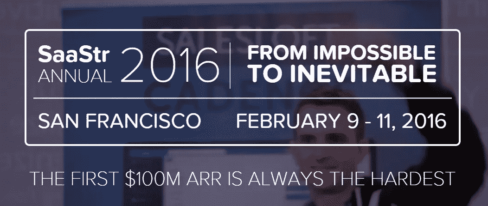

# 第一次参加 2016 年 SaaStr 年会？

> 原文：<https://medium.com/hackernoon/going-first-time-to-saastr-annual-2016-495d75b4881e>

最近关于[# 2016](http://saastrannual.com/)的讨论非常热烈。倒计时已经开始，每个人似乎都很热情。本次会议将持续 3 天，分两个阶段举行，有 [150 多位令人惊叹的演讲者](http://saastrannual.com/speakers?utm_source=pipemonk.com)，并包括与 5000 名与会者[交流的机会](https://hackernoon.com/tagged/network)。将有几个赞助商展示他们的业务和想法。

由于参加 SaaStr 令人兴奋和充满热情，我建议你在进入这个充满机会的休息室之前阅读这些文章并做好准备。

**我是第一次计时:**

*   [SaaStr 年度首次指南](https://www.saastr.com/first-timers-guide-to-saastr-annual/? utm_source=pipemonk.com)SaaStr
*   由 ChartMogule 编写的 SaaStr 年度指南
*   [SaaStr 年会上要做的 5 件大事](https://www.enterpriseirregulars.com/104692/5-awesome-things-saastr-annual/?utm_source=pipemonk.com)
*   从《T21》看 SaaS 成功的秘诀
*   [所有技术销售人员都应该参加 2016 年 SaaStr 年会的 8 个简单理由](http://www.saleshacker.com/sales-development/why-all-tech-salespeople-should-be-at-the-saastr-annual-2016/?utm_source=pipemonk.com)
*   每个商业博主可以从 SaaStr 那里学到什么

**为什么要参加 SaaStr:**

*   谁会参加 2016 年的 SaaStr 年会？SaaS 创始人、副总裁、客户……
*   [有 100 个客户？信不信由你，是时候召开你的第一次用户大会了](http://www.saastr.com/got-100-customers-believe-it-or-not-its-time-for-your-first-user-conference/?utm_source=pipemonk.com)
*   [在 SaaStr 年会上与 SaaS 顶级投资者一对一会面](https://www.saastr.com/meet-11-with-a-top-saas-investor-at-saastr-annual/?utm_source=pipemonk.com)

**接下来是什么:**

*   [SaaStr 年度 2016:从不可能到必然](http://www.eventbrite.com/e/saastr-annual-2016-from-impossible-to-inevitable-tickets-16205849131/?utm_source=pipemonk.com)
*   [SaaStr 2016“向我们展示你的 SaaS”视频比赛](https://www.onlinevideocontests.com/contest/7978/SaaStr-2016--Show-Us-Your-SaaS--Video-Contest/?utm_source=pipemonk.com)

**来自 SaaStr 2015 的回忆:**

*   [2015 年 SaaStr 年度客户成功经验](http://www.gainsight.com/2015/02/09/customer-success-learnings-from-saastr-annual-2015/?utm_source=pipemonk.com)
*   [SaaStr 你管频道](https://www.youtube.com/channel/UCwOILzAcxK5CM2M7oRBuWSg)
*   [2015 年度 SaaStr:照片日志](http://www.slideshare.net/stormventures/saastr-annual-2015-the-photolog)
*   [2014 年度 SaaStr:照片日志](http://www.slideshare.net/stormventures/saastr-summer-social-14-how-to-hire-a-great-vp-of-marketing)

上述资源只是我们 2016 年在互联网上看到的一小部分。

*在* [*空管*](https://www.pipemonk.com/?utm_source=medium.com&utm_campaign=Saastr) *的时候，我们为 2016 年激动不已。你会加入我们吗？在评论或者* [*推特*](https://twitter.com/pipe_monk) 上告诉我。 *:)*

> [黑客中午](http://bit.ly/Hackernoon)是黑客如何开始他们的下午。我们是 [@AMI](http://bit.ly/atAMIatAMI) 家庭的一员。我们现在[接受投稿](http://bit.ly/hackernoonsubmission)并乐意[讨论广告&赞助](mailto:partners@amipublications.com)机会。
> 
> 如果你喜欢这个故事，我们推荐你阅读我们的[最新科技故事](http://bit.ly/hackernoonlatestt)和[趋势科技故事](https://hackernoon.com/trending)。直到下一次，不要把世界的现实想当然！

