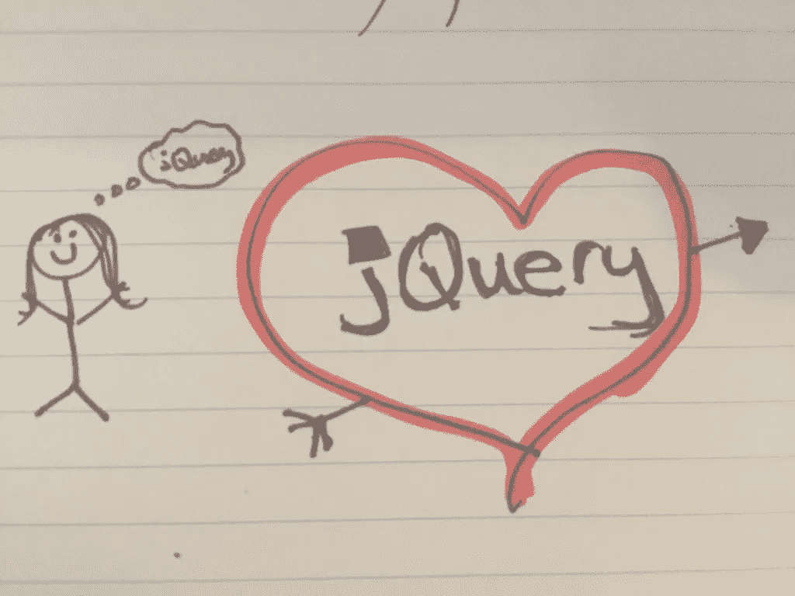
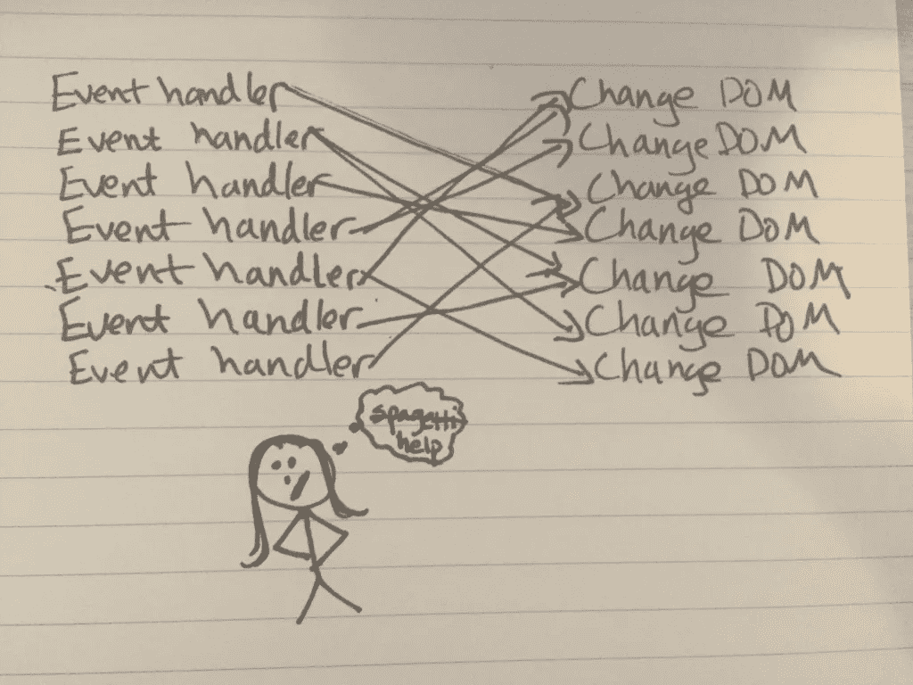
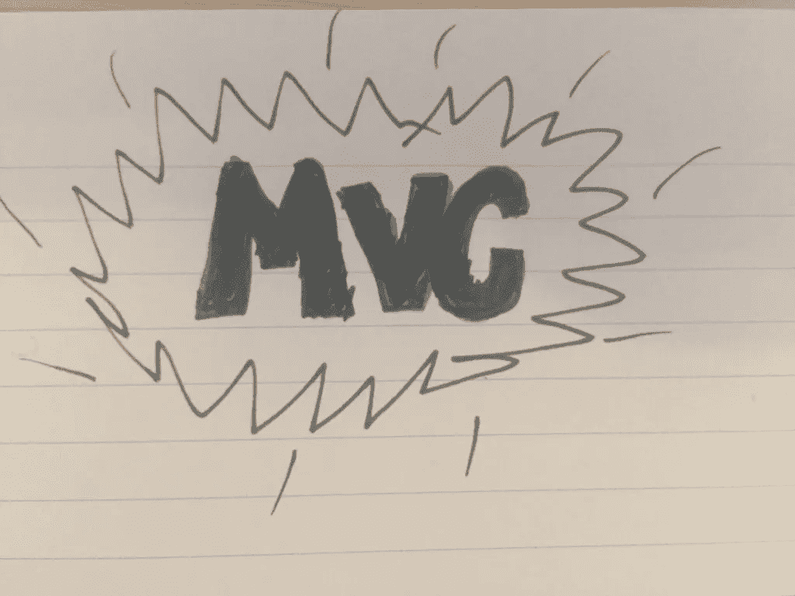
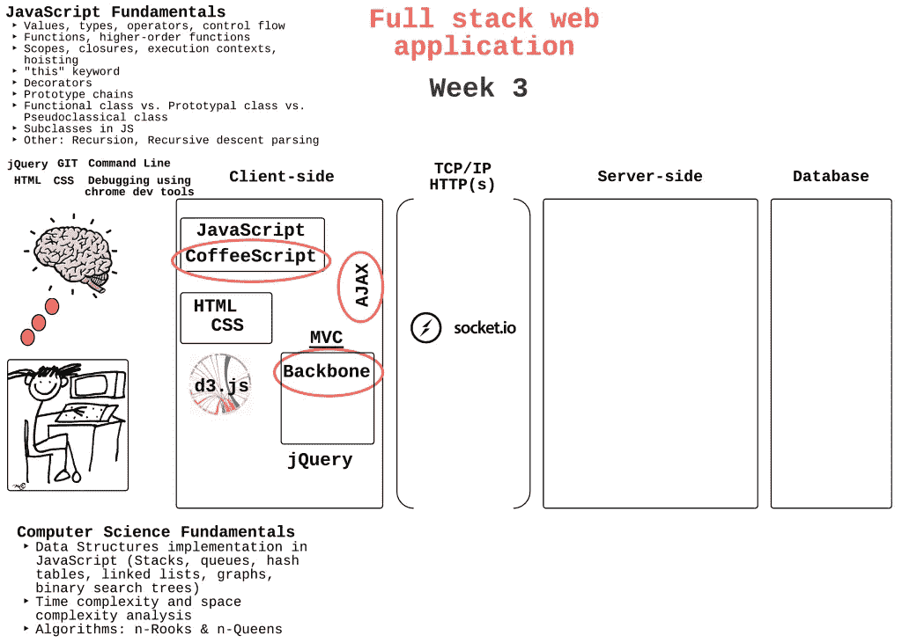

# 从 jQuery 意大利面到 MVC

> 原文：<https://medium.com/hackernoon/going-from-jquery-spaghetti-to-mvc-579fbf179490>

本周，让我们先来看看典型的 web 开发人员从纯 jQuery 到 MVC 框架的经历。

第一阶段:你发现了这个不可思议的脚本库，叫做 jQuery。它灵活、快速、易于使用，让您感觉自己像一个 web 开发超级英雄。

**第二阶段:**你用它来构建一些个人项目。其中一个得到一些牵引力并开始生长。随着注册人数的增加，您需要在客户端和服务器之间传输更多的数据。您开始着手改进 UX，并发现了 jQuery 和 Ajax 的混乱局面。你试着清理它，这样你就可以在它上面建造，但是你又退缩了，因为你害怕你会打破什么东西。

**第三阶段:**你的朋友和同事建议使用 MVC 框架来完成工作。MVC？你不知道那是什么意思，但是你认为它值得学习。

**第 4 阶段:**你搜索互联网，选择一个名为 Backbone 的 MV*框架，尝试一下。这是你第一次使用它。你马上就迷失了。控制器到底是什么？还是模特？我该如何设置这一切？什么去哪里？

**第 5 阶段:**您浏览一些教程并阅读文档。这需要一段时间来理解，但是你已经开始掌握基本功能的窍门，以及事物在高层次上是如何工作的。

第六阶段:你终于有足够的信心去尝试一下。你开始建造。或者至少，你认为你会开始建设。但是，等等…在你写一段代码之前，你实际上必须思考。甚至可以画一堆图表来描绘你的应用程序的控制流程。你真的很努力去适应这种新的建筑方式。你把这些都塞进你的大脑，希望从中得到一些好的东西。但是感觉太没效率了。这需要很长时间。你会气馁。你认为你从概念上理解了它，但是也许你需要回去重新阅读所有的东西。也许更好的办法是继续使用您所知道的知识，并找到一种更好的方法来组织您的 jQuery。

**第七阶段:**一两天后，你决定不能让骨干赢得这场战斗。你振作起来，深呼吸，再来一次。你从小处着手，赢得一些小小的胜利。一天后，你有了一个工作应用程序的一部分，你很兴奋。

**第八期:**经过一周的鼓捣，你可以看到隧道尽头的曙光了。您意识到为什么使用前端框架会使您的应用程序更易于维护。现在一切都说得通了。

第九阶段:你爱骨气，即使他让你努力工作，努力思考。但他是你的真命天子吗？你会听到所有关于其他框架和库的讨论，比如 Angular、Ember、React 和 Meteor。会不会是你错过了什么？

**第十期:**诱惑太甜。带着新的框架回到第 4 阶段！

这是我个人对 jQuery 和 MVC 框架又爱又恨的关系，但是我敢打赌，至少有一个开发人员正在阅读这篇文章并点头同意。

在每个开发人员的一生中，都会有一个 jQuery 欢迎她进入黑暗世界的时刻。当她的代码在页面上做体操的时候，但是在下面崩溃成一团混乱。你可以在职业生涯的任何地方碰壁。“这是常态吗？”你扪心自问。“一定有更好的办法。”很快，你开始研究所有的 MVC 框架，但是不确定哪一个适合你。

我个人在几个月前构建我的第一个项目时就遇到了这个转折点。从那以后，我一直在研读 MVC 框架，并渴望开始学习一种框架，以使我的代码更有组织性、可读性、可维护性和可伸缩性。

# **第一次 MVC**

Hack Reactor 上周向我们小组介绍了 MVC 设计模式，特别是一个被称为 Backbone 的 MV*框架。他们只给了我们很少的工作内容——只有几张幻灯片来介绍一些概念——并告诉我们必须重构现有的 jQuery 实现。就这样，他们把我们推进了深渊。为了完成我们的 sprints，我们花了一周的时间学习 Backbone 的内部工作——不需要 jQuery。

一开始，在不了解什么是 Backbone 或者它是如何工作的情况下，很难实现，更不用说如何使用它来构建应用程序的各个部分了。但我开始对这些令人生畏和陌生的经历变得有弹性，因为这是编程的本质——尤其是在 Hack Reactor。问题只会变得更难，而不会变得更容易。

当你看到其他开发人员钻研你似乎无法理解的概念时，你的自尊心会被撕碎，然而你不知何故会下定决心永不放弃，因为你知道如果你继续努力，你最终会开悟。这就是它的美妙之处。

综上所述，我来告诉你我对 Backbone 做了什么，不喜欢什么。注意:一旦我尝试了其他框架，我相信我的观点会改变:)

## **我喜欢的东西**

*   顾名思义，脊梁就是光秃秃的骨头。你得到的不是一个成熟的框架，而是一个极简的库，它提供了在应用程序中操作和查询数据的工具。因此，它是一个相当简单和小的代码库(我昨晚花了几个小时就能看完)，很容易上手
*   它触及了金属——这意味着，相对于其他前端框架，它具有更少的抽象和内置假设。这迫使你去理解和思考数据将如何在你的应用程序中流动，我认为这对初学者来说是一个非常重要的技能
*   它非常灵活，可以与其他框架或库很好地配合，因此您不必局限于一个解决方案
*   骨气不自以为是。事实上，许多组织创建了他们自己的惯例和他们自己接受的做事方式。除了主干社区同意的一些反模式和约定之外，如何连接应用程序以使事件通过它传播的选择就留给了程序员
*   黑仔文献

## **我不喜欢的东西**

*   没有双向数据绑定，这使得开发人员需要编写大量样板文件，以便在模型发生变化时更新视图，反之亦然
*   骨气不自以为是。这是礼物也是诅咒。我在上面解释了为什么我认为这个特性使 Backbone 变得特别——但是它也使新手很难选择太多，很容易误入歧途。我花了太多时间寻找做事的“正确方法”，结果却发现它们并不存在

最后，以下是我本周的更新:

## **本周最喜欢的学习**

这是一个棘手的问题，因为我们在过去的几天里讨论了太多！熟悉 Coffeescript 绝对是一个亮点。我发现它比 JavaScript 漂亮得多，我特别喜欢简单的函数和 lambda 定义、简单的类定义，以及去掉符号和花括号的语法吸引力。

…但至于我最喜欢的，本周我不得不选择主干，因为 MVC 设计模式对我作为一名 web 开发人员的进步是多么重要。虽然我一直在密切关注 Flux 架构以及 React 和 Meteor 的发展，并计划学习它们，但我很高兴我是从 Backbone 开始的。它为我提供了继续学习更抽象的框架所需的基础知识。下周见:)

*最初发表于*[*Preethi Kasireddy*](http://preethikasireddy.me/?p=108)*。*