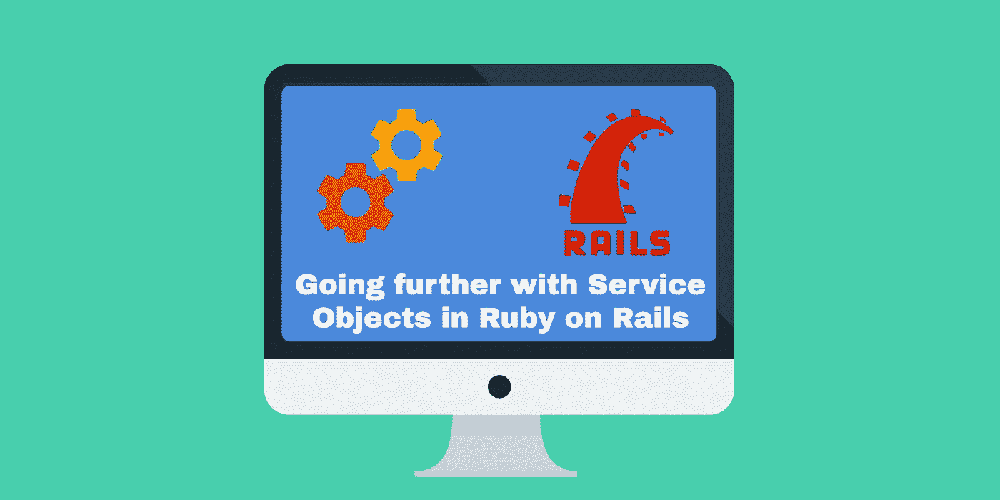

# 在 Ruby on Rails 中进一步使用服务对象

> 原文：<https://medium.com/hackernoon/going-further-with-service-objects-in-ruby-on-rails-b8aac13a7271>



注意:本教程是我的书[构建 SaaS Ruby on Rails 5](https://BuildASaaSAppinRails.com) 中服务对象章节的摘录。这本书将通过将应用程序部署到生产中来指导你从卑微的开始。如果你发现这种类型的内容有价值，这本书现在正在出售！

此外，你应该看看这个由我的一个好朋友开发的名为[子弹列车](https://bullettrain.co/?via=rob-medium)的项目，它将为你节省数周的开发时间，让你从每个 SaaS 都相同的所有功能开始，这样你就可以专注于让你的应用程序独一无二的东西。

作为最近一篇关于服务对象的文章的后续，我想更深入地探讨服务对象主题的细节，比如将对象保持在一个责任下、更好的错误处理和更清晰的用法。为了向您展示不同之处，我将重构我在第一篇关于服务对象的文章中创建的服务对象。

我还想指出一些影响这一重构的博客帖子，如[http://blog . Sunday coding . com/blog/2014/11/25/my-take-on-services-in-rails/](http://blog.sundaycoding.com/blog/2014/11/25/my-take-on-services-in-rails/)和[http://multithreaded . stitchfix . com/blog/2015/06/02/anatomy-of-of-service-objects-in-rails/](http://multithreaded.stitchfix.com/blog/2015/06/02/anatomy-of-service-objects-in-rails/)。

```
class NewRegistrationService
  def initialize(params)
    @user = params[:user]
    @organization = params[:organization]
  enddef perform
    organization_create
    send_welcome_email
    notify_slack
  endprivatedef organization_create
    post_organization_setup if @organization.save
enddef post_organization_setup
    @user.organization_id = @organization.id
    @user.save
    @user.add_role :admin, @organization
 enddef send_welcome_email
    WelcomeEmailMailer.welcome_email(@user).deliver_later
enddef notify_slack
    notifier = Slack::Notifier.new "https://hooks.slack.com/services/89ypfhuiwquhfwfwef908wefoij"
    notifier.ping "A New User has appeared! #{@organization.name} -   #{@user.name} || ENV: #{Rails.env}"
endend
```

让我们首先指出这样一个事实，即我们将一系列不同的职责放在一个服务类中。此外，它并不真正通过父类跟踪请求服务的控制器中的错误或成功。为了开始纠正这一点，我们将把每一项职责划分到各自的类中。

在展示这些类的代码之前，我还想谈谈新服务对象中的另一个变化，即使用 build 来注入依赖的类:

```
class NewRegistration def self.build
    new(OrganizationSetup.build, AdminUserSetup.build, SendWelcomeEmail.build, NotifySlack.build)
  end def initialize(organization_setup, admin_user_setup,     send_welcome_email, notify_slack)
    self.organization_setup = organization_setup
    self.admin_user_setup = admin_user_setup
    self.send_welcome_email = send_welcome_email
    self.notify_slack = notify_slack
  end....
```

这种构建/新技术之前已经在class NewRegistration
class OrganizationSetup def self.build
new
end def call(organization)
organization.save!
end end
end

…从新创建的组织中设置初始用户

```
# app/services/new_registration/admin_user_setup.rb
class NewRegistration
  class AdminUserSetup def self.build
      new
    end def call(user, organization)
      user.organization_id = organization.id
      user.save
      user.add_role :admin, organization
    end end
end
```

…发送欢迎电子邮件

```
# app/services/new_registration/send_welcome_email.rb
class NewRegistration
  class SendWelcomeEmail def self.build
      new
    end def call(user)
      WelcomeEmailMailer.welcome_email(user).deliver_later
    end end
end
```

…最后，消除松弛

```
# app/services/new_registration/notify_slack.rb
class NewRegistration
  class NotifySlack def self.build
      new
    end def call(user, organization)
      notifier = Slack::Notifier.new "[https://hooks.slack.com/services/89hiusdfhiwufhsdf89](https://hooks.slack.com/services/89hiusdfhiwufhsdf89)"
      notifier.ping "A New User has appeared! #{organization.name} - #{user.name} || ENV: #{Rails.env}"
    end end
end
```

在新版本的服务中，我对子组件的划分略有不同，以更好地体现每个单独的子服务，并潜在地处理异常。现在，我们有了子服务，我们可以在父服务中调用它们

```
# app/services/new_registration.rbdef call(params)
    user = params[:user]
    organization = params[:organization] begin
      organization_setup.call(organization)
      admin_user_setup.call(user, organization)
      send_welcome_email.call(user)
      notify_slack.call(user, organization)
    rescue => exception
      OpenStruct(success?: false, user: user, organization: organization, error: exception)
    else
      OpenStruct(success?: true, user: user, organization: organization, error: nil)
    end
  end....
```

正如你所看到的，与之前版本的新注册服务的另一个变化是我们不再使用`.perform`方法，现在使用`.call`。为什么这很重要？首先，它实际上比 perform 更常见，甚至是这里和其他地方的评论者所指出的普遍理解的标准。此外，`.call`响应 lambdas，这可能会帮助您在其他地方使用这些对象。

我们解析出参数，就像我们在以前的版本中所做的那样，但是现在解析成常规变量而不是实例变量，因为它们在同一个公共`.call`方法中被传递给新的子服务。尽管在两个版本中，要执行的项目的顺序和“瀑布”保持相对相同。

现在我们有了单独的子服务，我们可以在`begin...rescue..end`块中捕捉任何服务的异常。这样，我们可以捕捉到像组织不保存这样的问题，通过父对象和调用它来处理异常的控制器向上传递。此外，现在我们也将带有`OpenStruct`的结果对象传递回控制器。这个对象将保存`:success?`，被传入并被返回的对象，以及来自服务的任何错误。

有了所有这些变化，我们从控制器调用服务的方式略有不同，但差别不大:

```
result = NewRegistration.build.call({user: resource, organization: @org})
if result
  redirect_to root_path(result.user)
else
  ** redirect_to last_path(result.user), notice: 'Error saving record'
end
```

如果你想更深入地了解成功/错误路径、链接服务和用一个相当轻量级的 DSL 处理状态，我推荐查看来自describe NewRegistration do
context "integration tests" do
before do
@service = NewRegistration.build
@valid_params = {user: Factory.create(:user), organization: Factory.build(:organization)}
end it "creates an organization in the database" do
expect { @service.call(@valid_params) }.to change { Organization.count }.by(1)
end...etc, etc

这样，重构的注册服务对象更好地封装了单一责任原则(对于大多数虔诚的追随者来说可能并不完美)，更好的结果处理，改进的可读性，以及改进的依赖性处理。显然，几乎任何代码都可以不断改进，我期待着互联网来挑选这个版本的注册服务。:)

[](http://bit.ly/HackernoonFB)[](https://goo.gl/k7XYbx)[](https://goo.gl/4ofytp)

> [黑客中午](http://bit.ly/Hackernoon)是黑客如何开始他们的下午。我们是 [@AMI](http://bit.ly/atAMIatAMI) 家庭的一员。我们现在[接受投稿](http://bit.ly/hackernoonsubmission)并乐意[讨论广告&赞助](mailto:partners@amipublications.com)机会。
> 
> 如果你喜欢这个故事，我们推荐你阅读我们的[最新科技故事](http://bit.ly/hackernoonlatestt)和[趋势科技故事](https://hackernoon.com/trending)。直到下一次，不要把世界的现实想当然！

