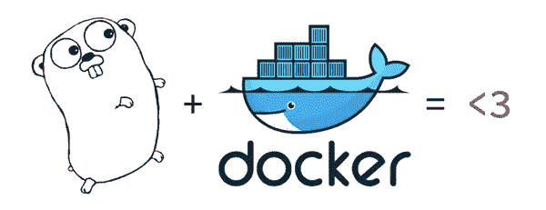
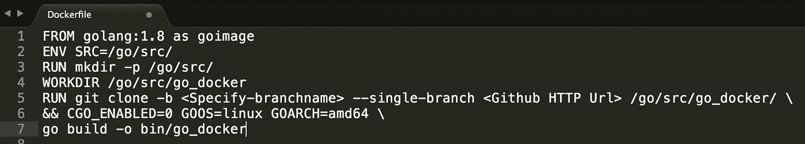
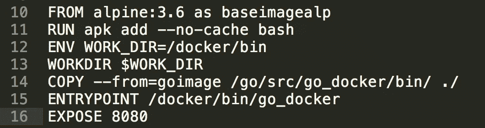

# Golang & Docker —面向企业模型的微服务(RESTful API)

> 原文：<https://medium.com/hackernoon/golang-docker-microservices-for-enterprise-model-5c79addfa811>



Beauty And The Beast :)

“Golang”这种由谷歌创造的语言为需要并发的应用程序提供了无可挑剔的性能，已经在技术社区中占据了一席之地，采用这种语言的知名公司包括脸书、网飞、Dropbox 等。当 Go API 被 dockerized 化时，它为部署在云上的应用程序提供了更多的灵活性和控制。甚至 Docker 软件也是在 Go 上编写的，这表明了它在行业中的突出地位

我们将演练构建一个包含 Go API 的 alpine 图像，实现它的步骤分为如下几个部分

*   用 echo 框架构建 Go Restful API
*   用 Docker 在 golang 基础映像上构建 Go 二进制文件
*   构建轻量级映像(Alpine)保存 Go 二进制文件
*   用 Docker 创建容器

## 用 echo 框架构建 Go Restful API

将该文件命名为 **main.go** ，其中包含依赖项——echo、logrus 和 net/http。我们有多个第三方框架，如 Gradle、Martini、Revel 等，为构建 RESTful API 提供了定制功能。选择一个满足你需求的服务完全是你自己的选择，你也可以只依赖 golang lib "net/http "来创建一个 RESTful 服务。

代码片段

```
**package** main

**import** (
   "fmt"
   "github.com/labstack/echo"
   "github.com/labstack/echo/middleware"
   "github.com/sirupsen/logrus"
   "net/http"
)
**var** log =logrus.New()

**func** init() {
   log.Formatter = new(logrus.JSONFormatter)
   log.Formatter = new(logrus.TextFormatter) // default
   log.Level = logrus.*DebugLevel* }

**func** main() {
   fmt.Println("Main function :")
   e := echo.New()
   e.Use(middleware.Logger())
   e.Use(middleware.Recover())
   // Routes
   e.GET("/go-docker",  goWithDocker)
   e.Logger.Fatal(e.Start(":8080"))
}

**func** goWithDocker(c echo.Context)error{
 **return** c.JSON(http.*StatusOK*, "Go with Docker Container")
}
```

该服务可通过 HTTP 端点获得

【T2**http://localhost:8080/go-docker**

市场上有多种 IDE 可供选择，其中一些是 Sublime、Atom、Gogland 等。我一直在使用 Gogland，因为它有多种功能，并且有早期构建，请尝试一下！！

现在让我们来谈谈这个程序，我们已经公开了一个简单的 GET 操作，它在 HTTP 协议**上公开了配置的路由 **/go-docker** 。**日志是使用 logrus 框架编写的，用于跟踪请求和响应。

对于构建管理，您可以使用安装了 Docker 插件的 Jenkins，使其与 Docker CLI 交互。

## **用 Docker 在 golang 基础映像上构建 Go 二进制文件**

根据你的需要使用 docker hub 中的任何 golang 图片[https://hub.docker.com/_/golang/](https://hub.docker.com/_/golang/)，我们将在这个博客中使用 golang:1.8



Ref A: Image containing the go binary

从 docker hub 中拉出镜像，并创建一个文件夹结构模式 **/go/src** (如 go 所料)来编译文件。第 5–7 行连接了多个命令，在 Github repo 中提取所需的源代码和供应商依赖项(假设您的 repo 在/vendor dir 中有第三方)。第 6 行& 7 指定生成的构建将特定于 linux 环境。最佳实践是始终将多个运行语句合并成一个语句，以避免在创建映像时创建多个层。

生成的 Docker 构建将在/bin 文件夹下有一个二进制文件 **go_docker.exe**

## **构建轻量级映像(Alpine)持有 Go 二进制文件**

让我们在这个演示中使用 alpine 3.6 基础，因为它是一个非常轻量级的映像，作为 linux 基础只有最低的先决条件。



Ref B : Alpine built with binary

在映像中安装 bash，使其在容器启动并通过 docker 运行后具有交互性。在第 14 行中，我们使用了 docker 新版本中发布的多阶段构建特性。 **— from** 标签将允许您通过提及源和目标目录，从先前创建的映像中获取并引用其内容。参考前面的**参考一个**图像行 1，指定 **goimage** ，这有助于在第 14 行参考它

ENTRYPOINT 命令指示容器启动应该执行。exe 文件即 **go_docker** 文件

所有上述内容将放在一个名为 **Dockerfile** 的文件中，以便一次性执行。构建 docker 映像，并使用标签-t 将其标记在某个版本下，以避免在未来的构建中发生冲突，否则 docker 将默认分配一个标签“最新”

代码片段

> *FROM golang:1.8 as goimage
> ENV SRC =/go/SRC/
> 运行 mkdir-p/go/SRC/
> work dir/go/SRC/go _ docker
> 运行 git clone-b<Specify-branch name>—单分支<Github HTTP Url>/go/SRC/go _ docker/\
> &&CGO _ ENABLED = 0 GOOS = 1*
> 
> *FROM alpine:3.6 as base imagealp
> 运行 apk add —无缓存 bash
> ENV WORK _ DIR =/docker/bin
> WORKDIR＄WORK _ DIR
> COPY—FROM = go image/go/src/go _ docker/bin/。/
> entry point/docker/bin/go _ docker
> EXPOSE 8080*

注意:—表示双连字符

可以通过发出以下命令来构建和查看映像。

> **docker build -t go_docker:1.0。**
> 
> **docker 图像**

有什么我们遗漏的吗！！集装箱？我们将在下一节介绍它

## 用 Docker 创建容器

从映像创建容器，并通过提及一个端口来公开它。您可以指定所需的端口范围，并将容器暴露给外界。在 AWS 中，您可以通过 ECS 将图像作为任务推送到 EC2 服务。

> **docker 运行— rm -p 8080:8080 go_docker**

注意:—表示双连字符

一旦容器启动，您可以在终端上看到类似下面的内容


通过提及所需的 URL，可以将图像推送到 docker repo。映像创建和推送的步骤可以通过 Shell 实现自动化

> **docker 登录-u= <用户名>-p =<PWD><Docker 回购网址>**
> 
> ***docker push-t<Imagename>:<版本>***

# 结论

选择 Go 是一个明智的决定，它为您的应用程序提供了可伸缩性和并发性，选择 alpine 这样的轻量级映像将使映像更快地推入和拉出注册表，并且小尺寸的基础为您提供了最少的操作功能来构建功能容器，您可以在将来添加/安装必要的依赖项。使用 Docker 已经获得了更广泛的认可，因为它有效地利用了磁盘空间，最有效地利用了资源。

# **干脆跟 Docker 走！！！**