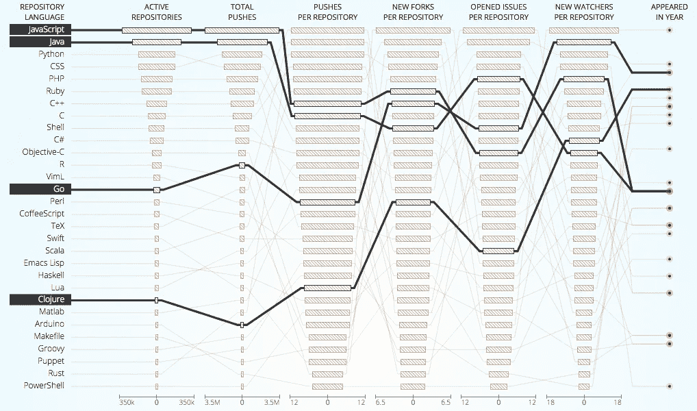

# GoLang 还是发展的未来

> 原文：<https://medium.com/hackernoon/golang-or-the-future-of-the-dev-984c2f145bbe>

免费午餐结束了。更好的是，免费午餐在 2005 年就已经结束了，现在我们开始为此买单，尽管我们并没有意识到这一点。

***编辑*** *:有一个* [*很有意思的 reddit 线程*](https://www.reddit.com/r/golang/comments/57g2y3/golang_or_the_future_of_the_dev/) *对于这个关于“围棋”vs“围棋”的片段。正如*[*2016 年学习 Javascript 的感受*](https://medium.com/u/cba1cd85bb0#.nke7ozrlm)

然而，除了所有的 Babel(s)，Typescripts 和 ES6-es 2016(s ), JS 的采用——尤其是在公司之间——并没有放缓。

Most used PL in 2016 on Github

这可以归结为几个原因，尤其是:

*   这种语言的相对容易
*   相对容易找到开发人员(前端开发人员已经熟悉该语言)
*   庞大的图书馆和工具生态系统

尽管 V8 引擎很棒，而且通过实现 promises 可以在事件循环上做些手脚，但是 **NodeJS 是单线程的**。因此，它不能直接使用多核 CPU，即使可以在几个线程上生成不同的进程。

另一方面，GoLang 作为一个现代的 T3，尤其是作为 T4 的替代者，受到了广泛的关注。

> Go 主要是一种命令式语言(尽管它有可用于 OOP 的结构和方法，以及用于 FP 的一级和更高阶函数)，它被编译并被垃圾收集(像 OCaml 和 Haskell)。
> ——[2016 年学习 JavaScript 的感受](https://medium.com/u/cba1cd85bb0#.nke7ozrlm)Jose Aguinaga
> 
> 
> 
> > [黑客中午](http://bit.ly/Hackernoon)是黑客如何开始他们的下午。我们是阿妹家庭的一员。我们现在[接受投稿](http://bit.ly/hackernoonsubmission)并乐意[讨论广告&赞助](mailto:partners@amipublications.com)的机会。
> > 
> > 如果你喜欢这个故事，我们推荐你阅读我们的[最新科技故事](http://bit.ly/hackernoonlatestt)和[趋势科技故事](https://hackernoon.com/trending)。直到下一次，不要把世界的现实想当然！
> 
> 