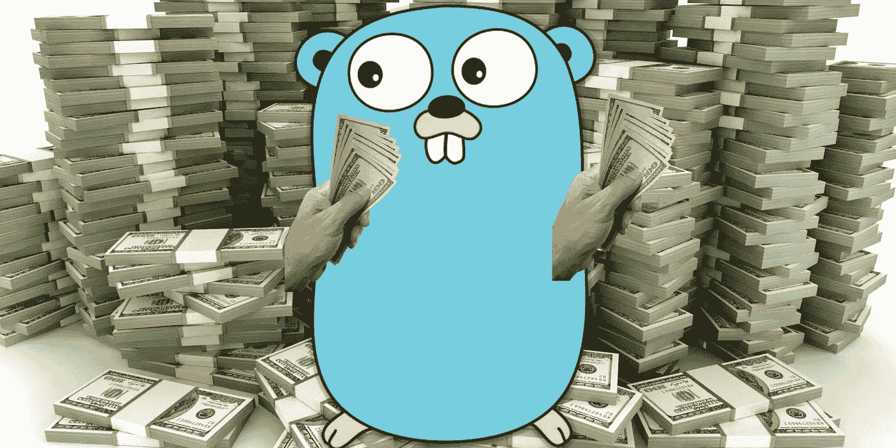
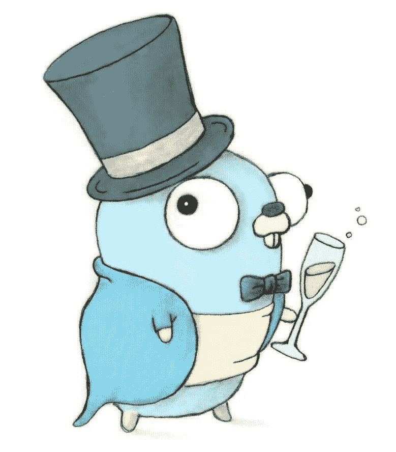

# Golang 的空间主题介绍

> 原文：<https://medium.com/hackernoon/golang-the-highest-paying-technology-to-know-9c6089d7081d>

> 一篇关于 Golang 的短文，目标读者是新开发人员或那些没有花太多时间研究这种语言的人，他们想要一个简短、简洁、经过深思熟虑的原创介绍。所有编写的代码都在 repl 中。

Go 非常酷，更酷的是，根据 Stack Overflows 2017 数据集，它是报酬最高的技术。Go 开发者的平均年薪是~ **11 万** : [链接在这里！](https://insights.stackoverflow.com/survey/2017)

(技术->侧栏上用于验证的顶级付费技术)



Hot damn!

但是，这只是学习围棋的一部分原因。主要原因是这样的:*学习它只会加快你对基础计算机科学主题的理解。*为什么？嗯， [Golang](https://hackernoon.com/tagged/golang) 是一种经过深思熟虑的现代语言，它利用了在它之前创建的[编程](https://hackernoon.com/tagged/programming)语言的许多最佳实践。

它也是一种由谷歌开发的语言，用来处理大量的数据和与处理几乎每个人都使用的搜索引擎相关的问题。

另一方面，要完全学会围棋，就要学会如何构建软件，为低级问题提供答案。另一种说法是为其他软件提供服务的软件。*在某种程度上，如果你了解 Golang，那么你就知道如何构建触及该领域根本的程序。*

让我们深入研究一些代码。故事是这样开始的:

> 这一次是在 2018 年。但是时间突然跳到了 240 年前。好像你一直是奥斯汀·鲍尔斯。这取决于你突然拯救宇宙。结尾有点曲折。

我写了一段代码，大约 150 行，完整地讲述了这个非常短的故事(大量打印)，我将把它放在最后。我将从头到尾检查一遍代码。开始很简单，然后变得有点复杂。

```
package mainimport (
 "fmt"
 "time"
 "strconv"
 "io"
 "strings"
)
```

**包主**？所有 Go 源代码都是包的一部分，每个文件都需要一个 package 语句。`package main`是代码运行的文件。其他程序包文件是导入到主程序包中的模块。模块是可重用的代码片段，可以在`package main`中使用或实现。

因此，导入的模块包含我将在这个文件中使用的源代码。

```
type Aliens struct {
  species int
}type NotEarthling struct {
  total int
  century string
  thingamajig string
}type Earthling struct {
  total int
  century string
  name string
  age int64
}type WordSpaceship struct {
  health string
  weapon string
}type NumberSpaceship struct {
  health int
  weapon int
}
```

具有不同用法的多个结构。

什么是结构？这是如何创建一个对象，可以有不同类型的每个值。关键是写的字，一串。尽管每个键必须有指定的类型，但它不是动态的。

创建对象的另一个主要方法是使用**地图**。但是，在这种情况下，每个键以及值都必须是单一类型:

*   **make(map[string]int)** 所有键都必须是 string，所有值都必须是 int

因此，在映射中，每个键必须是一种类型，每个值必须是一种类型。在结构中，每个值允许不同的类型。

```
var you = Earthling{century: "21st", name: "you", age: 24}func main() {
    defer fmt.Println("Is this all a dream?") now := time.Now()
    nanos := now.UnixNano()
    fmt.Printf("Right now it is: %v! \nPop! AHHHHH\n\n", now)
```

**变量声明**出现在全局范围内，所以必须用`var`关键字初始化。这是*初始化结构的一种方式*。请注意，我指定了键，并将其值设置为结构定义中编写的相应类型。注意我没有初始化每个键/值(你不需要)。

**延期**？这创建了一个后进先出的函数调用堆栈，在完成`func main() {...}`的之后调用*。我说像`defer`这样的堆栈可以被多次调用，每次调用时，最后一个推入堆栈的函数会被首先调用。*

**:=，这是什么？**这就是说类型会被编译器动态的计算出来。就像在中一样，当以这种方式初始化变量的值时，您不需要指定类型，这是唯一的方法。

**时间。Now()** 返回此值:2017–12–28 01:41:05.240081928+0000 UTC

**现在。UnixNano()** 返回这个:1514425756675856179，这是自 8 年前创建 Golang 以来发生的纳秒量。

**Printf** 允许以不同的形式记录数值:

**%v** 给出默认值

**%T** 给出数值的类型

是两种主要的形式。

还是在下面的函数 main 里。

```
 nanos = nanos + 7600000000000000000

    years := (nanos - now.UnixNano())/1000000000/31622400

    now = time.Unix(0, nanos) fmt.Printf("And now it is: %v!\nOh hell!\n\n", now)
```

开始时，一个人走了 76000000000000000 纳秒，来到未来，也就是大约 240 年。

**年**是一种计算，先换算成秒再换算成年。

**时间。Unix(秒，毫微秒)**会将纳秒转换为:2258–10–29 00:55:56.675856179+0000 UTC

```
 var e []Earthling
    var ne []NotEarthling for i := 0; i < 70000; i++ {
        e = append(e, Earthling{})
    }

    for i := 0; i < 44; i++ {
        ne = append(ne, NotEarthling{})
    }

    aliens := Aliens{2} futureEarthling := Earthling{len(e), "22nd", "The Future", 32141}

    futureNotEarthling := NotEarthling{len(ne), "99th", "Grok grok grok"}
```

**var** 关键字调用设置一个*零值*数组(空数组)，该数组只能用指定的类型填充。不能添加整数、字符串等。到这个数组。

在下面的 **for 循环**中，我*将指定类型的空结构*追加到数组中。

这种情况下只有两种外来物种。**地球人**和**非地球人**。

注意， **futureEarthling** 是如何被设置为 struct **Earthlings** 而没有指定键的，这是一个简写，只要你按照 struct 中定义的相应顺序放置值，在这个例子中: **{int，string，string，int64}** ，那么字段就可以这样填写。

现在有一个名为 **Greet** 的函数附加到每个**earthing**对象上…让我们来看看这个独立的函数，而不是主函数。

```
func (e *Earthling) Greet(y int64) string { century, _ := strconv.ParseInt(e.century[0:2], 0, 64) if century > 21 && century < 30 { age := strconv.FormatInt(you.age, 10) str := "Welcome to the future young Padawan, you are in the: " + e.century + " century. And I am: " + e.name + ". You are now... " + age + "years old. The world is under attack, and you have been revived to defend it! Big scary invader has something to say..." return str } else {
      e.age = e.age + y
      return "Where am I???"
    }
}
```

好的，这对应于这个人正在经历的存在主义危机，在遥远的未来醒来，某个随机的未来人有话要说！

嗯……看上面: **(e *Earthling)** 。这是什么？嗯， **e** 将成为调用该方法的 **Earthling** 对象的实例。还有那个 ***** ？*这是一个指针*。我邀请你打开下面的 repl，删除那个 ***** ，看看会发生什么。

意思是这样的:**你。Greet(year)** *正在创建* `*you*` *的副本，除非你指向它的内存地址*。如果不这样做，你在`you`上做的任何事情都不会改变主函数中的对象。指针确保对象可以被改变。

在这个代码片段中，我们还有一个新的库… **strconv** 。当你想把一个整型数转换成一个字符串，反之亦然，或者许多其他类型时，可以使用这个库。Go 有如此多的数据类型… int，int8，int16，int32，int64。我命名的是 int，换句话说，你可以一直输入下去。

如果你仔细观察，我使用指针的全部原因是为了改变年轻学徒的年龄。

```
numberShip := NumberSpaceship{100, 3}
wordShip := WordSpaceship{"Read this to defeat me.", "Powerful words!"}

wordAttack := make(chan int)
finished := make(chan int)go func() {
    for {
        numberShip.health = numberShip.health - <-wordAttack
        if numberShip.health <= 0 {
            Extinction(&aliens)
            finished <- 0
        }
    }
}()

fmt.Println(Fight(&numberShip, &wordShip, wordAttack, finished))
```

好的，首先，两个结构体的第一个参数是它们的健康状况。所以，对于数字船来说健康是 100，而对于单词船来说健康是一句话……`"Read this to defeat me"`……？我将在底部的函数中深入讨论这个问题，**对抗**，它使用的是所谓的**阅读器**。

**make(chan int)** 创建所谓的通道。发送/接收值的管道。发送是这样:**<-文字攻击**，接收是:**完成< - 0** 。

**go func() {…}()** 是一个 *goroutine 的创造。*当协调使用通道和 goroutine 时，要记住的主要事情是，只要通道向 go routine 发送值，它就会继续*。*那么，让我们看看它是从哪里得到它的值的， **Fight** 函数。

```
func Fight(ns *NumberSpaceship, ws *WordSpaceship, c, f chan int) string {
    x := len(ws.weapon)
    r := strings.NewReader(ws.health)
    b := make([]byte, ns.weapon)
    for {
        select {
            case c <- x:
                fmt.Println("Hit it!")
            case <-f:
                fmt.Println("He's finished!")
                return "\nYou saved time, space, eternity, everything!\n"
        }
        _, err := r.Read(b)
        if err == io.EOF {
            return "You failed, the universe is to end."
        }
    }
}
```

首先，检查函数签名。此函数由*引用*变量的内存地址调用(与 **&** )。在签名中，函数期望一个*指针*(即。一个*引用了*变量)作为**数字空间**和**文字空间**的参数。

此外，检查如何两个**陈 ints** 类型只写一次。如果参数类型彼此相邻并且类型完全相同，则可以对它们进行分组。

首先是**字符串**库，这“实现了简单的函数来操作 UTF-8 编码的字符串”在这个函数中，将创建一个*阅读器*来读取一个字符串。

好了，字符串阅读器的实现:

*   r :=字符串。NewReader(ws.health) 返回一个新的*阅读器*，它将从 s: `"Read this to defeat me"`中读取数据。
*   **b := make([]byte，ns.weapon)** 返回指定长度的字节片。 **ws.weapon** 是数值 3。
*   **_，err := r.Read(b)** 更细致入微。 **_** 也可以是变量名，姑且称之为 **n** 。如果 **n** 存在，意味着 **Read** 读取的字节数要返回给 **n** 。但是如果保持原样，则不必使用返回值。否则，你必须这么做，也就是说 *Go 不允许不使用声明的变量。*因此，首先， **Read** 返回读取的字节数，其次，当且仅当整个字符串被读取时，它返回一个错误，在这种情况下是一个 **io。返回 EOF** (文件结束)错误。否则，它的值为: **< nil >** 。
*   所以， **r** 就是读者。 **b** 是字符串的读数被放入的内容。**读作**是被调用来使之发生的函数。

所以，总结一下**阅读器**以及它被使用的原因，一旦字符串被读取，NumberSpaceship 获胜，而 WordSpaceship】失败。非常激烈的战斗。

一个快速的旁注:{…} 的**就是说，做一个无限循环，直到函数返回。**

至于对**号飞船**的攻击。

*   **选择**正在等待多个通信操作，两个通道 **c** 和 **f** 。当准备好发送或接收数据时，只要函数不返回，它就会继续发送或接收数据。
*   **情况< - x** 就是说，不断的向这个通道发送 x 的值。然后，回到 **func main** 的 goroutine，这样做:**number ship . health = number ship . health—<-word attack**对船造成伤害。因此，通道清空了它刚刚接收到的 x。*通道接收一个值，并在相应的 goroutine 中将其发送出去*
*   **case < - f** 仅在 f 有相关值时运行，并且这仅发生在 if 语句后的**main**:**finished<-0**中。

这就是战斗！战斗结束后，无论谁输了，他们的整个物种都灭绝了…这是怎么写的，逻辑并没有结合到真正的代码中。

```
type Aliens struct {
    species int
}func Extinction(a *Aliens) {
    a.species = a.species - 1
}func main() {
    aliens := Aliens{2}
    Extinction(&aliens)
}
```

很强的逻辑性。

以及从真实代码中注销的全部内容！

```
Right now it is: 2017-12-28 21:40:35.066259304 +0000 UTC! 
Pop! AHHHHH

And now it is: 2258-10-29 20:47:15.066259304 +0000 UTC!
Oh hell!

Where am I??? 

Welcome to the future young Padawan, you are in the: 22nd century. And I am: The Future. You are now... 264 years old. The Universe is under attack, and you have been revived to defend it! Big scary invader has something to say... 

Tord thaz geck hild quemp 240! 

He challenged you! You're the chosen one, so you must save the Universe! Jump on this spaceship.

VRRRROOOOOOOOOOOOMMMMMMMM BOOM BOP BOOM BOP

Hit it!
Hit it!
Hit it!
Hit it!
Hit it!
Hit it!
Hit it!
He's finished!

You saved time, space, eternity, everything!

AHHH, the aliens left a bomb, the Universe is to disintegrate into nothingness!

Some higher being sort of thing says: There are  0  sentient beings left alive.

Was that all a dream?
```

和回复:

[](https://repl.it/@jerrymuzsik/GolangArticleFrozenSpaceGuy) [## @jerrymuzsik 的 repl . it-golangarticlefrozenspace guy

### 强大而简单的在线编译器，IDE，解释器和 REPL。用 JavaScript、Python…编写、编译和运行代码

回复它](https://repl.it/@jerrymuzsik/GolangArticleFrozenSpaceGuy) 

如果你有兴趣学习更多的围棋，伟大的入门文档/练习题，我强烈推荐这本书！

 [## 围棋之旅

tour.golang.org](https://tour.golang.org/welcome/1) 

> 非常感谢！你是最棒的！Golang 先生也有话要说。



I thanky thee muchee for readee thisee thingee, cheerees mee buddy