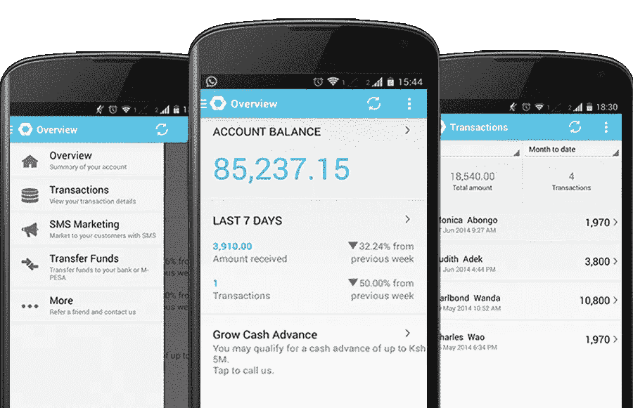
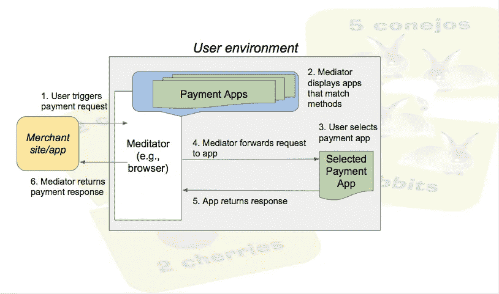
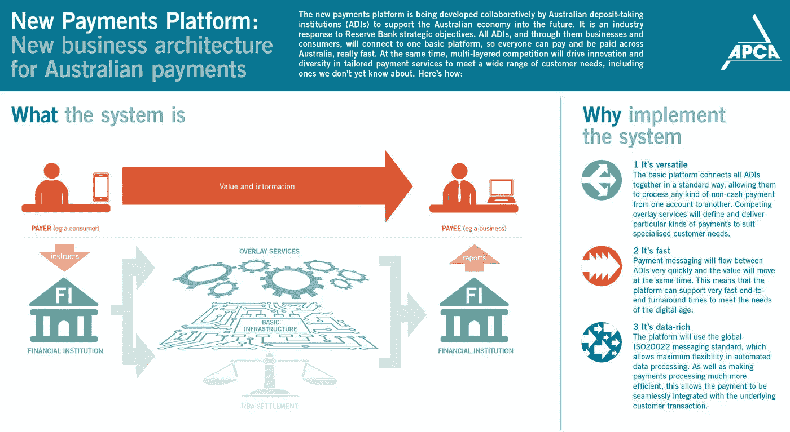

# 金色胡萝卜

> 原文：<https://medium.com/hackernoon/golden-carrots-1b496d032f21>

# 第一部分:50 亿先令

今天，有人——可能在印度或非洲——正在购买他们的第一部手机。它可能是一个预付费帐户，也可能是一个有多个 sim 卡的设备，因为在自己的运营商打电话通常比打给另一家运营商便宜得多。

这款手机可能看起来很像诺基亚 3310——我们过去称之为手机，但我们现在称之为“傻瓜手机”。

很难记起来，但是十年前——在 iPhone 出现之前——我们所有的手机都是傻瓜手机。我们会用它们打电话或发短信，或许偶尔玩玩贪吃蛇游戏。但仅此而已。这是我们唯一能做的。

然而，即使这样也彻底改变了我们的生活。这在非洲和澳大利亚都是事实。其实在非洲更是如此。

在肯尼亚，早在 2007 年，占主导地位的运营商——Safaricom——为肯尼亚数百万手机用户推出了一项服务。

移动 PESA 允许你通过短信汇款。

这是怎么回事？

在我解释这一点之前，你必须了解一些关于东非和发展中国家的事情——那里没有很多银行，没有很多银行分行，大多数人都没有银行账户。

这是为什么呢？在发展中国家，银行真的只想与富有的公司和个人打交道。即使是肯尼亚的普通中小企业也没有足够的资金让银行与他们做生意。

所有这些意味着肯尼亚在 2007 年有一个巨大的现金经济——仅仅是因为别无选择。

PESA 成了另一种选择。

Safaricom 在肯尼亚已经有一个代理网络，他们会卖给你一部电话或一个 SIM 卡或通话时间。这些代理人还被授权接收现金，然后可以存入个人的 M-PESA“账户”——一个与他们的 SIM 卡相连的储蓄账户。

一旦这些现金被存入代理处，就可以通过短信转移给任何使用 M-PESA 的人。一旦转账，收款人可以拜访代理人并收到现金。

这听起来可能不多，但在肯尼亚——人们从村庄迁移到内罗毕工作——这意味着全世界。

不用每两周花一整天的时间回到那个村庄把现金交给一个家庭成员，现金可以立即转移——而且安全得多。

M-PESA 立即获得了巨大的成功。点对点的银行转账——我们在澳大利亚很少使用的方式——改变了肯尼亚的经济，因为人们转移资金变得容易多了。这增加了资金的流通速度，并且——在过去的十年里——使肯尼亚成为世界上经济增长最快的国家之一。

尽管 M-PESA 非常适合个人对个人的资金转移，但它并不是为商业交易而设计的。

你不可能走进街角的商店，用 M-PESA 支付一包洗衣粉的钱。你需要拜访一个代理商，拿一些现金，然后去街角的商店，手里拿着现金。如果你是店主，你必须用现金支付批发商——这意味着你手头必须有大量现金——这使得每家中小企业都成为劫匪的诱人目标。

一家初创公司认为他们有解决这一缺点的办法。

Kopo Kopo 为移动 PESA 创建了一个商业服务接口，允许从街角商店到电工和其他各种类型的中小企业拥有商业移动 PESA 账户。

当 Kopo Kopo 推出时，肯尼亚开始了向无现金社会的缓慢过渡——他们没有银行，没有信用卡，没有即用即付。所有人都需要一个耳机，因为 Kopo Kopo 意识到他们可以在 M-PESA 提供的 API 上建立一个庞大的业务。

Kopo Kopo leverages a transaction history into a sophisticated array of SME banking services.

那只是前奏。随着 Kopo Kopo 与商家签约，这些商家开始通过 M-PESA 接收付款，他们创造了他们以前从未有过的东西——可验证的交易数字账本。这些交易可能不会涵盖企业的所有现金流——肯尼亚人仍在使用纸币——但它捕捉到了足够的快照，使分类账本身成为一个有用的数据来源。

Kopo Kopo 意识到他们为这些企业打开了一个极其丰富的分析来源。Kopo Kopo 立即将这些数据提供给企业，这样他们就可以了解他们的现金流、现金需求和现金轨迹。

请记住，所有这些中小企业都没有银行账户。这使得了解他们的现金轨迹变得更加重要，因为他们不能在困难时期跑到银行寻求帮助。

当 Kopo Kopo 意识到这一点时，他们采取了合乎逻辑的下一步——对中小企业进行信贷额度资格预审。

让我们打开这个:这些中小企业没有银行账户，因为银行进行冗长的信用检查以确保业务具有适当的资本风险的成本太高了。这样做的成本远远高于向企业提供贷款所实现的任何利润。

但是 Kopo Kopo 手里有所有需要的数据来评估企业的信誉。

它可以利用其分析——基于该企业的交易流——来了解该企业是否有资格获得信贷额度。这降低了银行的所有成本，Kopo Kopo 作为做市商，将中小企业与银行联系起来，信贷开始流入从未获得过营运资本的肯尼亚中小企业。

2017 年，肯尼亚的银行系统在某些重要方面比我们在澳大利亚的任何系统都要复杂。而且都是他们自己做的。

# **第二部分:三幕剧**

在肯尼亚发生的一切正在澳大利亚发生。

当然，这并不完全一样——总的来说，澳大利亚人和澳大利亚企业都有银行账户、资金渠道和各种支付系统——从支票到 EFTPOS 到 BPAY 再到点击支付。所以肯尼亚的一些司机根本不在这里。

但是我们有其他的司机。

在 iPhone 问世十周年之际，80%以上的澳大利亚成年人都带着智能手机。最初只是一个将音乐、信息和语音通话结合到一个设备中的智能设备，现在已经成为通用工具。

我说的是普及:到 2020 年，世界各地 80%的成年人将使用智能手机。肯尼亚将赶上澳大利亚。

奇怪的是，在澳大利亚，商业世界仍然与智能手机脱节。你可能有一个银行应用程序，但你的交易有多少是通过你的智能手机进行的？

即使是现在——在 2017 年——遇到没有经过重新设计以在智能手机上良好运行的网页也并不罕见。就好像这些设备变得如此普遍以至于被忽视了。

但事实更加残酷——我们还没有爬上第一座山。澳大利亚的许多企业甚至还没有达到最底层——简单的应用程序接口，使得网络可以在手机上访问。

一些公司已经绕过网络，开发自己的应用程序来捕捉商业。但这也带来了自身的问题，因为智能手机上的商业存在很大的障碍。

如果一家澳大利亚公司编写了一个应用程序，允许通过该应用程序进行购买和支付，那么苹果或谷歌很可能会出现，要求从这笔销售中分得一杯羹。

公司可以通过保留你的信用卡信息来解决这个问题——让交易远离智能手机。但这本身就是一个障碍，因为你必须让客户在应用程序中输入这些细节——客户必须信任卖家，他们才会愿意这么做。

如果你从 iTunes 上购买一张专辑，所有这些都没问题，但是如果你从宜家买一个沙发呢？PayPal 等支付平台试图弥合这一差距——将你的详细信息保存在 PayPal 中，然后使用你的 PayPal 账户向任何零售商付款。如果你有一个贝宝账户，那就可以了——*和*商家接受贝宝。但是，如果边缘不符合——这是经常发生的情况——客户和商家都会感到沮丧。

当你考虑到到 21 世纪 20 年代初，大多数在线交易将通过智能手机进行，这些支付失败对澳大利亚商业构成了一场迫在眉睫的灾难。

幸运的是，有一个解决方案。

18 个月前，万维网联盟(W3C)成立了一个[网络支付工作组](https://www.w3.org/Payments/)，负责将丰富的 API 引入浏览器，尤其是移动浏览器，这样用户只需在浏览器中输入一次他们的支付细节，就可以将这些支付细节呈现给任何兼容的移动网站。

W3C’s Web Payments project can transform Web commerce, making it flexible and seamless.

通过网络支付，一个网站比一个应用程序有更多的功能，并创建了一个不通过苹果或谷歌进行支付的支付机制。有趣的是，支付机制现在正在扩展，因此它可以是买方和卖方都同意的任何支付机制——它可以是信用卡，或 PayPal 或支付宝或比特币，或……任何你能想到的支付机制。

这并不意味着你可以带着以太坊去科尔斯购物。但这确实意味着，只要卖家同意，你可以用你选择使用的任何货币，用你选择使用的任何支付处理器轻松进行支付。

你马上就能看到，网络支付 API 将在“交易”领域创造爆炸性增长，这种交易将采用一种货币或支付机制，并将其转换为与特定卖家兼容的东西。

正如 Kopo Kopo 认识到商业服务是移动 PESA 中缺失的元素一样，聪明的公司将通过网络支付抓住时机，建立这些市场，并在各种不同的买家和卖家之间建立非常广泛的商业联系。

当然，作为应用编程接口专家，你们这些人会去找你们所有的客户，提出将网络支付集成到他们的移动网站和移动应用程序中，或者，一旦它进入移动浏览器，就会这样做。目前只有 Chrome Android v53 支持这一 API，尽管它显然会扩展到其他移动浏览器——它们都支持这一标准化努力——但它可能还需要 18 到 24 个月才能变得相对普遍。

这给了我们一个很好的机会来思考如何从顾客的角度重新思考支付方式。支付受到支付机制的限制——信用卡是一种方式，PayPal 是另一种方式，BPAY 更奇怪。他们每个人都有自己的用户体验。现在，所有这些都可以隐藏起来，实现无缝连接。这为各种支付系统开辟了新的可能性。

考虑小额支付。从网络诞生之日起，微支付就被奉为圣杯，媒体的救星。纽约*时报*或*卫报*不再与你争夺年度订阅费，他们会为每篇文章收取你几分钱。

这从来都是不可能的，因为支付的交易处理费用总是远远高于任何读者愿意为阅读一篇文章支付的任何金额。

已经有很多尝试来解决微支付的问题——但所有这些都给用户体验带来了一些麻烦。没有人希望这样，所以微支付从未起飞。

有了网络支付 API，小额支付系统可以成为另一个支付接口。点击一个新闻网站，它通过 API 使用小额支付服务请求付款，然后你就上路了。我不知道这是否完全没有摩擦——你显然希望用户授权一项交易，即使只有几分钱——但它几乎可以*没有摩擦。*

当然，必须有人安装一个微支付处理器——这也许是出版商作为一个非营利性金融机构可以做的事情，其唯一目的是保存用于微支付的资金。这是有先例可循的:肯尼亚中央银行要求 Safaricom 将所有的 M-PESA 资金存放在一个特殊的银行账户中，不能用于任何其他目的。

这是支付 API 最有趣的地方。一旦你建立了一个新的支付机制，一个相关应用的生态系统就会围绕着它聚集起来。

网络支付 API 意味着微支付。意思是微支付处理器。这意味着小额支付接受网站。这意味着微支付分析工具。等等等等。

网络支付 API 并不是网络商务的顶峰。相反，这只是开始。一旦你有了一个移动 API，你就可以开始围绕它构建服务，并在它之上构建服务。这是 M-PESA 的教训，我们将看到它在全球范围内以网络支付的方式再次发生。

事情将会变得更加有趣。

# **第三部:没有同伴**

作为一个发达经济体，澳大利亚已经有了各种各样令人惊叹的支付系统——我们甚至有一天会有 Apple Pay——但值得注意的是，所有这些系统都建立在一个超过 30 年的基础之上。早在 20 世纪 80 年代中期，储备银行就领导了将国家支付基础设施转移到电子网络的努力。

这种支付系统让银行家们忙上几个小时——只在工作周清算支付——而且一点也不像即时支付。除非你在银行内部转移资金，否则使用澳大利亚的任何支付系统进行支付都需要几个小时或几天的时间。当然，当你使用你的点击支付卡时，你的银行会支付你的费用——这是你支付的一部分——但这些付款不会被处理，贷记和借记，直到付款作为一个整体被“批量”处理，通常是一夜之间。

我们很少再听到“批处理”这个术语，但直到 20 世纪 80 年代末，大多数计算机系统都是这样设计的。他们一次运行一个程序，浏览所有数据，然后继续下一个程序。因此，我们的支付处理系统当然是成批工作的。

然后现代个人电脑出现了，它可以同时做许多事情。还有一天 24 小时来回发送信息的互联网。

当然，还有智能手机，它是个人电脑和互联网的混搭——不断连接，不断做许多不同的事情。

这在一定程度上解释了为什么我们有 35 年历史的国家支付系统不仅看起来有点老，实际上还阻碍了创新。澳大利亚有数千万部智能手机与支付系统集成不佳。

我们并不孤单。即使是最先进的国家支付系统——如新加坡——仍与所有智能手机分离。虽然智能手机已经成为大多数人拥有的最重要的技术，但这并没有反映在支付上。

还没有。

10 月，储备银行的多年计划[新支付平台](http://www.nppa.com.au/) (NPP)将向公众发布。与任何以前的澳大利亚支付平台不同，NPP 从一开始就被设计成一个开放的平台。这是一组 API，任何公司都可以用来构建自己的支付服务。

Australia’s New Payments Platform is an open API for payments. Open to everyone.

目前，只有极少数公司——大银行和少数其他支付处理商——能够接入澳大利亚的支付基础设施。而且，已经提到过，它的速度很慢。NPP 承诺在几分钟内解决——大部分在几秒钟内。所以它不仅开放，而且快速。

我们能用它做什么？

你首先看到的是一整套点对点支付应用程序。没错，我们要做的第一件事就是复制肯尼亚 M-PESA 的功能。

为什么澳大利亚人需要一个点对点支付系统还不清楚，但是我们有几个选择。

然而，还有另一种类型的点对点支付看起来非常有趣:智能手机应用程序之间的支付。

现在，你的智能手机应用程序并没有真正地互相交流。他们当然不会互相交易。

比方说，一个餐馆预订应用程序想让你的出租车送你上门——现在这一切都发生在幕后，因为预订应用程序不能订购和支付出租车。没有允许这些应用程序执行事务的 API。

在每一种情况下，这些应用程序要么必须通过苹果或谷歌——他们的 30%的提成——要么他们必须依赖用户可能不想输入的信用卡信息。这些应用程序只为自己服务。一个 app 支付不了另一个。

但是，如果点对点支付可以在两个人之间转移现金，为什么它不能在同一个人拥有的两个应用程序之间转移现金呢？

所有这些应用程序需要的是一个支付服务的 API，允许这些应用程序立即向其他应用程序发送支付。有了这个 API，应用程序将可以自由地进行自己的商业运作。

我们为什么要将这种能力添加到应用程序中？我已经举过一个例子，你可以同时预订餐馆和出租车。

但是，一旦你有能力执行这些智能手机内的交易，你就会看到一类新的应用程序，它们提供价值链的一小部分——通过点对点支付连接的价值链。

这不是我们今天对智能手机的看法。应用程序是一个个孤岛，每个应用程序之间都没有什么联系。但付费是金胡萝卜，这种诱惑提供了所有开发者或商家需要向其他应用开放这种能力的理由。今天没有理由，但 10 月份将会有一个压倒性的理由:美元。

离 NPP 发布还有 7 个月的时间，而你需要用来编写服务的所有文档都已经发布了。我希望今天在这个房间里至少有一个人得到了这个正在开放的机会，创造一个围绕智能手机的新经济。

不仅仅是在这里开放。

核电厂由 SWIFT 建造。你以前听说过它们——因为当你向海外汇款时，你使用 SWIFT 代码来转移资金。他们是银行的国际支付网络。他们正在澳大利亚这里建立 NPP，一旦他们全部完成并调试完毕，他们将把它提供给每一个想要 21 世纪支付平台的国家。

使用 NPP 为智能手机应用程序创建一个点对点支付平台不仅是澳大利亚人的一个简洁的解决方案，也是智能手机内支付全球解决方案的桥头堡。

到 2020 年，超过 50 亿成年人将使用智能手机。随着这些人获得自己版本的 NPP，智能手机支付平台将与他们同行。它将成为 21 世纪中期商业的基础。

那是绝对会发生的。摆在你面前的问题很简单——你想成为实现这一目标的人吗？你有洞察力，你有工具，你有 API。

你还需要什么？

> [黑客中午](http://bit.ly/Hackernoon)是黑客如何开始他们的下午。我们是 [@AMI](http://bit.ly/atAMIatAMI) 家庭的一员。我们现在[接受投稿](http://bit.ly/hackernoonsubmission)，并乐意[讨论广告&赞助](mailto:partners@amipublications.com)机会。
> 
> 如果你喜欢这个故事，我们推荐你阅读我们的[最新科技故事](http://bit.ly/hackernoonlatestt)和[趋势科技故事](https://hackernoon.com/trending)。直到下一次，不要把世界的现实想当然！

