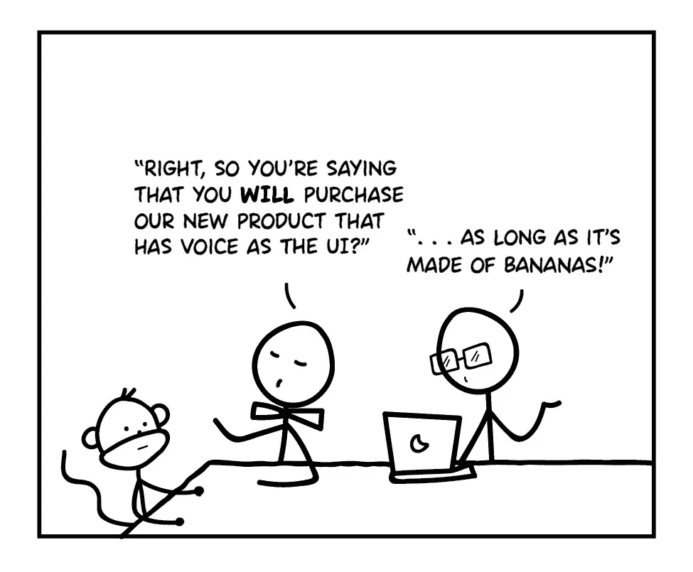

# 为什么科技公司不擅长产品反馈

> 原文：<https://medium.com/hackernoon/golden-rule-product-feedback-e4a17328616d>

Typical user survey at tech companies

*”故事讲的是一个* [*焦点小组*](https://hackernoon.com/tagged/focus-group) *为了一个新的 100 美元的电子小玩意。焦点小组的反应令人难以置信。所有的人都兴奋地谈论着新设备的特点。*

*会议结束时，主持人说“感谢您的到来。作为我们给你的礼物，你可以选择你的设备或 25 美元。”*

*大家都拿了现金。*

*调查询问你的客户的偏好、他们的净推广意图、他们的媒体习惯——与观察人们有机会时实际做什么相比，这些调查基本上毫无用处。”*

—编辑节选自[调查和焦点小组](http://sethgodin.typepad.com/seths_blog/2015/11/surveys-and-focus-groups.html)，作者 [Seth Godin](https://twitter.com/ThisIsSethsBlog)

塞思·戈丁用这个一针见血。要求用户预测自己未来行为或观点的调查绝对是徒劳的。众所周知，人类不擅长预测自己的未来行动，更不用说当用户被问及他们的意见时，会出现许多偏见。然而，今天的大多数用户调查正是这样做的。

但这并不意味着调查已经过时。你并不总是有观察所有用户行为的奢侈，有时调查是必要的。

那么，如何进行调查来避免这些陷阱呢？

**用户反馈的黄金法则:**

# 获取事实，而不是观点。

问一些问题，让你的客户分享*事实*和*经历*而不是观点。不要问“你会吗..?"。问“你最后一次是什么时候..?"或者“告诉我一次你..?"。

当你试图衡量一个潜在的[产品](https://hackernoon.com/tagged/product)或功能想法，而不是“你会用这个吗？”，问“您经常使用哪些功能？”以及“当你大量使用特性‘x’时，你具体想要完成什么？”

与用户交流是一项艰苦的工作，但这是你在打造伟大产品的道路上必须付出的代价。

> [黑客中午](http://bit.ly/Hackernoon)是黑客如何开始他们的下午。我们是 [@AMI](http://bit.ly/atAMIatAMI) 家庭的一员。我们现在[接受投稿](http://bit.ly/hackernoonsubmission)，并乐意[讨论广告&赞助](mailto:partners@amipublications.com)机会。
> 
> 如果你喜欢这个故事，我们推荐你阅读我们的[最新科技故事](http://bit.ly/hackernoonlatestt)和[趋势科技故事](https://hackernoon.com/trending)。直到下一次，不要把世界的现实想当然！

