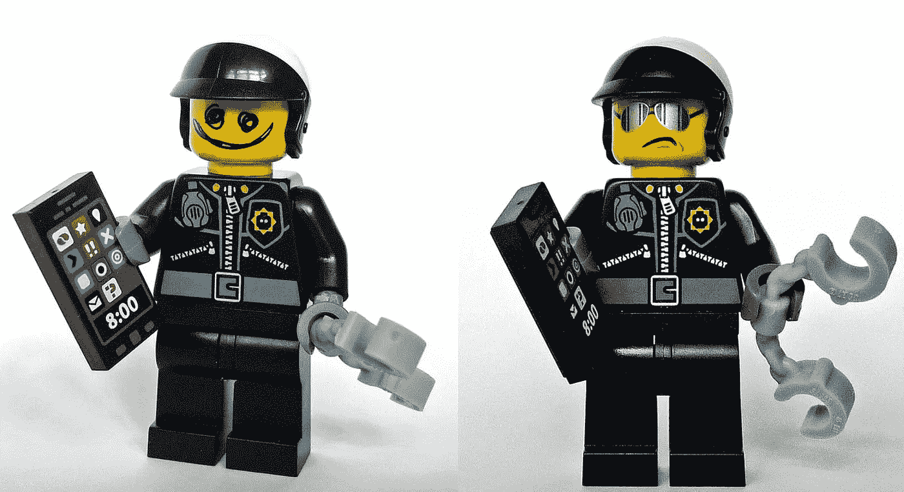

# 好的建筑/坏的建筑

> 原文：<https://medium.com/hackernoon/good-architecture-bad-architecture-1a0fc1e9cf01>

flickr photos by Trev Grant [https://flickr.com/photos/trevgrant/13733340525](https://flickr.com/photos/trevgrant/13733340525) shared under a Creative Commons (BY) license

我们这些在软件行业的人至少会同意这个行业的变化速度很快。悲观主义者可能称之为不断变化，乐观主义者可能称之为不断进化。无论哪种方式，这也意味着我们真的从来没有完全同意*好的*软件[架构](https://hackernoon.com/tagged/architecture)到底意味着什么。否则我们为什么要如此快速地改变它？昨天*好的*今天不那么*好的*，所以我们改变它。[现代网络开发是一个很好的例子](/hacker-daily/how-it-feels-to-learn-javascript-in-2016-d3a717dd577f)。

 [## 2016 年学 JavaScript 的感受

### 在撰写本文期间，没有创建任何 JavaScript 框架。

medium.com](/hacker-daily/how-it-feels-to-learn-javascript-in-2016-d3a717dd577f) 

在我们的行业中，变化是持续的，因为我们对于什么是好的架构没有达成一致。当你听到有人说某些软件架构不好时，他们到底在说什么？是他们认为它可以更好地完成任务吗？或者说它表现很好但很难维持？还是它的结构难以理解？是什么让*变坏了*？

## 迭代就是编码，编码就是迭代

我们在迭代中编写软件。这和盖房子很相似，都有一个计划，一个目标，一个最终会是什么样子的愿景。但是当我们建造一座建筑时，我们不会重复。我们绝对遵循一个计划，但我们一砖一瓦地建造它。我们永远不会重复建造一堵墙，然后拆掉它，然后用一扇窗重新建造，然后拆掉它，最后用一扇窗和一扇门重新建造。然而，在软件中，我们正是这样做的。软件没有物理表现，这为我们提供了迭代的创造性奢侈。我们可以在每次迭代中不断改进特性。

下一次迭代并不总是引入新特性。更常见的是，迭代试图改进一组现有的步骤来执行任务。缓慢但不可避免的是，旧代码在某个方面被认为是不好的，而新代码是好的(T21)。这本身就是一种断言。新代码必须是*好的*，否则我们会故意创建*坏的*代码。然而，我认为两者都不是。

## 技术债务

在我们的行业中，我们经常听到技术债务这个术语。当编码人员向后靠，埋头苦干，比较技术上的战斗伤痕时，它就被抛到了一边。技术债务被用来负面描述这样一种情况:本应实现*好的*软件架构，但一个不可避免的原因强加给自己，并要求生产*坏的*软件。推论是好的架构最终需要以更高的成本来实现。这个术语，虽然确实是一个吸引人的名字，但是太简单了，并且在我看来违背了迭代创造力的精神。从本质上来说，接受和过度应用技术债务这个术语可能最终会引导我们远离我们真正认为是好的软件。

## 世界范围什么？

自鸣得意地认为应该有严格的数据结构定义就是一个例子。为什么我们要容忍我们的数据有任何产生错误的不一致的结构？构建没有如此严格检查的软件难道不是技术债务，会让我们以后付出更多的代价吗？第一遍写好(*好)*不就好了吗？

虽然这种严格的观点听起来很棒，但它具有误导性。想想 HTML 和 XHTML 的区别。如果我们都站出来要求万维网基于 XHTML 的良好的严格性，万维网会更成功吗？或者更有可能的是，僵化——过早的优化——导致早期浏览器面临更多的不兼容性，以至于整个事情根本不会发生。

尽管 HTML 的方法很松散，但网络、互联网和电子商务蓬勃发展。全球社会没有陷入混乱的事实与这一严格观点的前提相矛盾。作为程序员，我们的文化充满了这些错误的绝对，让我们走上了好标签和坏标签的道路。几年前，如果你是一个开明的 web 开发人员，你绝不会把 HTML 和 JavaScript 混在一起。聪明、冷静、有思想的人就像带光环的天使一样徘徊在我们中间，扔下充满无限智慧的话语，宣扬陈述和逻辑分离的福音，恐吓任何敢于质疑他们智慧的人。今天…反应堆。

我不认为这很容易，但我们至少应该勇敢、客观、务实，有时勇敢地审视我们的选择，并决定出于正确的原因做出选择，不管酷孩子怎么说。我们被告知的是，技术债务实际上可能是技术资产。

软件架构没有好的或坏的之分，它就是这样。它可以也应该发展。当 Windows XP 发布的时候，你有没有听到有人谈论 Windows 1.0 有多糟糕**？*Windows XP 的到来并不会突然将以前的 Windows 版本追溯性地转变为*糟糕的*软件架构。那只是软件。*

*当然，除了 Windows Vista，那确实是非常糟糕的软件*

******

> *[黑客中午](http://bit.ly/Hackernoon)是黑客如何开始他们的下午。我们是 AMI 家庭的一员。我们现在[接受投稿](http://bit.ly/hackernoonsubmission)并乐意[讨论广告&赞助](mailto:partners@amipublications.com)机会。*
> 
> *如果你喜欢这个故事，我们推荐你阅读我们的[最新科技故事](http://bit.ly/hackernoonlatestt)和[趋势科技故事](https://hackernoon.com/trending)。直到下一次，不要把世界的现实想当然！*

**