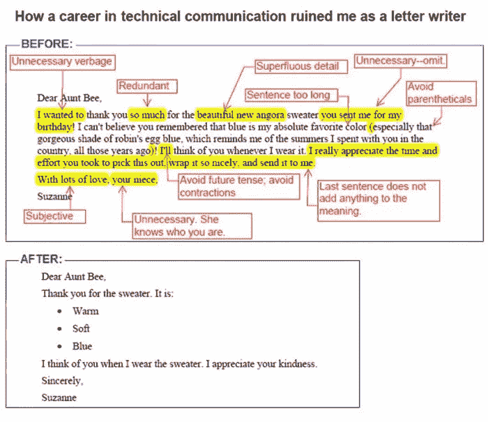
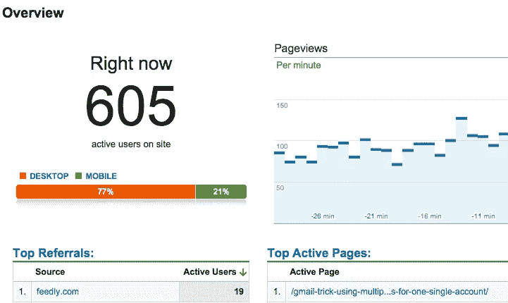

# 好的项目经理是好的作家

> 原文：<https://medium.com/hackernoon/good-pms-are-good-writers-f0964945c9d9>

Do you recognize yourself reading this?

我第一个真正的帖子是在 2014 年。

不是你在这里看到的那张，但它是一张关于 Gmail 恶作剧的傻照片。

没有火箭科学，但是嘿:它直接登上了黑客新闻的头版。一周后，我写了关于罗马尼亚总统[在脸书](https://blog.hipwerk.com/how-klaus-iohannis-passed-coca-cola-and-mcdonalds-in-less-than-6-months/)上疯传的文章，第二次成功！

我在那里，每 10 秒钟点击一次 HN 线程上的刷新按钮，同时对谷歌分析页面进行截图:

Yeeha!

但是我知道即使有 15000+[人](https://hackernoon.com/tagged/people)访问我们的网站，我也不会从中赚到钱。我知道那甚至不是我的目标。感觉继续是对的，但我不知道为什么…我停下来了。

现在，几年后，我想我明白了。

作为产品经理，你写了很多。除了像这样的文章，还有页面上的文本、行动号召、用户故事、谷歌幻灯片、表格、电子邮件。

这还不是全部。

比如你见过 [Slack 发行说明](https://slackhq.com/a-little-thing-about-release-notes-997d2e06842d?gi=44505612f2b9)有多酷吗？

那么来自首席执行官的著名信件呢，比如史蒂夫·乔布斯宣布辞职时写的那封具有历史意义的信？

还是上周的[特稿由 Medium](https://blog.medium.com/welcome-to-series-a-new-type-of-story-on-medium-bade380985c4) 发布。

以上都是写得很好的文字，有时滑稽，有时严肃，但易于阅读，信息清晰。

根据我的经验，在小团队中，通常项目经理必须完成大部分的写作。

他应该这么做！

明确地说，一个好的项目经理应该拥有那个产品/特性。她确切地知道要传达的信息应该是什么。她知道用户是如何滴答作响的。她知道好的文案是好设计的基石。

这是一个非常困难的工作，这就是为什么我认为我们都应该练习。尝试几种形式、渠道、受众。不管你写什么，继续写。

> 我甚至认为写作是经前综合症最重要的技能。

好消息是我们并不孤单。我们实际上拥有世界上最好的帮助:

> 对所有的顾客满意者，UX 人，开发者，销售和市场人员大声喊出来。你总是在那里，随时准备提供帮助，有时甚至会参与进来，完成整个工作，这让你做得非常出色。

谢谢！！👏

后来的编辑:所有的反应给我留下了深刻的印象，我写了一篇[向媒体社区](/@jurasadam/homage-to-the-medium-community-4200de15b040#.nx62v8pyn)致敬。看看吧:)

P.S .第一张图不是我的，很久以前存的，记不清出处了。如果你知道，请告诉我，我会包括它。

> [黑客中午](http://bit.ly/Hackernoon)是黑客如何开始他们的下午。我们是 [@AMI](http://bit.ly/atAMIatAMI) 家庭的一员。我们现在[接受投稿](http://bit.ly/hackernoonsubmission)并乐意[讨论广告&赞助](mailto:partners@amipublications.com)机会。
> 
> 如果你喜欢这个故事，我们推荐你阅读我们的[最新科技故事](http://bit.ly/hackernoonlatestt)和[趋势科技故事](https://hackernoon.com/trending)。直到下一次，不要把世界的现实想当然！

