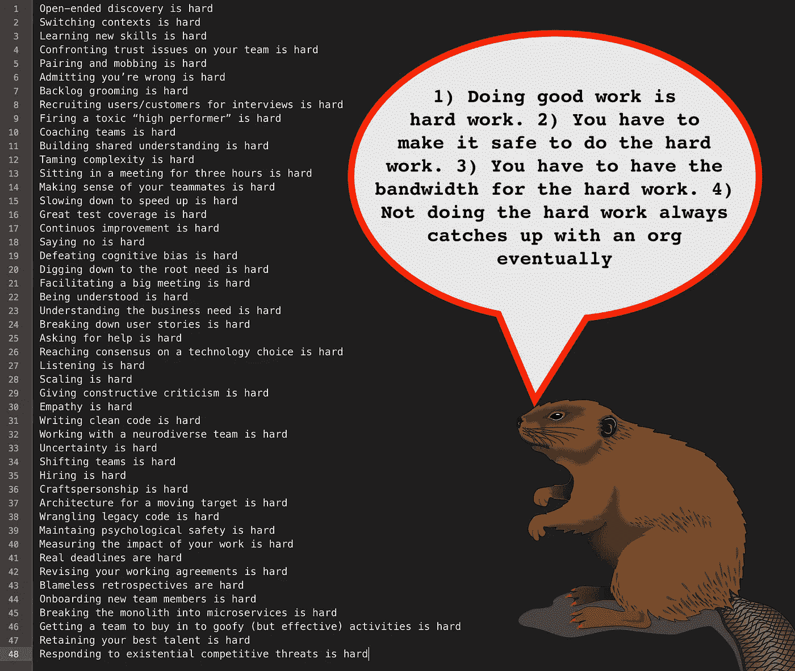

# 好的工作是艰苦的工作

> 原文：<https://medium.com/hackernoon/good-work-is-hard-work-faffb6da1371>

软件产品开发很难。

Gratuitous, free-to-use photograph of something kind of difficult looking (so Medium has an image)

做艰苦的工作需要信任和安全。没有信任和安全，个人和公司就会进入自我保护模式。在这种情况下，我们用流程取代信任，用控制取代合作。

所有公司都有问题。最好的公司优先处理最具威胁性的问题并解决它们。新的出现了，他们一直在处理。复杂性逐渐增加，他们驯服了它。每个人都相信“重要的事情会得到解决”。信守承诺(尤其是支持和尊重的承诺)。这些公司将熵拒之门外，因为如果你落后太多，你将永远无法摆脱困境。

引用伟大的格雷格·莱蒙德的话:

> “事情从来不会变得容易，你只要走得更快。

大量的持续改进只是让*有可能*去做艰苦的工作(有效的工作)和面对出现的挑战。

因为…

*   开放式发现很难
*   切换上下文很难
*   学习新技能很难
*   面对团队中的信任问题是很困难的
*   结对和围攻很难
*   承认自己错了很难
*   积压整理是困难的
*   招募用户/客户参加面试很难
*   解雇一个有毒的“高绩效者”是很难的
*   辅导团队很难
*   建立共识很难
*   驯服复杂性是困难的
*   连续三个小时开会是很难的
*   理解你的队友很难
*   减速加速是很难的
*   伟大的测试覆盖率是困难的
*   持续改进是困难的
*   说不很难
*   战胜认知偏见很难
*   挖掘根本需求是困难的
*   促成一个大型会议是很难的
*   被理解很难
*   理解业务需求很难
*   分解用户故事很难
*   寻求帮助很难
*   就技术选择达成共识很难
*   听力很难
*   缩放很难
*   给出建设性的批评很难
*   移情很难
*   编写干净的代码很难
*   和一个神经多样化的团队一起工作很难
*   不确定是很难的
*   转移团队很难
*   招聘很难
*   手艺很难
*   移动目标的架构很难
*   争论遗留代码是困难的
*   保持心理安全很难
*   衡量你工作的影响是很难的
*   真正的截止日期很难
*   修改你的工作协议很难
*   无可指责的回顾是困难的
*   新团队成员的入职很难
*   将整体分割成微服务是很难的
*   让团队接受愚蠢(但有效)的活动很难
*   留住你最好的人才很难
*   应对现存的竞争威胁很难

# 都很难！

