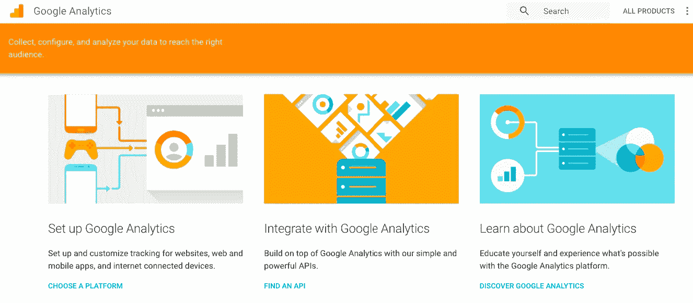

# 谷歌分析及其对人工智能初创公司的潜力

> 原文：<https://medium.com/hackernoon/google-analytics-and-the-potential-it-has-for-ai-startups-f1071f61ecfa>

## “如何充分利用谷歌分析”有超过 2700 万个结果。人们意识到他们不知道如何最大限度地利用这个神奇的分析工具。


In my opinion, you shouldn’t have the need to become an expert at a product that has mass application/usage. ([img src](https://www.techwyse.com/blog/website-analytics/how-to-become-a-google-analytics-expert-in-60-days/))

> 谷歌分析可能很难理解和剖析。

这就是这篇文章——*从我选择上面这张图片的地方——*开始的。

这是真的。“如何从谷歌分析中获得最佳/最大收益”，“如何分析谷歌分析数据”只是世界各地的人们正在搜索的众多问题中的两个。


在不同的网站上有无数这样的文章、技巧和教程，它们在你能想到的每一个分享平台上不断传播。尝试在媒体上搜索谷歌分析的故事，你会发现从*初学者指南*到*终极指南*到*释放谷歌分析的力量*的故事。

为什么话题上存在这么多文章？为什么每个人都试图帮助你更好地使用这个产品？

真的很简单。各地的营销人员和企业主不断依赖谷歌分析来了解他们的网络流量、活动表现等等。他们中许多人的问题在于不知道如何理解、发现或分析存在于不同模块和部分中的所有数据。

除了主仪表板和一些内页上提供的最基本的信息，许多营销人员通常不会使用很多信息，即使有些人使用，你也可以肯定没有企业主会使用。这正是我觉得奇怪的地方。毕竟，这是一个强大的工具，能够完全剖析你的交通信息，让你深入了解你的观众，所以你为什么不使用它呢？主要是因为，对于门外汉来说，他们没有办法以一种简单易用的方式使用这些信息。这导致讲师提供关于这个主题的 Udemy 和 Coursera 课程，博客和营销人员也就此撰写教程。不幸的是，这只是给你提供了一个变通方法，并没有提供解决方案。

## 了解企业所有者

让我们了解一下这里所说的受众。我们不是在谈论数字营销专家，他们知道关于谷歌分析、Adwords 等等的一切。我说的是企业主和其他利益相关者，他们可以(*和 do* )发现数据非常有用，但是`**are not able to**`使用谷歌分析的任何东西，除了它提供的现成的东西——就在第一页。

> 新访客、独立访客、页面浏览量、平均页面浏览量/会话、跳出率、热门页面、退出页面的百分比。

除此之外，你认为企业主还会使用任何仪表板吗？不是吧？老实说，有一半的机会，他们甚至没有使用所有这些。即使他们知道，很多时候他们也不知道该从这些数据中推断出什么，或者当趋势没有朝着有利的方向发展时，他们该怎么办！

这正是今天深度学习初创公司存在的机会所在(*，甚至对于独立开发者来说也已经存在了很长时间*)。

有两种方法去做这件事。作为一家企业，你可以考虑打造一款类似谷歌分析的产品，但要以一种更全面、更易于消费的方式呈现。一个乏味的过程，耗费太多的时间，需要大量的开发带宽，你需要从头开始，与可能是你能想象到的最大的竞争对手竞争——更糟糕的是，一个提供大部分免费服务的人。我不会推荐它。

另一条路是在谷歌分析的基础上建立一个层。使用[谷歌分析 API](https://developers.google.com/analytics/devguides/integrate/) 建立一个企业主喜欢使用的系统。



“Build on top of Google Analytics”. Google wants you to.

# 你能做什么——或者说——你应该做什么？

几乎天空就是极限。谷歌分析提供了无数对企业有价值的东西。您能为他们提供一种更简单的访问方式吗？

创建目标、自定义仪表盘、自定义提醒、受众细分、行为流、创建自定义活动及其跟踪，这些只是您可以帮助他人轻松轻松地执行的众多功能中的一部分。所以也许你能做到。

# 深度学习创业公司的机会？

开始从源源不断的海量数据中提供见解。你能帮助企业主回答问题吗？

> 为什么这周我的跳出率这么高？

当我第一次创业时，我发现了谷歌分析，我很兴奋。不过这种兴奋只持续了几天。我可以看看我的跳出率，但我完全不知道如何降低它。我不得不接受经营网站的现实——*就像税收和死亡一样，跳出率是存在的，不可避免的*。我没意见。

一天，当我注意到过去 2-3 天的跳出率比历史数据低了 30-35%时，大问题出现了。搞什么鬼！！这是怎么回事？不幸的是，我又一次毫无头绪。在接下来的 24 小时里，我花了大部分时间试图找出问题所在。如果有一个系统能告诉我两件事，我会放弃什么呢？

1.  为什么我的跳出率突然比平时高了？
2.  我能做什么来降低我的跳出率？

深度学习可以帮助回答这两个问题，而且不仅仅是实时的，甚至可能提前提醒我。谈论拥有一个主动的资源来帮助你采取预防措施！

这只是一个特殊的例子。有无数种方法可以帮助企业主理解 Google Analytics 提供给他们的大量数据。例如，你可以为我提供可操作的情报，比如我应该在 Adwords 或脸书上开展什么样的活动，我应该制作什么样的内容作为我的内容策略的一部分，我应该发送什么样的电子邮件等等。

## 为什么我认为这很重要？

最近，我一直在思考如何提高我们日常生活中使用的产品和系统的可用性，这些产品为我们提供的潜力，以及我们如何确保使用这些产品的人能够充分利用这些系统。谷歌分析是全球数百万企业主使用的产品之一。它所能提供的如此之多，而使用的却如此之少；这就是整个思考过程的开始。

毫无疑问，像这样的系统将为像我这样的利益相关者带来很多透明度，如果他们能够从我的行为中学习并帮助我获得有意义的*可操作的*见解，我就可以专注于事情的业务方面，而不管我是否有一个强大的分析师团队来筛选我的业务产生的数据。

我知道这很自私。但是如果这样的系统对我有用，那么它们对外面的许多人也有用！

## 如果你是这个领域的创业者，该怎么做

如果你在这个领域有产品，给我发一封[邮件](mailto:mail@abyshake.com)。我通常不怎么投资，但如果你在寻找天使投资< 50k，我也许能帮上忙。干杯！

# 今天到此为止；明天见！


```
I am Abhishek. I am here... there.... Everywhere...[**Medium**](/@abyshake) **|** [**Twitter**](http://twitter.com/@abyshake) **|** [**Facebook**](http://facebook.com/abyshake) **|** [**Quora**](http://bit.ly/abyshake) **|** [**LinkedIn**](http://in.linkedin.com/in/abyshake) **|** [**E-mail**](mailto:mail@abyshake.com)
```

[](https://upscri.be/a5ccb9/)

Click here to join the mailing list.