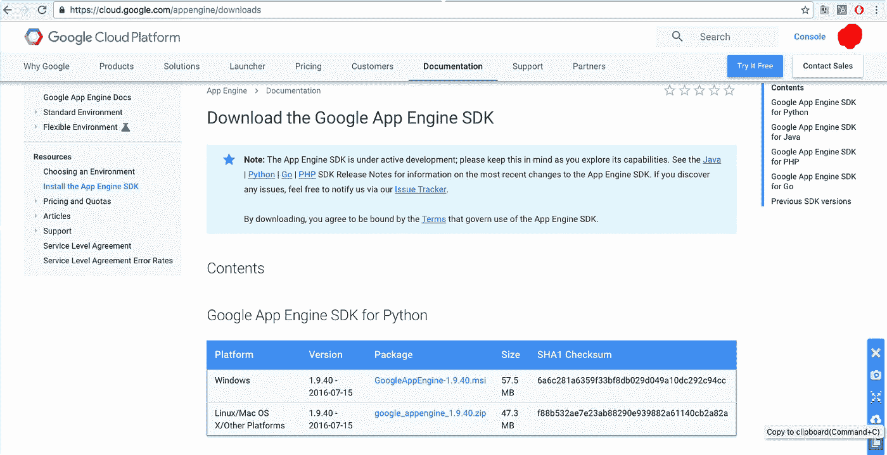
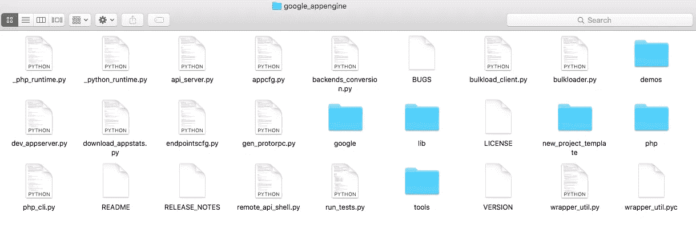
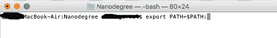
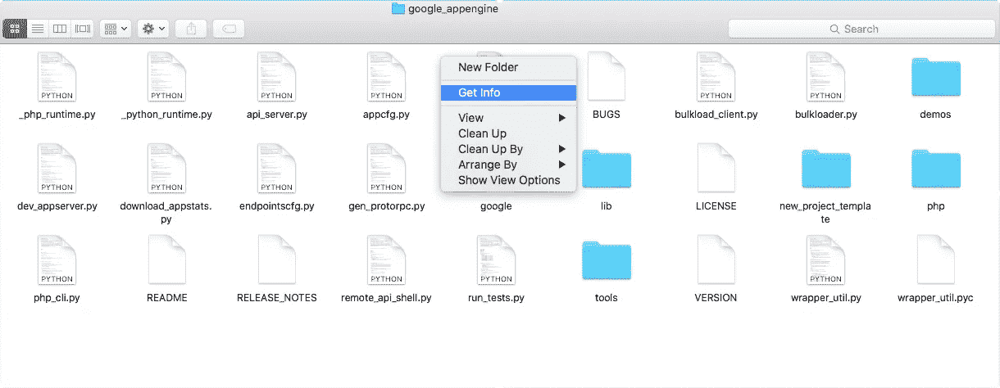
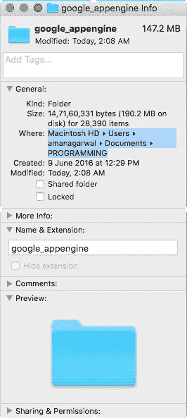
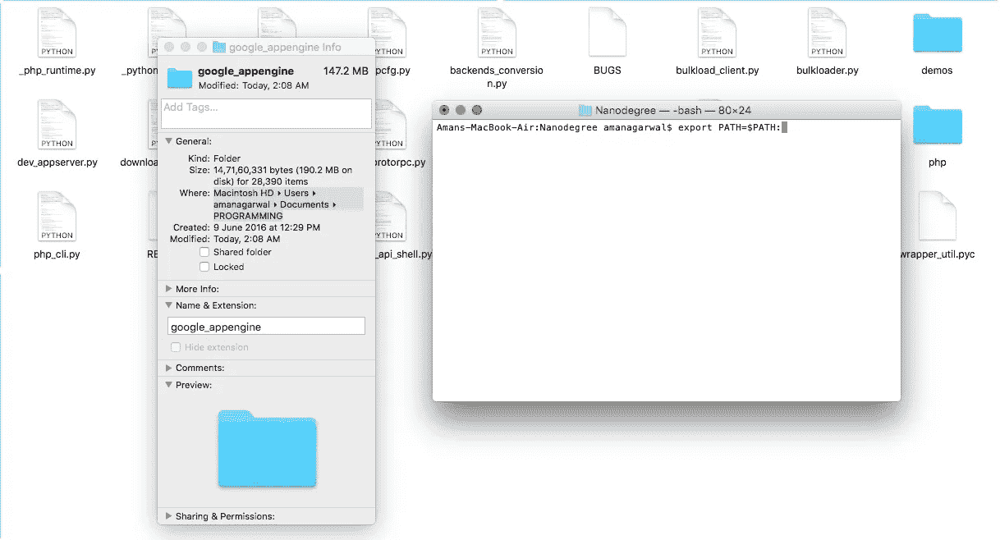
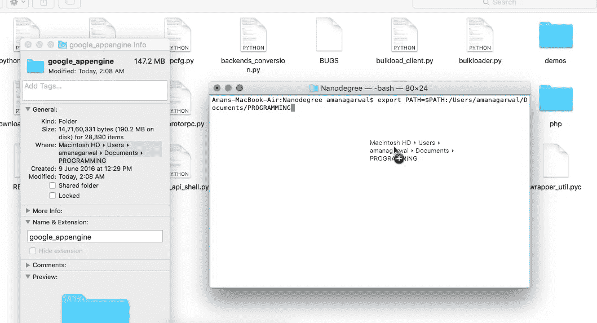
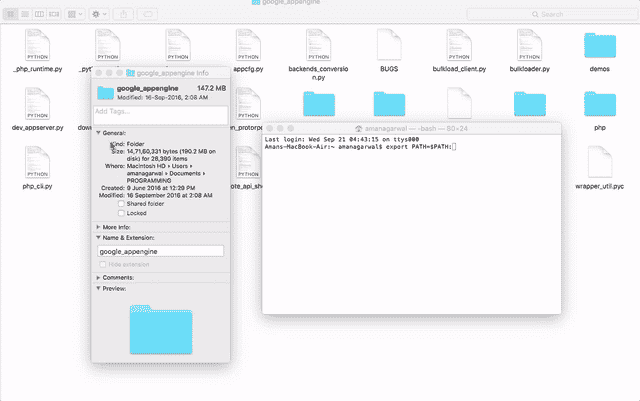
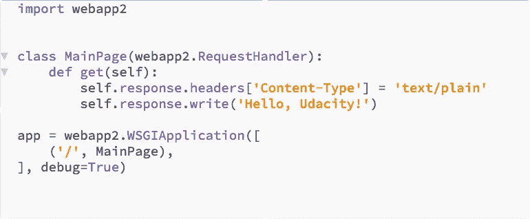

# 谷歌应用引擎:像我这样的傻瓜快速教程

> 原文：<https://medium.com/hackernoon/google-app-engine-quick-tutorial-for-dummies-like-me-5f75a6279f9d>

(适用于 Mac 用户)

我是一名工程师。 ***我最讨厌我在网上找到的*** 的文档。我猜开发人员为彼此写文档，这是一种很容易理解的情绪。我们使用对我们俱乐部有意义的行话。但无意中，这种超级技术语言往往会将刚刚参加在线课程或阅读一本书、只想完成工作的初学者拒之门外。

我在参加 Udacity 的全栈 Web 开发人员 Nanodegree 时，在尝试设置**谷歌应用引擎**时也有类似的经历。Udacity 强调不要把所有东西都灌输给学生(这样他们才能成为真正的开发者)，所以他们只是告诉我去谷歌云网站，并指向我设置谷歌应用引擎所需的文档。过了一会儿，我疯了。我以前从未真正使用命令行来做这些事情。我花了 3-4 天时间尝试不同的东西。论坛上的人都很友好，我和一个同学聊了很久，他真的试图帮我建立这个论坛，但最后我还是放弃了，因为我为浪费了这个友好的人的时间感到抱歉。

最后，通过在网上拼凑材料，并一次又一次地尝试，我自己找到了这个东西。这是一个给普通人和普通人以下的详细教程，解释了如何设置谷歌应用引擎。为了简洁起见，我称它为“GAE”。

## 这是一个给普通人和普通人以下的详细教程，解释了如何设置谷歌应用引擎。

1.  下载谷歌应用引擎。叫做“SDK”，基本上是一个 zip 文件，你可以在这里找到。下面是截图:

I use Python, so I downloaded the google_appengine_1.9.40.zip file for Linux/Mac OS X

2.拉开那该死的拉链。你会得到一个名为“google_appengine”的文件夹，其中包含如下文件:

Inside the unzipped “google_appengine” folder

3.现在打开终端，您可以在应用程序中找到它。

4.键入以下内容，与我在这里写的完全一样:

> 导出路径=$PATH:

这只是命令的一半，让它像这样未完成。不要点击或按下任何按钮，保持原样。

Yep, that’s right

5.打开 google_appengine 文件夹。是的，没错，之前解压的文件夹。打开后，右键单击(或双击或无论你做什么)，并点击“获取信息”。

Yo, see that?

6.您将看到文件夹位置的路径。单击并拖动鼠标来“选择”它。它应该是这样的:

Select the path with your mouse.

7.在另一个窗口中再次打开您的终端。它应该有一个未完成的"**导出路径=$PATH:** "在那里。现在，您应该像这样打开两个窗口:

8.在文件夹属性框中拖动选中的路径(你看到的是 Machintosh HD > Users > blah blah)，把它拖到屏幕上，放到终端中那个未完成的命令的末尾。

You know it took me over half an hour to figure out how to take this screenshot? Including the cursor in a screenshot while DRAGGING a line of text between TWO different windows?

9.好吧！现在你将看到整个道路直到尽头。现在键入 **/google_appengine** ，如果它不在那里的话。

10.按键盘上的回车键！

***下面是展示上述动作的 GIF 图。记得这篇文章是给像我这样的傻瓜写的吗？***

Now you’ll never have to ask again how to copy-drag a path onto the Terminal.

11.现在，您的*路径*已经被设置为包含 google_appengine 中的文件。我真的不知道这他妈的是什么意思，但现在你已经设置好了，可以开始部署应用程序了。

12.你现在需要的第一件事，是你将要部署的应用程序(这就是重点，为什么我们要摆弄谷歌应用引擎，而不是看网飞的马可波罗，对吗？).可部署的应用程序是具有处理 http 请求的代码的程序。因此，它将有函数和复杂的程序来处理对它的 GET 和 POST 请求。您的小 [Python](https://hackernoon.com/tagged/python) 程序，无论它可能多么整洁和令人敬畏，在您可以使用 GAE 将它放入浏览器之前，都需要有这样的代码。

This is the kind of code that your deployable Python file should have. See the webapp2 and “RequestHandler” and shit?

如果你的电脑上有这样一个应用程序(基本上是一个文件夹，比如说 ***X*** ，有一个 python 文件和一个 *app.yaml* 文件)，它应该是这样的:

This little “Hello World” application is a folder with both a python file (main.py) and an app.yaml file.

13.在您的终端上写下:

> dev_appserver.py<path to="" the="" folder="" x=""></path>

等等，我说的<path to="" the="" folder="" x="">是什么意思？你还记得我们如何找到 google_appengine 文件夹的路径吗？这里也一样。转到包含 python 文件和 app.yaml 文件的文件夹 X，使用“Get Info”找到该文件夹的路径。将路径拖放到这里。</path>

按回车键！您应该看到终端开始工作，吐出几行，yada yada yada，然后最终显示它已经在 localhost:8000 等处设置了一个管理员。嗯，这意味着你可以在你的网络浏览器中进入[***http://localhost:8080***](http://localhost:8080)，看看你的应用程序在运行！

## 我们已经建立了谷歌应用引擎。其余的(如何为可以在其上部署的 web 应用程序编写代码)，您可以在其他地方学习。如 [Udacity](http://udacity.com) 。

好吧，你走吧！

你愿意和我保持联系吗？我不把它作为一个可以分享链接的时事通讯，而是作为一个双向交流的渠道，通过它我可以听到你的故事和想法:

> [黑客中午](http://bit.ly/Hackernoon)是黑客如何开始他们的下午。我们是 [@AMI](http://bit.ly/atAMIatAMI) 家庭的一员。我们现在[接受投稿](http://bit.ly/hackernoonsubmission)，并乐意[讨论广告&赞助](mailto:partners@amipublications.com)机会。
> 
> 如果你喜欢这个故事，我们推荐你阅读我们的[最新科技故事](http://bit.ly/hackernoonlatestt)和[趋势科技故事](https://hackernoon.com/trending)。直到下一次，不要把世界的现实想当然！

