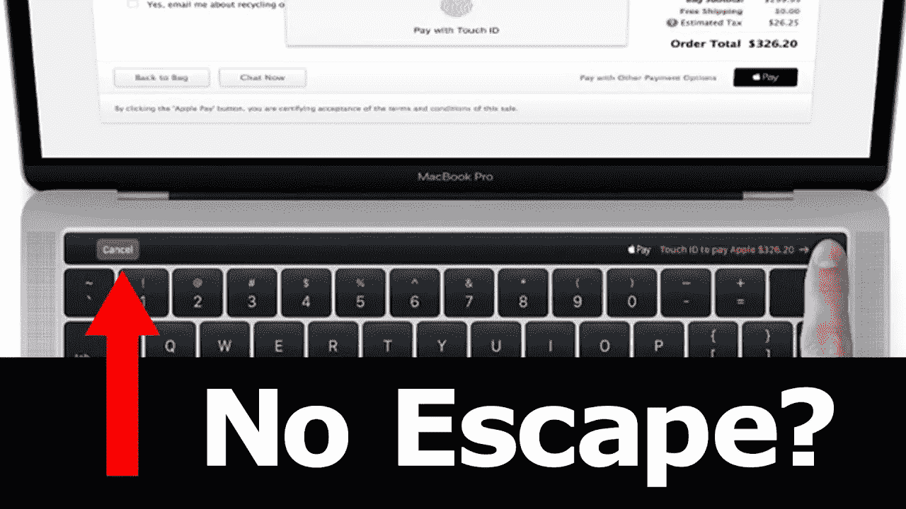
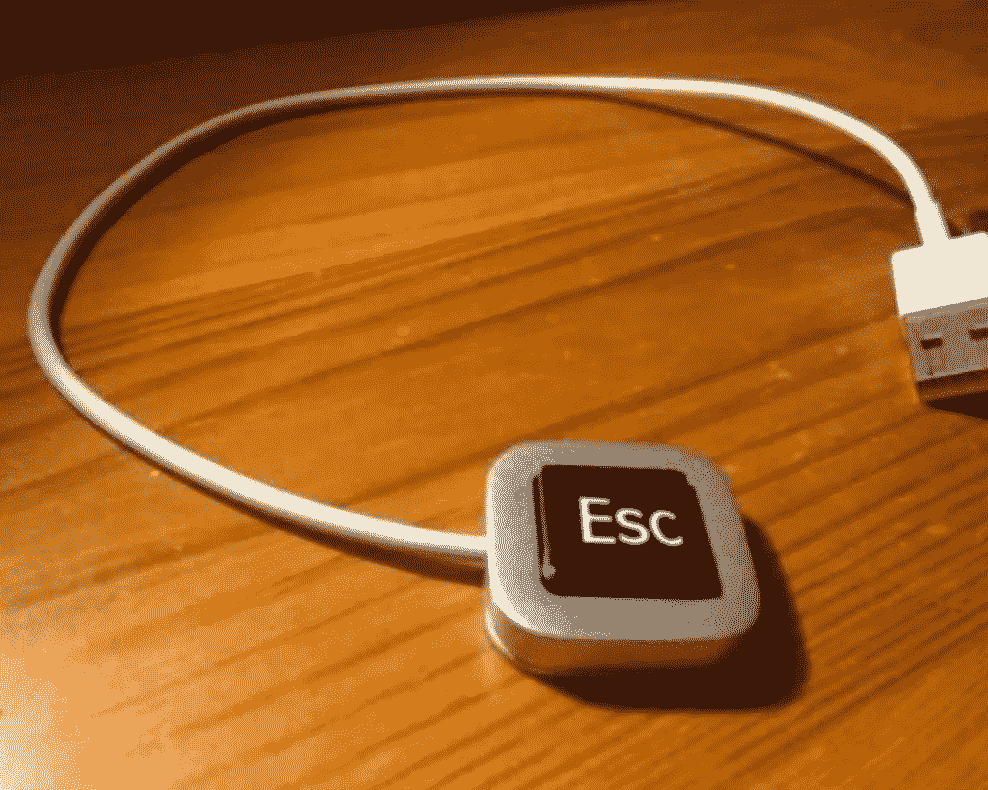
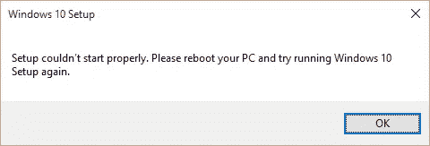

# 谷歌，你在听吗？

> 原文：<https://medium.com/hackernoon/google-are-you-listening-f3a7d26d6f62>

十多年来，我一直是苹果 Macbook Pro (MBP)的快乐用户。苹果 MBP 是一个了不起的产品。它是为软件工程师量身定做的。在过去的十年里，MBP 一直是笔记本电脑发展的黄金标准。

**苹果正在疏远开发者**

新款 Macbook Pro 没有 ESC 键。作为 vim 和 bash 的重度用户，ESC 键对我来说很重要。在苹果的新 Touch bar 中拥有平坦的触摸区域永远无法取代物理键的重要敏感触感，尤其是像 ESC 键这样重要的键。更糟糕的是，HDMI、USB、Thunderbolt 端口和 Magsafe 连接器等重要的物理端口都不见了。最重要的是，我在硬件方面也没有任何改进。

Touchbar 是唯一的附加物，价格昂贵。是的，这很奇特，但是知道按什么是上下文敏感的。这不仅会增加工作量，还会扰乱大多数人的工作流程。似乎苹果已经决定抛弃 MacBook 用户，只专注于 iPhone。

苹果已经停产了 Mac 显示器。Mac 显示器不是视网膜分辨率，但它可能是我很长时间以来使用的最好的显示器。它确实是一款拥有很多快乐用户的好产品，但是苹果停止了它。为什么？我一点也不知道。

**窗户能填补空白吗？**

绝对不行！微软试图通过在 Windows 10 中添加原生 linux 支持等功能(Ubuntu repository 的 Linux 实用程序在 Windows 中原生运行)来吸引开发者回到 Windows。然而，微软真正的客户是 IT 管理员。IT 人员喜欢在我做重要工作时重启我的 windows 机器。这是完全不能接受的。

硬件方面，Surface 获得了好评。看起来还行。我认为 2013 MBP 仍然是一个比 Surface 更好的产品。

根据我使用 Windows 的经验，每次更新都会降低电脑速度。此外，其容易碎片化的文件系统往往会影响性能。受攻击最严重的操作系统，要求我安装一个消耗性能的反病毒软件。

我使用的大部分软件都是开源的。为什么操作系统会有所不同？

**是什么让苹果 Macbook Pro 变得伟大？**

让我们看看是什么让之前的苹果 MBP 对开发如此重要。

**Unix**

苹果 Mac OS X 是 BSD unix 的衍生产品。因此大多数 unix 实用程序都是本机可用的。因此，所有 GNU 软件都可以在 Mac OS X 上编译和安装。SSH、Bash、Python、NodeJS、Perl、Make 和 GCC 等等。

**包管理器**

我个人使用“brew”来安装我需要的软件。多半是因为体验和 Linux 差不多。

**清理用户界面**

Mac 有 mission control、多个桌面、手势、Dock、App Store 等。DMG 文件有助于在不安装的情况下运行软件，这使得它在我尝试新事物时很有用。在 Mac 中安装卸载 app 就像复制删除一个文件一样简单；非常优雅的方法。

**更新**

Mac OS X 的每个新版本都显著增强了性能，并且升级是无缝的。苹果为 5 年以上的旧 MAC 提供软件更新。因此，一台 Macbook 至少可以用 5 年；物超所值。

**硬件**

伟大的触控板！没有什么能与 mac 触控板相提并论。我认为它比老鼠好。这是一个真正的创新，仍然是竞争对手无法比拟的。

Mac 多年来一直使用背光键盘，在黑暗中工作时非常方便。键盘手感很棒，大小合适，而且我觉得噪音小一些。视网膜屏挺好的。我认为其他笔记本电脑正在赶上视网膜分辨率。Magsafe 电源适配器、facetime 摄像头、电池寿命和 thunderbolt 是 MacBook 真正伟大的其他因素。

*除了 Macbook，仍然没有笔记本电脑可以用一个手指打开。*

我的 2013 款 MacBook Pro 在使用 3 年后仍然非常好用，比市场上大多数笔记本电脑都要好。我有一辆 2006 年的老款 MBP，虽然还能用，但速度慢了。

**开发者需要什么？**

*开发人员需要功能齐全的命令行和合适的 GUI 程序。当然，需要强大的 CPU 和大量的内存。好的 GPU 也不错！*

Mac 有命令行工具，伟大的图形用户界面程序和硬件。Windows 有体面的图形用户界面程序，基本的命令行和体面的硬件。Linux 有很棒的命令行，一般的 GUI 程序和不错的硬件。对于 windows 和 Linux，硬件是相同的。

**有替代方案吗？**

当然有。这将是一台 Linux 笔记本电脑。

然而，没有一个 Linux 发行版有好的 GUI 程序，除了 Android。Android 有很棒的 GUI 和应用程序。但是 Android 只在移动设备上运行，缺乏开发工具。

Linux 有很棒的开发工具。所有的语言、工具、框架和库都是在 Linux 中开发和测试的。移动和云运行在 Linux 上。

将 Playstore 的 **App 生态系统**和 Debian 的 **GNU 生态系统**放在 Linux 内核 (UNIX)之上，在技术上是可行的。

**PC 硬件上能支持 Android 吗？**

如果 Android 在 PC (x86_64)硬件上移植和支持，我认为它直接解决了一个开发者的需求。对于今天的开发人员来说，Android 笔记本电脑将是一款杀手级产品。

*想想一台成熟的* ***Linux 笔记本电脑，搭载 Android 应用、Linux 内核和 GNU 实用程序*** *。类似于谷歌 Pixel Phone，但这是一款为开发者量身定制的 Linux 笔记本电脑。那太棒了！*

**谷歌，希望你在听！**

> [黑客中午](http://bit.ly/Hackernoon)是黑客如何开始他们的下午。我们是阿妹家庭的一员。我们现在[接受投稿](http://bit.ly/hackernoonsubmission)并乐意[讨论广告&赞助](mailto:partners@amipublications.com)机会。
> 
> 如果你喜欢这个故事，我们推荐你阅读我们的[最新科技故事](http://bit.ly/hackernoonlatestt)和[趋势科技故事](https://hackernoon.com/trending)。直到下一次，不要把世界的现实想当然！

