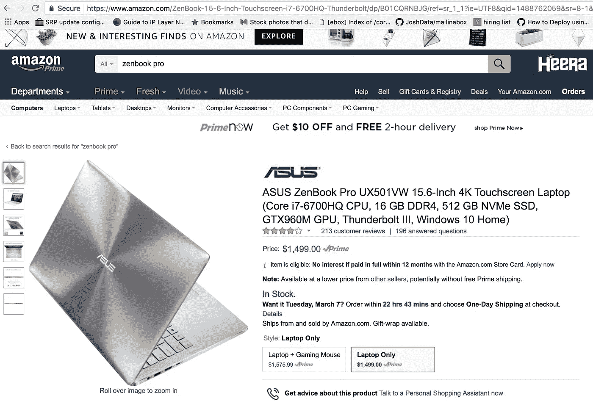
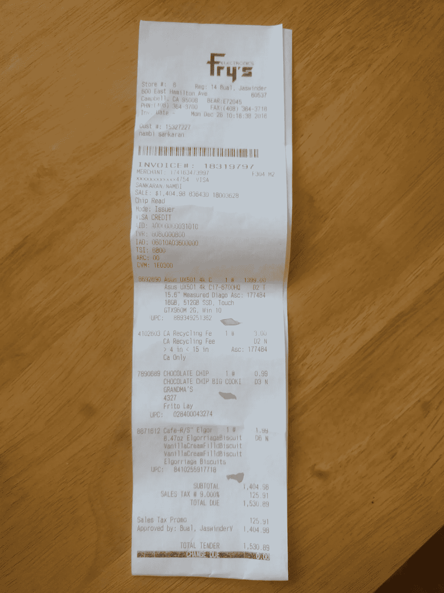
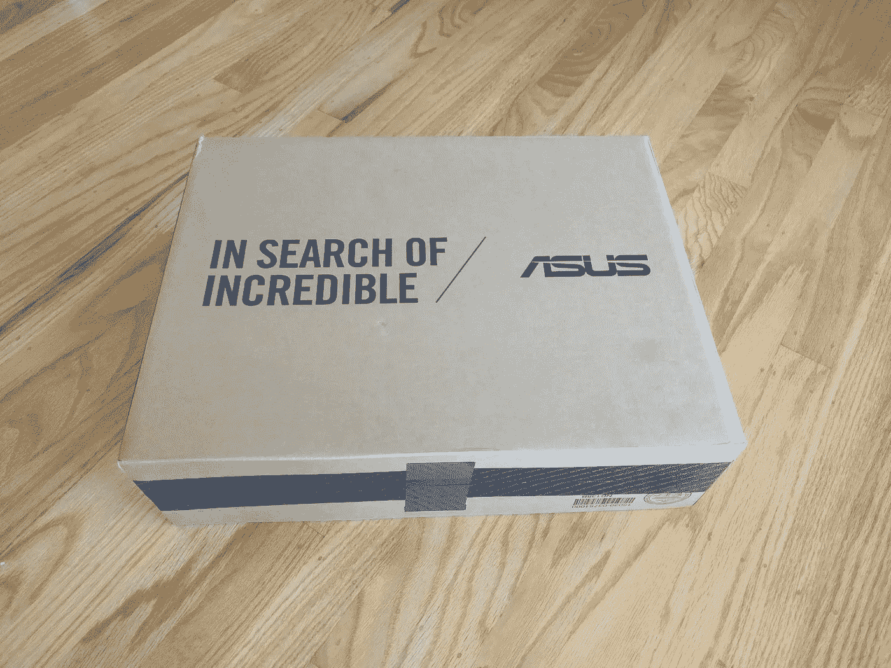
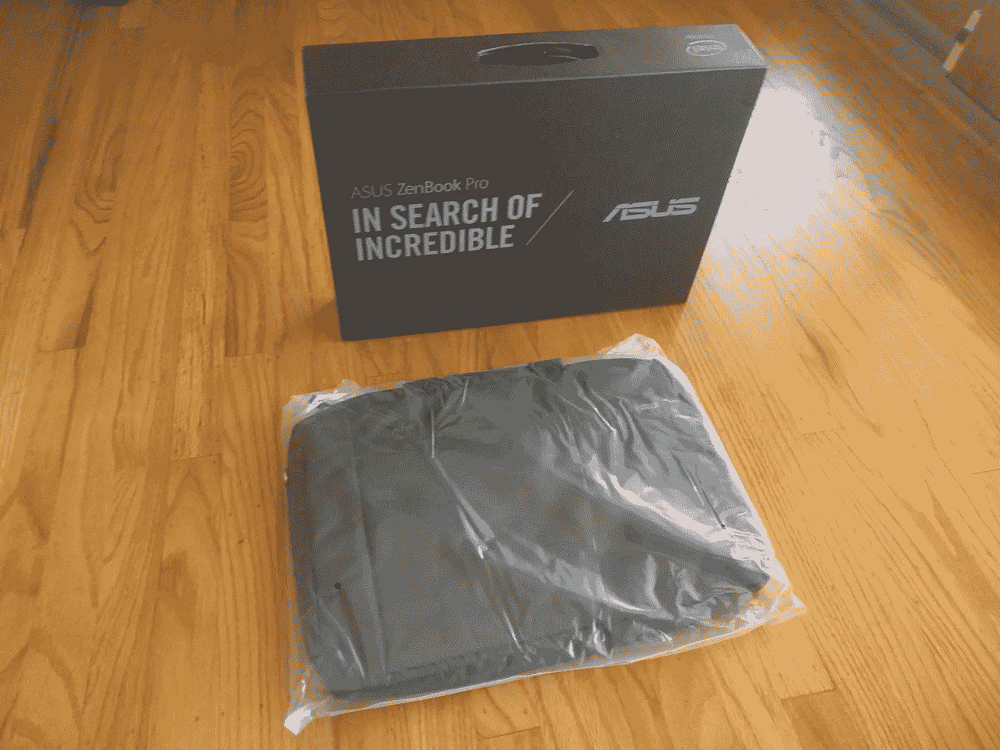
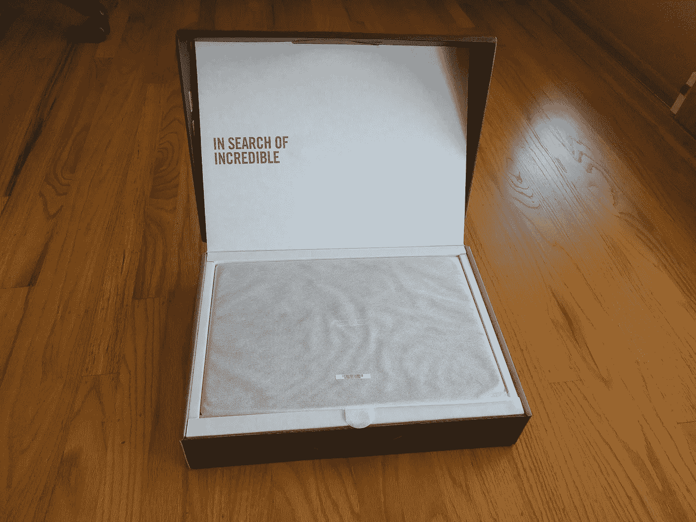
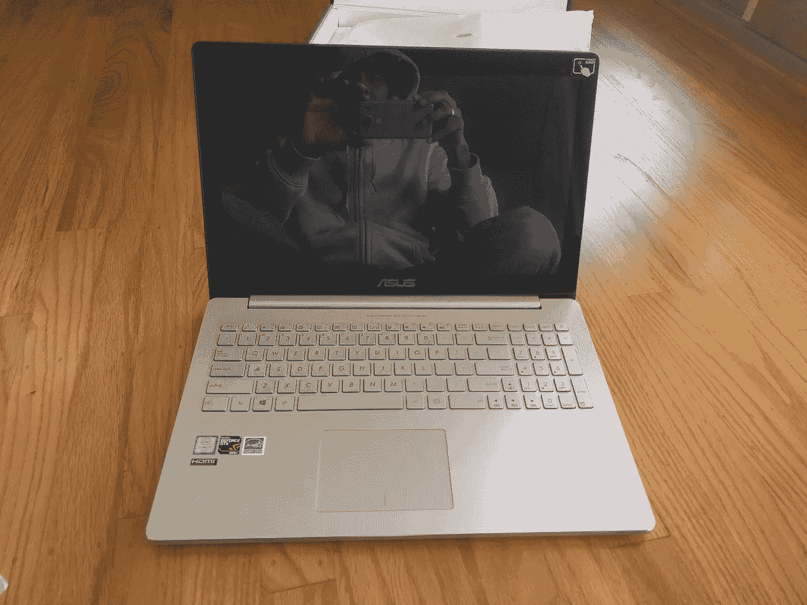
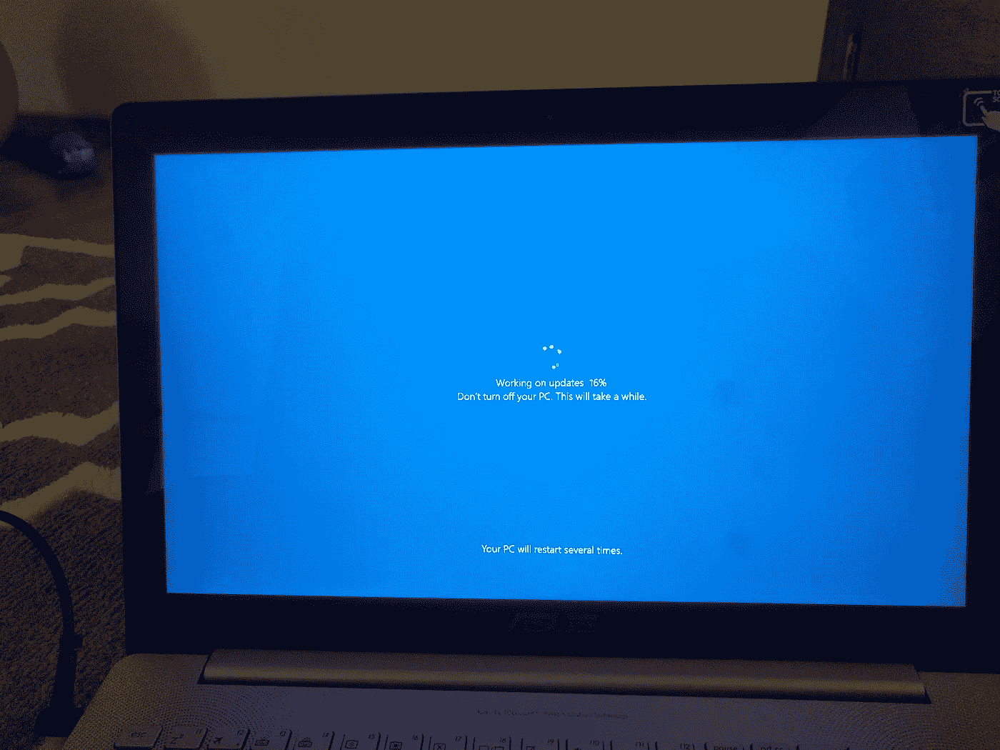
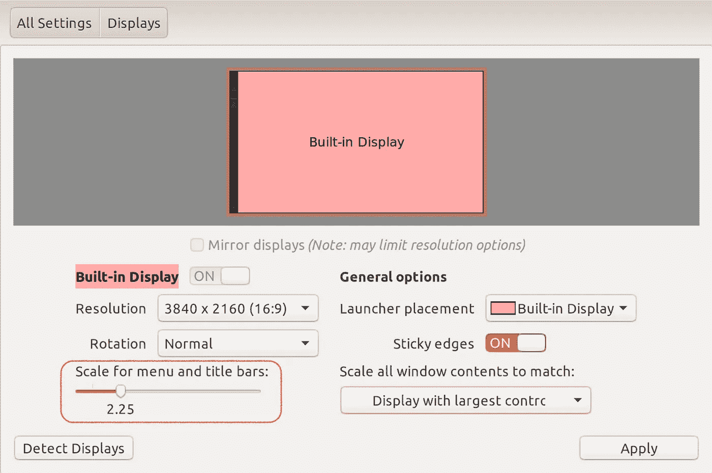
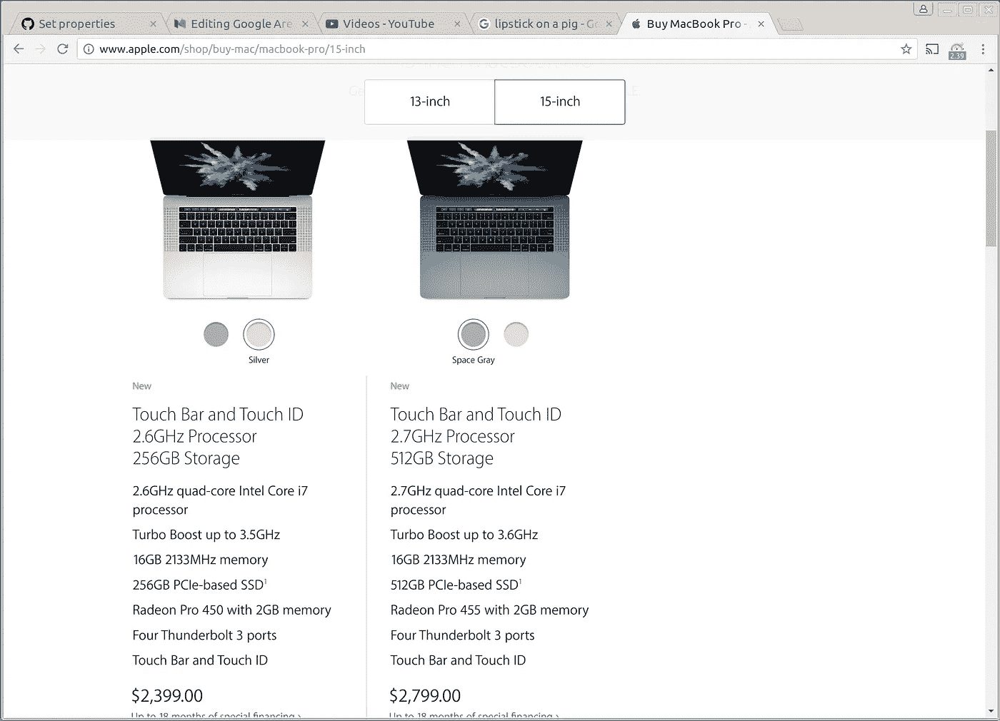

# 谷歌你在听吗？第二部分

> 原文：<https://medium.com/hackernoon/google-are-you-listening-part-ii-160cb4149ab7>

这是对谷歌的跟进[你在听吗？](https://hackernoon.com/google-are-you-listening-f3a7d26d6f62#.x1u57q3h3)在这篇文章中，我将解释如何构建一台 Linux 笔记本电脑作为 Macbook Pro 的替代品。

这是一个很长的帖子。

**TL；DR；**

*   对我的 *MacBook Pro* 替换笔记本电脑的要求
*   购物和“开放”体验。
*   预装 Windows 10 操作系统的体验
*   Ubuntu Linux 安装和使用 Linux 与 Mac 的比较

**要求**

笔记本电脑应该比 Macbook Pro 有更好的硬件和更低的价格。

*   8 核英特尔 CPU
*   至少 16 GB 内存
*   NVIDIA GPU (MacBook Pro 附带镭龙 GPU)
*   4K 显示器(MacBook Pro 没有 4K)
*   轨迹板
*   网络摄像头、扬声器、麦克风
*   背光键盘
*   定价约 1500 美元
*   Ubuntu 认证(或至少有可用的驱动程序)

**搜索**

最初我搜索“linux 笔记本电脑”，然后我用“最佳 linux 笔记本电脑 nvidia”来细化搜索。该查询返回了几个比较网站。我浏览了一些网站来寻找合适的。

 [## 最佳 Ubuntu 笔记本电脑:2016 年 9 大最佳笔记本电脑

### 这个我就开门见山了。找到最好的 Ubuntu 笔记本电脑并不容易——即使找到一台好的笔记本电脑…

picknotebook.com](http://picknotebook.com/blog/best-ubuntu-laptop/)  [## 2017 年最佳 Linux 笔记本电脑:最新的戴尔 XPS 13 | ZDNet

### 如果您仍然认为笔记本电脑是普通的，它们之间的唯一区别是它们的价格标签，戴尔邀请您…

www.zdnet.com](http://www.zdnet.com/article/2017s-best-linux-laptop-the-latest-dell-xps-13/) 

我浏览了比这些更多的网站。

**决策制定**

戴尔和联想的 Thinkpads 在 Linux 上都有很好的支持。不过我喜欢的是*华硕 ZenBook Pro* 。

 [## 华硕 ZenBook Pro UX501VW |笔记本电脑|华硕美国

### 华硕，笔记本，卓越的移动性，UX501 系列，ZenBook Pro

www.asus.com](https://www.asus.com/us/Notebooks/ASUS-ZenBook-Pro-UX501VW/) 

**我为什么喜欢华硕 ZenBook Pro？**

在此阅读完整对比[。](http://www.digitaltrends.com/computing/macbook-pro-15-inch-2015-vs-asus-zenbook-pro-ux501/)

**购买**

Zenbook 在亚马逊的售价为 1499 美元。

Zenbook screenshot from Amazon

然而，最好的交易是由 Fry's 提供的 1400 美元。于是，我去 Fry 的，购买了华硕 Zenbook。

Fry’s Receipt

**开场…**

Zenbook 有一个非常漂亮的包装。

Unopened Zenbook From FRY’s

该包包含一个 Zenbook 和手提袋。*苹果不提供 Macbook 的手提袋。*

Zenbook Computer Bag

Zenbook nicely packed inside the box

Zenbook Pro has a very nice finish. Looks really good.

**设置**

Zenbook 预装了 Windows 10。令我惊讶的是，安装 Windows 很容易。Windows 10 安装过程简短而简单。👏😁

第一次安装后，Windows 10 进入更新模式。

Windows 10 updates itself

在更新过程中，我可以盯着漂亮的蓝色屏幕。😴💤💤💤更新花了将近一个小时才完成。😅😤😡

**启动**

大惊喜。Windows 10 启动快。我可以在不到一分钟的时间内启动 windows 10。

**关机**

尽管启动速度更快，关闭速度却变得更慢。有时需要几分钟才能关闭。看起来 *windows 更新进程*从启动转移到关闭。

Windows shutdown still displays “Getting Windows Ready”

看来微软把进程移到“关闭”后忘记更新“更新”屏幕的标题了。标题仍然是“让 Windows 做好准备”。

**Windows 体验**

*   Windows 10 在不到 60 秒的时间内启动👍
*   新的用户界面是光滑的👍
*   触摸屏很不错👍
*   触控板太慢👎
*   无法微调触摸板。Windows 10 没有提供足够的控件👎
*   预装的“试用软件”。微软预装了传统的 word、excel 和 power point 应用程序。但是要使用它们，我需要购买许可证。非常感谢，但是，我一点也不在乎。谷歌文档比微软 office 好，而且协作更容易。👎
*   Windows 10 的很多部分还没有更新。传统的 windows 组件在 4k 上看起来不太好，在 Windows 10 上也不流畅。这就产生了一种混杂的体验。👎
*   [Windows Subsystem for Linux](https://blogs.msdn.microsoft.com/wsl/)(WSL)就是一个很好的尝试。安装程序没有按描述运行。但是我能够从 Windows 打开 BASH shell，并且能够在 BASH 中执行一些命令。👌😐🆗
*   关机速度较慢

*Windows 10 比早期版本更好。所以，干得好，微软。但是它仍然需要工作。*

Windows 10 is incomplete. Sorry windows folks, more work needs to be done.

**Linux**

即使 Windows 10 更好，WSL 对 Windows 用户来说是一个巨大的进步，为什么要在 Windows 中运行 Linux 命令呢？为什么不是合适的 Linux？所以，我继续在 Zenbook 上安装 Ubuntu Linux。

**USB Live 上的 Ubuntu Linux**

创建用于引导 Linux 的实时 USB 驱动器[https://www . Ubuntu . com/download/desktop/create-a-USB-stick-on-windows](https://www.ubuntu.com/download/desktop/create-a-usb-stick-on-windows)。使用实时 USB 驱动器启动 Linux 很容易，所有的东西都在运行中。

然后跟着[https://Marc Lewis . com/2016/02/21/installing-ubuntu-on-the-ASUS-Zen book-pro-UX 501 VW/](https://marclewis.com/2016/02/21/installing-ubuntu-on-the-asus-zenbook-pro-ux501vw/)安装 Ubuntu。这些步骤很容易遵循。

**在 Ubuntu 桌面中启用显示缩放**

巨大的 4k 显示屏很难在不缩放的情况下使用屏幕。幸运的是，缩放是可以配置的。

Adjust the “Scale menu” for best experience

**启用触摸板驱动程序**

当我用实时 USB 试用 Ubuntu 时，触摸板工作得很顺畅。但是，触摸板在安装后无法正常工作。我可以移动光标，但手势和点击不起作用。

在阅读了几篇 stackoverflow 帖子后，看来正确的 Linux 内核可能会成功。所以，我尝试了不同的 Linux 内核。在 Linux 中改变内核是很容易的。

Installing a kernel in Linux

当我安装了*4 . 6 . 0–040600-generic*内核后，触摸板开始完全工作。

**调整触摸板和鼠标以缩放 4K 显示**

默认的缩放比例是 1，这使得使用鼠标和触摸板非常慢。但是配置非常简单，但是找到正确的命令和配置需要时间。

首先，使用 *xinput* 命令显示当前设置。它显示连接的设备及其 id。

Display the X input settings

然后，显示特定设备的设置。例如显示触摸板的设置，执行 *xinput* 的“*列表-道具*选项。

最后，更改触摸板的设置。我尝试了各种设置，以获得最终的参数集。以下是我喜欢的鼠标和触摸板的配置列表。

Final set-properties script for mouse and touch-pad.

**安装 NVIDIA 驱动程序**

找到了一些解释安装过程的博客，并继续跟进。安装非常简单。

 [## 如何通过 PPA 在 Ubuntu 或 Linux Mint 中安装最新的 Nvidia 驱动

### 在 Ubuntu(或 Linux Mint)中升级到最新版本的 Nvidia 专有驱动程序是相当复杂的…

www.webupd8.org](http://www.webupd8.org/2016/06/how-to-install-latest-nvidia-drivers-in.html)  [## 如何在 Ubuntu 16.04 Xenial Xerus 上安装最新的 Nvidia 驱动

### 下面的教程将指导你在 Ubuntu 16.04 Xenial 上安装 VGA NVIDIA 驱动程序的所有步骤…

linuxconfig.org](https://linuxconfig.org/how-to-install-the-latest-nvidia-drivers-on-ubuntu-16-04-xenial-xerus) 

**华硕 Zenbook Linux 体验**

*   安装费时费力，但并不太复杂。但绝对不建议非技术用户使用。鉴于 Linux 是由志愿者运行的自由软件，这太棒了。👍🆗
*   Ubuntu UI 还可以。同样没有抱怨，因为它是免费的，就像在 T21 啤酒一样免费。🆗
*   大多数驱动程序都是开箱即用的，除了 Nvidia 是闭源的。开箱即用的 4K 显示器、触摸屏、鼠标、网络摄像头、麦克风、摄像头、USB、HDMI 和蓝牙。👍
*   触摸板体验堪比 Mac。尽管它需要手动配置。👍
*   如果你喜欢运行任何需要通过 CUDA SDK 访问 GPU 的机器学习程序，Nvidia 是一个额外的奖励。👍
*   当然，Linux 的开发环境远比 Mac 或 Windows 优越。👍

**Ubuntu Linux 软件体验**

*   我使用 intelliJ 进行开发。已安装最新的 IntelliJ，没有问题。👍
*   诸如 Java、Python、NodeJs 等软件开发套件可以作为一等公民使用。没问题。👍
*   网络浏览器。我用 Chrome 和 Firefox。两者在 Linux 中都有。另外，Linux 还有其他图形和命令行浏览器。👍
*   电子邮件、日历、文档、电子表格和演示文稿。我个人用谷歌，工作用 Office 365。两者都是云+浏览器应用。Office 365 比 Mac 中的原生版本要好。没问题。🆗
*   信息传递。我大部分时间使用 Slack，它是一个原生程序。没问题。👍
*   投屏软件。我在 mac 上使用 Quicktime。我在 Linux 上试了几个像 kazam 这样的，效果还可以，但是有一些 bug。但至少我能在他们周围工作。🆗
*   图像编辑软件。我在 Mac 中使用*预览*进行简单的图像操作。我用过 gimp，堪比 photoshop。我仍然在寻找一个简单的工具，如*预览*。🆗
*   拍摄屏幕截图。Mac OS 为屏幕截图提供热键。Ubuntu 有个程序叫“截图”。👍
*   播放音乐。苹果电脑中的 iTunes。Ubuntu 中的默认音乐播放器。👍

**价格对比**

MacBook Pro prices as of March 12, 2017

如你所见，MacBook Pro 的价格至少为 2400 美元，而华硕 Zenbook 的价格为 1500 美元。Zenbook 支持 Windows 10 或 Linux。当然，与 MacBook Pro 相比，Linux 的体验更好。

**MacBook Pro 中没有的东西**

*   4k 显示器
*   触摸屏
*   英伟达 GPU
*   HDMI，读卡器

**最终结论**

如果你愿意花一点时间，你可以得到更好的硬件，并节省 1000 美元。

**缺口**

差距主要在硬件驱动程序和用户应用程序可用性方面。硬件集成可由任何硬件供应商完成，如戴尔、Lenova 或惠普。但它们都没有 Appstore，也没有能力建立一个。*这就是谷歌可以帮助 play store 和适当的硬件集成的地方*。谷歌已经在 Android 生态系统中实现了这一点。

***希望谷歌在听。***

> 黑客中午是黑客如何开始他们的下午。我们是这个家庭的一员。我们现在[接受投稿](http://bit.ly/hackernoonsubmission)并乐意[讨论广告&赞助](mailto:partners@amipublications.com)机会。
> 
> 如果你喜欢这个故事，我们推荐你阅读我们的[最新科技故事](http://bit.ly/hackernoonlatestt)和[趋势科技故事](https://hackernoon.com/trending)。直到下一次，不要把世界的现实想当然！

