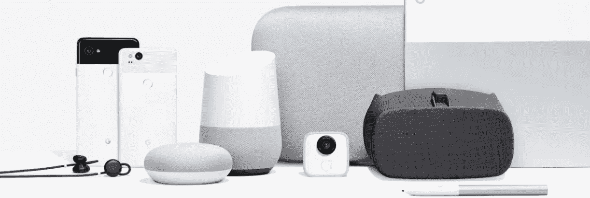
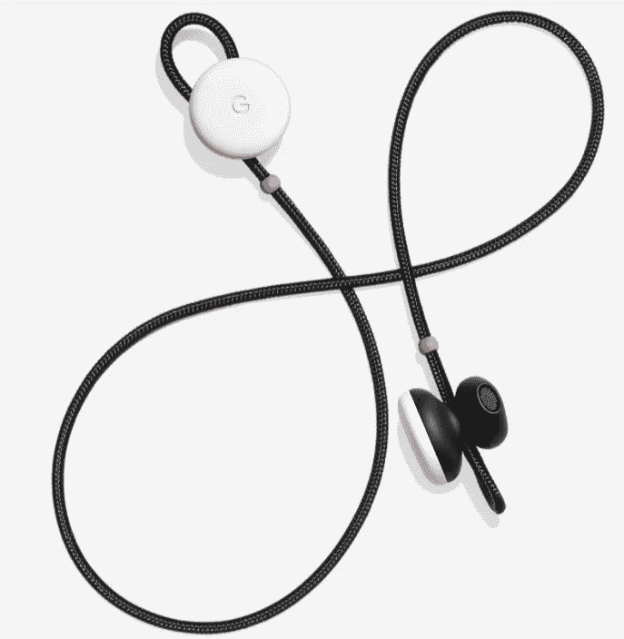
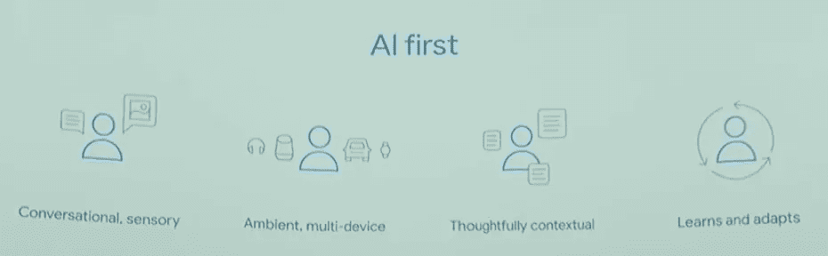
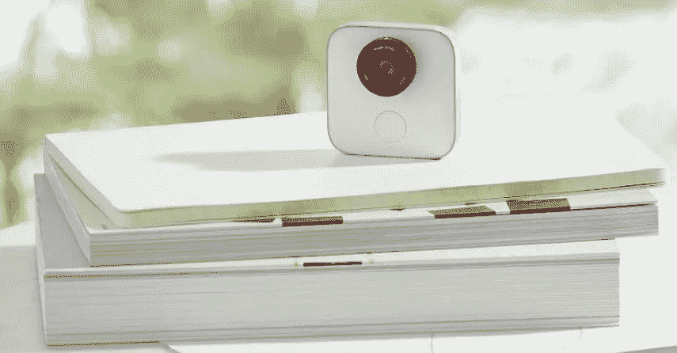
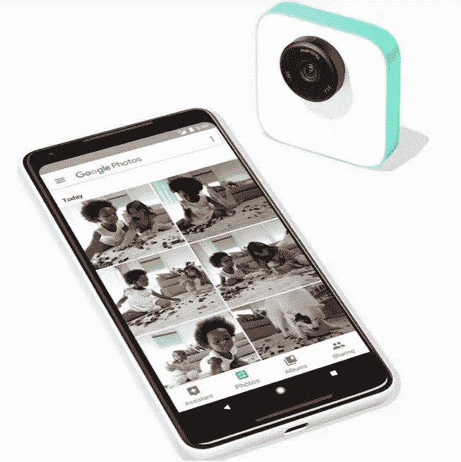

# 谷歌设备正在推进智能手机的解体

> 原文：<https://medium.com/hackernoon/google-devices-are-advancing-the-smartphone-disintegration-cc51ef9796e6>

本周[谷歌](https://hackernoon.com/tagged/google)宣布了几款新的硬件设备，包括新的 Pixel 手机、笔记本电脑、智能扬声器、无线耳机和可穿戴相机。我不会分析这些产品，因为[有很多文章可以做得比我更好](https://www.wired.com/2017/10/everything-google-announced-2017-pixel-event/)，但我想在这里强调一些事情:

*   谷歌如何试图将重心从硬件转移到软件，以利用他们的优势。
*   这是如何从根本上围绕他们的人工智能游戏，特别是围绕谷歌助手。
*   以及这将如何进一步推动他们进入[智能手机解体趋势](/@jorge.serna/apple-airpods-and-the-disintegration-of-the-smartphone-cb8e29efc8e3)。

# 从硬件到软件

在对 Pixel 2 手机的分析中指出的一个相关因素是[它们的规格与上一代产品没有太大区别。这让他们有机会展示他们的软件如何让他们以不同的方式做事，至少与苹果不同:](https://techcrunch.com/2017/10/04/hands-on-with-googles-pixel-2-a-shift-away-from-the-war-of-hardware-specs/?ncid=rss&utm_source=tctwreshare&utm_medium=feed&utm_campaign=Feed%3A+Techcrunch+%28TechCrunch%29&sr_share=twitter)

*   推动他们的谷歌照片服务，实现照片的无限存储，避免硬件存储限制。
*   他们的相机软件允许他们像 iPhone 的肖像模式一样拍照，而不需要第二个相机来这样做。
*   无论像素的设备屏幕大小如何，都提供相同的功能。

当然，这从根本上有利于谷歌的优势，并在某种程度上发出微妙的信息，即最终 Pixel 手机并不那么重要:他们相信软件将使他们能够更有效地与苹果竞争。

当然，相机的行为目前是基于其处理器的，因此与 Pixel 手机的硬件相关，但我预计这种软件改进最终会在所有(现代)Android 设备中找到出路。

# 中心助理

事实上，谷歌的目标不仅仅是在尽可能多的手机上运行 Android 软件，他们正在研究下一步:让谷歌助手在尽可能多的设备上运行。这是一场与亚马逊和苹果争夺生命操作系统的战斗。

这体现在新推出的设备上，这些设备似乎是对竞争对手特定产品的直接攻击:

*   [新的谷歌 Home Mini](https://www.wired.com/story/google-home-mini-puts-assistant-everywhere/) 正试图赶上亚马逊 Alexa 系列中最便宜的产品[Echo Dot](https://www.amazon.com/All-New-Amazon-Echo-Dot-Add-Alexa-To-Any-Room/dp/B01DFKC2SO)的市场成功。
*   另一方面，新的 Google Home Max 将重点放在音质上，试图与苹果的 HomePod[竞争(抢先一步，因为它还没有推出)。](https://www.apple.com/homepod/)
*   [Pixel Buds](https://www.wired.com/story/google-introduces-pixel-buds/) 是对[苹果 AirPods](https://www.apple.com/lae/airpods/) 的明确回应。

在所有这些设备中，关键的特征是你如何用你的声音与它们互动:从播放音乐到实时语音翻译。即使是新的 Pixelbook 和 Pixel 2 手机也是如此，它们也支持谷歌助手。现在，在 Pixel 2 手机中，你可以“挤压”来启动它。

本周产品公告中没有透露的是，谷歌是否会在第三方制造的更多设备(手机以外)上获得助手。这一块很关键，因为谷歌的优势不在于推动硬件，[和他们的销售反映了这一点](https://android.gadgethacks.com/news/rare-moment-pixels-sales-figures-are-revealed-0178148/)。他们的[助手战略](https://hackernoon.com/tagged/strategy)将更好地服务于成为“其他设备的安卓”，这一新的生活操作系统。他们在[亚马逊这里有一个激烈的竞争，亚马逊正在大力推动成为他们自己的对等物:Alexa](https://hackernoon.com/how-amazon-is-winning-the-battle-for-the-home-operating-system-d794ab48fb82) 的生命操作系统。

# AI 优先

谷歌助手是他们人工智能优先战略的一部分，谷歌首席执行官桑德尔·皮帅解释说，该战略有四个组成部分:

对话、上下文和学习方面都与助手体验有关，但我认为看多设备维度是关键，因为这是智能手机解体的驱动因素。

如果仔细观察图标，您会看到几个设备类别:

*   耳机的一部分，预示着[像素芽](https://www.wired.com/story/google-introduces-pixel-buds/)(这是在他们宣布之前提出的)。
*   谷歌家用智能音箱。
*   一辆汽车，代表他们的 [Android Auto](https://www.android.com/auto/) 系列(或者可能是谷歌未来的自动驾驶汽车？😜)
*   一块手表，代表他们的 [Android Wear](https://www.android.com/wear/) 倡议。

**也没有电话，因为电话已经解体成了它们的全部。**

# AI 首先带来智能手机的解体

谷歌的多设备战略最初是基于他们以互联网为中心的服务方式，允许从任何设备访问他们的服务。

但现在，同样的多设备方法正以相反的方式产生影响，专用设备可以依赖其他设备来补充它们的功能。当不同的元素可以一起工作时，突然之间，功能可以以不同于现在的方式进行划分。正如我最初在[第一次谈论智能手机解体](/@jorge.serna/apple-airpods-and-the-disintegration-of-the-smartphone-cb8e29efc8e3)时写的:

> 一旦所有这些部件都就位，手机作为一个整体就变得不那么重要了，因为部件取代了它的位置:
> 
> -手腕中的处理、定位和通信
> 
> -音频交互和语音命令在您的耳朵里
> 
> -眼睛中的视觉呈现和图像捕捉
> 
> -手持屏幕，用于更详细的可视化/交互
> 
> 不是单个元素取代它的位置，而是一个元素生态系统，这些元素可以单独提供价值，也可以一起提供完整的体验。

[苹果已经开始通过新的 LTE 联网 Apple Watch](https://hackernoon.com/the-lte-apple-watch-virtuous-cycle-for-a-new-ecosystem-a9211c608f54) 走这条路，而[我预计在他们的下一次活动中，他们将更深入地了解它与 AirPods 的关系](https://hackernoon.com/whats-missing-in-the-lte-apple-watch-5129382893b8)。

[我认为 Pixel Buds 将为谷歌](/@jorge.serna/wwdc-2017-social-comms-2-watchos-4-and-the-smartphone-disintegration-340050269251)扮演类似的角色。实际上我预计他们也会在这次活动中宣布推出 Pixel Watch，但他们没有。也许他们的重点是首先与合作伙伴一起加强 Android Wear，但 Pichar 幻灯片中显示的手表暗示他们将继续追求这一空间。

# 分解摄像机

谷歌宣布的是 [Google Clips，这是一款小型自主相机](https://store.google.com/us/product/google_clips?hl=en-US)，可以在无人看管时自动拍照，可以放在桌子上，也可以夹在你的衬衫里。

这款产品已经被确定为与 GoPro 直接竞争，尽管我更倾向于将它视为 Snap 的[“相机公司”](https://www.newyorker.com/business/currency/why-is-snap-calling-itself-a-camera-company) angle 和他们的 [Spectacles](https://www.spectacles.com/es/) 产品的竞争对手。

**但这款产品显然是去掉了智能手机的一个关键部分——摄像头，把它变成了一个独立的设备。然后，该相机可以依靠手机作为连接提供商来共享这些照片。明显解体。**

当然，这款产品涉及了很多人工智能(“随着时间的推移变得越来越聪明”)，谷歌建议将其与谷歌照片结合使用

这最终将我们再次带到谷歌的核心优势和多设备方法的基础，并推动智能手机的解体。**成为一个生活操作系统，它不存在于特定的手机、笔记本电脑或扬声器上，而是无处不在，可以从所有设备上访问******。****