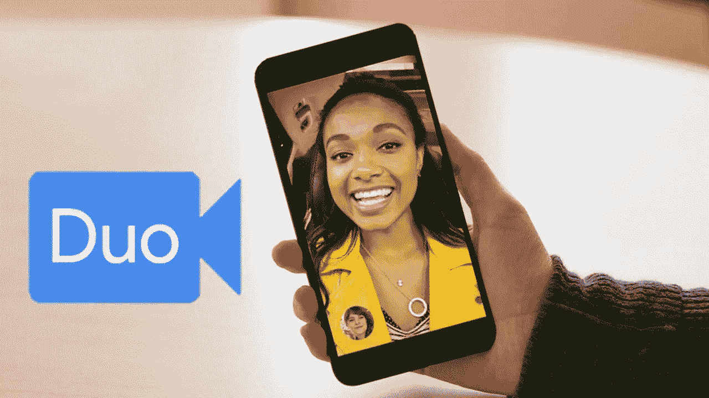
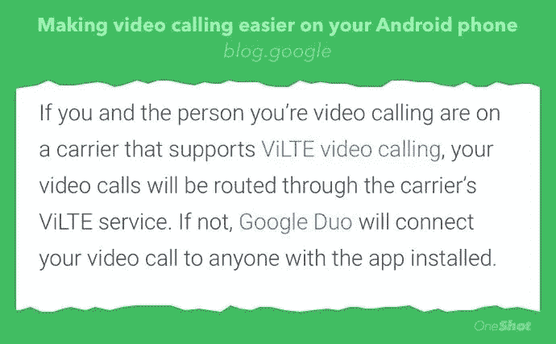

# Google Duo 给 ViLTE 的棺材钉上了最后一颗钉子

> 原文：<https://medium.com/hackernoon/google-duo-puts-the-last-nail-in-viltes-coffin-9a748b7d1bf5>

## Duo 被原生集成到电话拨号器中只意味着基于运营商的个人通信服务将更快淡出

[谷歌](https://hackernoon.com/tagged/google)本周[宣布，他们的视频通话应用 Duo 将更深入地整合到 Android](https://blog.google/products/duo/making-video-calling-easier-your-android-phone/) 手机的本地拨号器中，这样用户就可以用它以及本地联系人和信息应用进行视频通话。

这是一个复杂战略的一部分，谷歌试图利用他们在移动操作系统市场的领先地位，试图进入个人通信领域。

虽然一些运营商在这一战略中与谷歌合作，试图从谷歌的最终成功中获得一些东西，但现实是，它们只是达到目的的一种手段。

# 谷歌在社交媒体中的地位

Android 在全球移动操作系统渗透率方面明显领先，据[一些分析称其渗透率超过 80%。](https://www.idc.com/promo/smartphone-market-share/os)

但在社交通讯领域，这种成功伴随着一个警告，因为即使他们是 Android 用户，[人们也会从根本上使用脸书的财产](https://blog.prototypr.io/facebook-and-the-attack-of-the-clones-f82f6979ee13) ( [脸书](https://hackernoon.com/tagged/facebook)，Facebook Messenger，WhatsApp，Instagram)来相互交流，或者在某些情况下使用 SnapChat 或 HouseParty 等其他产品。在这个领域没有强大的谷歌产品。

这对谷歌来说是一个风险，因为他们错过了参与对话式电子商务的预期收益的机会——效仿微信在中国的成功，以及像 WhatsApp 、[苹果](/@jorge.serna/wwdc-2017-social-comms-3-imessage-and-business-messaging-65d0021bf7d9)或亚马逊这样的玩家正在认真进入这一领域。

对于一家将收入建立在广告基础上的公司来说，广告从根本上说是公司接触受众的一种方式，被排除在这个新机会之外是一个很大的问题。

# 安卓的杠杆作用

当然，谷歌正在努力实现这一目标。这就是为什么他们[在 2016 年 5 月宣布他们将推出 Allo 和 Duo](https://www.blog.google/products/allo/allo-duo-apps-messaging-video/) ，这是一对分别专注于消息和视频通信的应用程序。

但是[试图进入通信领域的问题是提出一个足够有说服力的主张，以创造网络效应，吸引用户进入](https://hackernoon.com/amazon-anytime-can-that-work-2-the-good-the-bad-and-the-ugly-bbd4ac2b512f)。因为，如果一个新的消息应用没有带来真正的差异化价值(这不仅仅是拥有更多“功能”)，用户就不可能试图推动他们现有的社交圈转移到新的应用中。虽然数字仍在增长，但 T4 宣布的 Duo 的 1 亿下载量远远落后于 WhatsApp 的[亿日活跃用户，WhatsApp](https://9to5mac.com/2017/07/26/whatsapp-one-billion-active-daily-users/)顺便也提供视频通话(记住，下载量和日活跃用户是非常不同的指标，所以我们在这里不仅仅考虑 x10 的因素)。

因此，这可能就是为什么谷歌在想"*为什么我们不利用我们对 Android 平台的所有权来扩大我们的通信应用？*”。这听起来是一个非常好的策略，其中苹果已经在 iMessage 上取得了相当大的成功。

但这里有一个问题:虽然谷歌拥有 Android，但他们并不真正* **拥有** *设备中的原生通信体验；设备制造商会。这就是为什么三星、LG 或华为的同一个 Android 版本的手机实际上有不同的短信和通话应用。这也是为什么在 Google 的声明中，很明显对 Duo 集成的支持不会很广泛:

> “我们开始向第一代 Pixel、Android One 和 Nexus 设备推出集成视频通话，Pixel 2 手机也将提供这种功能。我们正在与我们的运营商和设备合作伙伴合作，随着时间的推移，将这种体验带到更多的 Android 设备上。”

# 与行业合作

谷歌实际上正试图控制这些重要的应用程序:Android 智能手机中的联系人、电话和消息原生功能。他们最初的做法是[在他们的消息应用](https://www.wired.com/2017/02/google-support-for-rcs/)中增加对 RCS 的支持。

RCS，即“[丰富的通信服务](https://en.wikipedia.org/wiki/Rich_Communication_Services)”标准，是一个行业倡议，可以追溯到 2007 年(在 iPhone 的 AppStore 出现之前！)，它多次被称为“运营商的 WhatsApp”(即使它在 WhatsApp 推出之前就开始了)，并且在过去 10 年里经历了多次迭代。但是，考虑到这个时间表和当前相关性的缺乏，可以猜到，它的推出对运营商来说是一场真正的斗争。我可以写一篇关于这个的长文，也许下次吧。

谷歌希望，通过帮助该行业推出一项运营商在近十年内无法独自完成的服务，他们可以夺回手机通讯应用的所有权，并最终夺回 Android 的控制权。这不是谷歌的新玩法。过去，他们还接受了一项行业倡议，最终获得了一个重要市场的控制权。该倡议被称为[开放手机联盟](https://www.openhandsetalliance.com/)，谷歌加入其中，并带来了他们刚刚获得的一项有趣的资产:[它被称为“Android”](https://www.openhandsetalliance.com/press_102108.html)。

但这一次，这种方法并没有真正发挥作用，或者至少没有以谷歌预期的速度发挥作用。是的，谷歌不时会发布一些关于新运营商推出 RCS 的消息(上次我知道是在 6 个月前)。但是，当你看到谷歌已经有一段时间没有提到 RCS 时，你会意识到它正在停止，没有在他们的二人组公告中，没有在他们的 Android Oreo 发布会上，甚至没有在他们最近的 I/O 会议上，这将是一个完美的地方，在他们预期的[消息即服务(MAAP)平台](https://www.gsma.com/futurenetworks/rcs/messaging-as-a-platform/)的基础上创建一个开发者生态系统。正如 Dean Bubley 所说，RCS 仍然是一个僵尸。

所以他们正在尝试与 Duo 稍有不同的东西。

# Duo 是 ViLTE 杀手

二人组博文中有一个有趣的细节:

ViLTE 是“ [Video over LTE](https://www.gsma.com/futurenetworks/technology/vilte/) ”，是运营商在蜂窝网络中提供视频通话的标准服务。到目前为止，ViLTE 表现出的不成功使得 RCS 看起来像一个大热门。根据[最新的 GSA 地图](https://gsacom.com)，世界上有不到 10 个国家推出了 ViLTE，这甚至没有反映出任何一种对其使用的市场吸引力。不仅只有少数运营商支持 ViLTE，而且他们只在有限的设备中支持 ViLTE，iPhone 根本不支持它(就像它不支持 RCS 一样)。

尽管如此，当你读谷歌的说明时，感觉他们在玩运营商标准的游戏，对吗？因为他们说他们优先考虑 ViLTE，这样如果运营商让制造商安装这个应用程序，该标准将在谷歌的 Duo 之前工作。

但事实是它不会，因为为了使 ViLTE 优先，两个用户必须在呼叫时都有 ViLTE 可用，这要求:

*   两者都在启用了 ViLTE 的操作符中。即使在推出 ViLTE 的国家，这也不太可能，因为目前每个国家只有一家运营商推出过 ViLTE。
*   并且都具有支持 ViLTE 的手机。根据 GSA 今年 8 月的报告，“*只有一个确定的设备，三星手机，支持 ViLTE 技术*”。
*   两者都有运营商网络支持的手机，这在大多数情况下需要通过运营商渠道获得(运营商正在试图改变这一点，但需要时间)。
*   并且都在 LTE 覆盖范围内

使用 Duo 的唯一要求是双方都安装了 Duo…即使被叫方没有安装 Duo，他们也可以通过[应用程序预览消息](https://support.google.com/allo/answer/6385770)发送一个不错的邀请。除此之外，Android Duo 用户实际上可以联系到 iPhone 用户，因为有一个 iOS Duo 应用程序[。](https://itunes.apple.com/us/app/google-duo-video-calling/id1096918571?mt=8)

**在实践中，这种“ViLTE fall”不会发生，这只是谷歌为 Duo 提供的一个原生集成。**

通过获得这种表面上对运营商友好的行为，谷歌实际上正在推动收购其 Duo 平台，将其转变为 Android 平台的 FaceTime 等价物。由于这一功能是原生手机应用的一部分，Duo 有理由成为核心 Android 服务的一部分，并预装和自动注册到任何新的智能手机上……就像苹果公司对 FaceTime 和 iMessage 所做的那样。

通过成为 Android 手机事实上的标准，将没有理由使用 ViLTE，并且对于运营商来说，肯定没有动力推出用户不需要的服务。在它出生前就杀死了它。

# 接下来是消息传递

谷歌会对他们的信息解决方案 Allo 做同样的事情吗？我希望如此，[因为 Allo 和 Duo 正在寻求进一步整合](https://www.androidpit.com/google-allo-update)，而且 Duo 已经整合到原生消息应用中。我认为这表明最终 Allo 也将与 Messages 应用更加紧密地联系在一起。

谷歌也可以用一种对运营商友好的方式来定位:

"*只有当文本对话双方都不支持 RCS* 时，我们才会在“信息”应用程序中“回退”至 Allo。

同样，考虑到 RCS 推出状态、iPhone 和 Android 的应用预览消息中缺乏支持，这将意味着“回落”将不是一个角落情况，而是推动 Allo 收购的最常见用例。

它看起来对操作员很友好，而且很可能是这样，因为最终它将帮助操作员停止在 RCS 上浪费更多的时间。