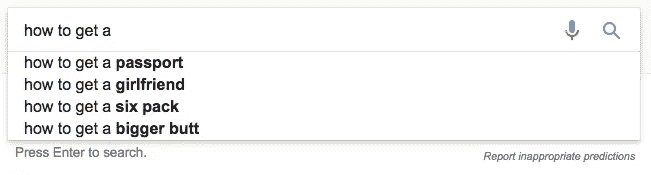

# 谷歌现在是世界的记忆

> 原文：<https://medium.com/hackernoon/google-is-the-worlds-memory-now-b3caa22b5ef9>

在昨晚《权力的游戏》(没有剧透)的一个场景中，一个在亚历山大图书馆工作的老人告诉那里的一个年轻人，他们是“世界的记忆”。

作为一个成年人，我没有经历过没有电脑的图书馆，从大学开始就没有进过。我最喜欢的许多 20 世纪人物传记几乎总是涉及一个主题带着一个问题前往图书馆的故事，这与我们今天如何使用谷歌没有太大不同。据我所知，图书管理员是互联网出现之前的搜索框。

我的中学一年级是在 2000 年，所以我几乎不记得没有谷歌的世界。StumbleUpon 是我接触互联网的入门毒品。我会点击他们的蓝色和绿色标志，却不知道接下来会弹出什么。如果结果有趣，我会去谷歌上获取更多信息。

不知不觉看了很多屁话。我开始与朋友和家人谈论所说的废话，然后发现那是废话。我很快就学会了不要相信你在网上看到的任何东西，因为这样做让我看起来和感觉起来都很愚蠢。更重要的是，我认识到任何值得了解的知识都需要努力才能获得——即使是在互联网上。

今天，谷歌是世界的记忆，但只有当你能找回它时，记忆才有用。最近，我们向我们的记忆中输入了大量的垃圾，包括研究不充分的点击诱饵和我们自己都没有检查的事实。我发现越来越难找到最有用的知识。

在《权力的游戏》中，图书馆的一部分被锁了起来。只有老人和智者才被允许进入，因此，很多知识是不可获得的。今天，理论上，它是可用的。

但是，如果通过将我们作为消费者的注意力集中在社交媒体上，将我们作为创作者的注意力集中在获得点击上，我们将图书馆的一部分锁在一堵墙后面，只有少数人知道如何访问它，会怎么样呢？在尼尔·斯蒂芬森的 *Anathem* 中，几千年后的[未来](https://hackernoon.com/tagged/future)，只有[少数](http://anathem.wikia.com/wiki/Ita)人知道如何驾驭网络变成的垃圾箱大火。

如果没有别的，它是供思考的食粮。

🎉 🍻❤️ —安迪