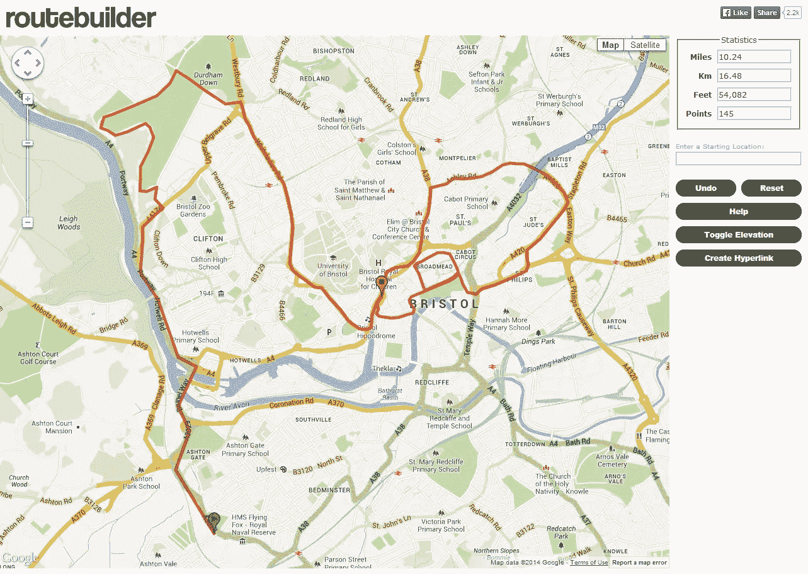

# 谷歌正在迫使 Routebuilder 关闭

> 原文：<https://medium.com/hackernoon/google-maps-is-forcing-routebuilder-to-shutdown-615ce42f413a>

TLDR:谷歌突然声称一个基于地图 API 建立了十年的地图绘制网站违反了“服务条款”。

我在 2006 年建造了 routebuilder.org 的 T2，作为用户创建和与朋友分享自定义地图路线的工具。该网站在过去几年中获得了少量的人气，超过 70，000 名自行车运动员、皮划艇运动员、跑步运动员和马拉松组织者在该网站上保存了路线。它提供了一个简单的接口来解决一个简单的问题。Routebuilder 建立在[谷歌地图 API](https://developers.google.com/maps) 之上，该 API 托管地图小工具并提供在其上绘制路点的服务。

2016 年 1 月 6 日，谷歌地图团队发送了一封电子邮件，要求 RouteBuilder 关闭:

> 亲爱的开发者，
> 
> 我们很高兴看到开发者对我们的产品感兴趣，然而，你的应用[http://routebuilder.org/](http://routebuilder.org/)，违反了谷歌地图 API[服务条款](https://developers.google.com/maps/terms)。
> 
> 特别是，您的应用程序违反了条款 10.4(c)，该条款不允许开发人员创建包装器，即重新实现或复制谷歌地图网站或移动应用程序或任何谷歌地图 API 的应用程序。请删除您的应用程序或将其修改为不再使用 Google Maps APIs。
> 
> 我们提请您注意这一点，以便我们能够共同努力，确保您的实施符合我们的服务条款。如果您无法使您的实施符合条款，我们将采取措施限制您对服务的访问。
> 
> 请在接下来的 14 天内让我们知道您已经更新了您的实施，以符合我们的服务条款。你可以回复这封邮件。

Routebuilder 的优势在于你可以用最少的点击量创建定制路线。它不提供任何铃声或口哨声。据我所知，谷歌不提供任何类似的服务。我能找到的最接近的是 [Google 我的地图](https://www.google.com/maps)，2008 年[6 月](https://en.wikipedia.org/wiki/Google_Map_Maker)(route builder 2 年后，备案)。我尝试了一下这个服务——它非常有特色，但正因为如此，创建简单的路线也非常费力。

很明显，谷歌地图 API 是他们的产品，他们可以选择谁用谁不用。然而，突然对那些从一开始就使用他们 API 的独立开发者穷追不舍似乎有些过分。

我试着给谷歌地图团队发电子邮件来为我的案子辩护，但是我的信件没有得到回复。对我来说，一个选择是重写 routebuilder，让它在另一个地图平台上运行，但由于家里还有一个婴儿和一份全职工作，坦率地说，我没有时间或精力。

**更新** : [谷歌回应](/@andrewcmartin/google-is-no-longer-forcing-routebuilder-to-shut-down-8d4882f31447#.2ja8ul2xo)。

@ [安德鲁·马丁](https://twitter.com/andrewcmartin)

> [黑客中午](http://bit.ly/Hackernoon)是黑客如何开始他们的下午。我们是 [@AMI](http://bit.ly/atAMIatAMI) 家庭的一员。我们现在[接受投稿](http://bit.ly/hackernoonsubmission)并乐意[讨论广告&赞助](mailto:partners@amipublications.com)机会。
> 
> 如果你喜欢这个故事，我们推荐你阅读我们的[最新科技故事](http://bit.ly/hackernoonlatestt)和[趋势科技故事](https://hackernoon.com/trending)。直到下一次，不要把世界的现实想当然！

