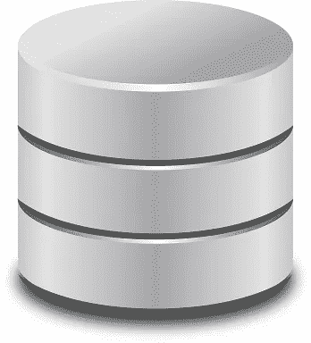

# Google Sheets 作为你的数据库

> 原文：<https://medium.com/hackernoon/google-sheets-as-your-database-9016b9797169>

非常快速的原型制作有助于在头脑中还清晰的时候尝试你的头脑风暴的想法，而不需要大量的设置。新工具的出现使您能够在客户机、服务器和数据库层快速尝试新想法。

GoMix 和 RunKit 之类的工具对于让你的服务器端代码快速运行非常有帮助，并且能够动态测试变化。