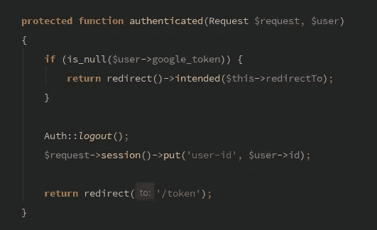

# 使用 Laravel 的 Google 令牌认证

> 原文：<https://medium.com/hackernoon/google-token-authentication-with-laravel-22da5e0fbbda>



我最近在我工作的一个项目中实现了多因素认证。[安东尼奥·里贝罗](https://medium.com/u/dde5a8ca29bc?source=post_page-----22da5e0fbbda--------------------------------)有一个很棒的软件包可以让这个实现变得非常容易，并且 [Christopher Thomas](https://www.sitepoint.com/2fa-in-laravel-with-google-authenticator-get-secure/) 为此发布了一个很酷的策略。让我们复习一下这些步骤。

## 1-安装 google2fa-laravel

```
composer require pragmarx/google2fa-laravel
```

## 2-生成二维码

用户首先需要的是启用/禁用多因素身份认证的方法。实现这一点的一个方法是在`GET profile/token`上公开一个请求，如果用户没有私钥，这个请求将呈现一个**启用**视图，或者如果用户已经启用了**禁用**视图。

在`showEnableTokenForm`中，Google2FA Facade 将负责生成一个密钥，并生成用户可以用来捕获密钥的二维码。

不要忘记通过图像标签显示二维码

```

```

## 3-存储/删除令牌

一旦用户读取 QR 码，他们可以输入一次性密码并提交给应用程序以验证其激活。

如果用户提交了正确的一次性密码，Google2FA Facade 将验证该密码，并将密码存储在用户的表上。

## 4-认证方法

激活令牌后，下一步是在登录过程中需要它。在 Laravel 默认认证系统中，`LoginController`带有一个`authenticated`方法，可用于在认证后触发一个动作。申请代币的绝佳地点。

策略是检查`authenticated`用户是否有令牌，如果有，要求一次性密码。如果令牌为空，将应用重定向到主页的常规行为。当不是这种情况时，用户被重定向到`/token`路线。

*注意:确保在用户表中添加 google_token 列。*

## 5-登录时请求一次性密码

`TokenController`将显示一个简单的视图，其中有一个需要一次性密码的输入字段。

在这个视图的表单提交中，目标是检索用户并根据他们的 google 令牌验证他们的一次性密码。如果匹配，则它们被认证，否则再次询问。

## 6-最后的想法

这个包使得在任何 Laravel 应用程序中实现多因素认证变得非常简单。Google2FA Facade 只关注生成一个密钥并在必要时验证它，完美地处理了这项工作。
另一个有趣的地方是使用 Auth Facade 强制注销的策略，同时请求一次性密码并在令牌匹配时依赖`loginUsingId`。