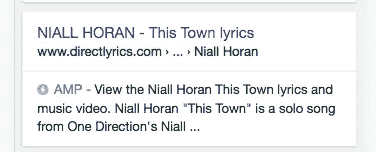

# 谷歌的⚡AMP 作为开发者评论道

> 原文：<https://medium.com/hackernoon/googles-amp-reviewed-as-a-developer-19734198c9b1>

# ⚡

自从谷歌的 [AMP](https://googleblog.blogspot.com/2015/10/introducing-accelerated-mobile-pages.html) 在主要搜索引擎列表中的全球推广以来，它最近得到了很多关注…

You’ve been [AMP](http://www.directlyrics.com/niall-horan-this-town-lyrics.amphtml)-ed

..通过这篇文章，我想谈谈作为一名开发者和网站所有者，我对好的和坏的部分的看法。但是首先…

# 为什么？

官方[回答](https://www.ampproject.org/docs/get_started/about-amp.html)。我们需要另一种 HTML 格式来生成快速加载的页面吗？显然，合乎逻辑的答案是否定的，因为 HTML 不是问题所在，HTML 实际上是相当精简和吝啬的。最大的加载速度问题是 iframes、广告网络、gif 和脚本标签。哪个放大器想在[一举干掉](https://www.ampproject.org/docs/reference/spec.html#html-tags)！但是后来他们[没有](https://github.com/ampproject/amphtml/blob/master/extensions/amp-a4a/amp-a4a-format.md)...

那么我们为什么要这样做呢？跟着读。

# 好的部分

*   由于广告网络和分享按钮，网络——特别是查看你的新闻网站——已经呈现出一种混乱的膨胀状态。众所周知，阻止广告网络电话会显著改善你的网络浏览体验。AMP 最初不允许任何第三方内容。该规范要求外部工具与定制的 HTML 组件挂钩。看一眼。那好大的*万岁！*对于用户来说，不过是作为开发者来管理的另一个怪异的自定义规范。我希望你使用任何被认可的广告网络，否则你就要倒霉了。还有你的 CMS 准备好<amp-YouTube>了吗？
*   AMP 规范的一部分是用**元数据**标记你的内容。这是谷歌一直希望出版商实现的一项任务，这样他们就能更好地理解页面内容的属性和背景——对于乌托邦主义者来说——或者像愤世嫉俗者可能说的那样，提取你的内容并直接注入 SERP。好的一面是，新的 [json-ld](https://developers.google.com/schemas/formats/json-ld) 规范比它的前身(不幸的是仍然存在)微数据更有意义，它包括:itemscope、itemprop、meta、 RDFa 甚至嵌套 DOM 元素上的 vcard 属性。
*   **Google.com 的知名度提高结果**。AMP 图标可能会吸引更多人浏览你的物品。它也是通过一个小的排名提升推出的(**更新**:正式不是排名提升)。我的经验是，[谷歌](https://hackernoon.com/tagged/google)通常只说让开发者采用新协议。就我个人而言，我看不到上升趋势。而且*即使它提高了你的排名*，你所有的竞争对手都会趁虚而入，6 个月后就没有竞争优势了。
    对于谷歌新闻出版商来说，我的网站也是一个自豪的俱乐部成员，新闻转盘实际上出现得更频繁了，AMP 文章比以前获得了更多的眼球。感谢谷歌！
*   **速度**！是的，它几乎是即时呈现的。我知道全球所有没有 4G/wifi 的人都会发现这是一个致命的特性。默认情况下包括 SSL。由于速度原因，甚至 good-ol' < img >标记也已被丢弃，取而代之的是< [amp-img](https://www.ampproject.org/docs/reference/amp-img.html) >。

# 坏事

*   维护网站内容的副本。是的，AMP 依靠你们自己托管的 URL 生存。只有谷歌会抓取它，它并不意味着作为一个实际的目标，实际发送您的访客(你可以)。问题会出现，你会发现晚了。此外，谷歌实际上会为用户提供他们自己网站的本地副本。它关闭了为登录用户定制的页面。他们允许你 ping 他们的 CDN 到[更新到一个新的副本](https://developers.google.com/amp/cache/reference/acceleratedmobilepageurl/rest/v1/ampUrls/batchGet)。但是，是的，有更多的事情要处理。不酷。虽然网站管理员工具有一些不错的问题报告。**更新**:还有这个新的[调试工具](https://ampbench.appspot.com/validate?url=https://ampbyexample.com/)。
*   紧挨着上面的点。我以为我们都在做响应式设计，不会再做特别的手机页面了？我错了。AMP 是关于移动的。所以你正在创建一个定制的手机页面。直到他们也支持桌面。我想你也会通过@media 查询来支持这些。
*   由于 html 规范的束缚，AMP-ed 版本通常**更少用户参与**。比较使用 AMP 和未使用 AMP 的用户对同一页面的每次访问页面数，用户会更快地进入，但也会更快地退出。这可能是由于非功能部分的非 AMP 页面不太混乱造成的，但这是不好的。我也看到了更多的报道。有人可能会说这实际上是 T2 的好事。他们确实支持像图像传送带这样的东西——离不开它们——但是只有一个谷歌提供给你。
*   这一规范始于吝啬和吝啬。但是为了支持越来越多的现有网络功能，T4 已经失去了控制。很好的例子:Cookie 同意通知。这是一个定制的规格。其与用户相关联。并向您的后端发出 CORS 请求。不要忘了血糖！我在[看不到尽头](https://www.ampproject.org/roadmap/)。
*   **更难货币化**。所有这些广告网络都加载在一个页面视图中的原因是为了从一个页面视图中获得最大的收益。例如，我现有的广告网络还不被支持，这意味着我回到了 2004 年，只有一个 Adsense 部门，收入减半。

# 我的建议

如果 AMP 获得成功，谷歌将是明显的赢家。它们会有即时加载的结果，极大地改善了 Google Experience，让用户可以更多地使用 Google。

作为一名开发者，我看不出我的网站的移动副本对我有什么好处。这是更落后的东西。

但是谷歌，让我们折中一下。2G 或 GPRS 用户获得 AMP-ed，我将提供一个支持 AMP 的网站，但我们继续为所有其他网络用户提供非 AMP 服务(例如 iPhone 7 4G)？见鬼，我甚至会为此提出一个规范:*amp-观众-目标-唯一。LGTM。*

> [黑客中午](http://bit.ly/Hackernoon)是黑客如何开始他们的下午。我们是 T21 家庭的一员。我们现在[接受投稿](http://bit.ly/hackernoonsubmission)并乐意[讨论广告&赞助](mailto:partners@amipublications.com)机会。
> 
> 如果你喜欢这个故事，我们推荐你阅读我们的[最新科技故事](http://bit.ly/hackernoonlatestt)和[趋势科技故事](https://hackernoon.com/trending)。直到下一次，不要把世界的现实想当然！

