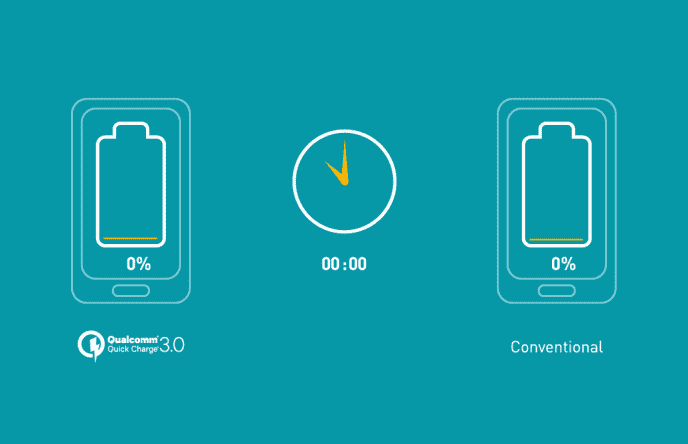

# 谷歌的 Android O 为移动应用开发者提供了充满希望的功能

> 原文：<https://medium.com/hackernoon/googles-android-o-sprinting-its-way-with-promising-features-for-mobile-app-developers-99c68e6c99ae>

当我小的时候，我习惯用谷歌搜索一切。从解决我的数学问题到在学校找到我丢失的铅笔。当然，作为一个孩子，我认为谷歌是最棒的东西，在那里你可以找到任何东西。很明显，随着我的成长，这种看法被改变了。现在我更加清楚地相信了。对我来说，谷歌是创新的鼻祖。

在过去的两年里，谷歌一直在为其最新的重要产品 Android O 进行开发者预览。现在是庆祝的时候了，来欢迎这位伟大的父亲。虽然它现在还不面向大众，但是对于开发者来说，好消息是你可以马上尝试和测试它。从[这里](https://developer.android.com/index.html)下载。对于其他人来说，建议高枕无忧，等待正式发布。

# 让我们从 Android O 中的新功能开始

市场上的第一个预览版为移动[应用开发](https://www.branex.ca/mobile-app-development)和一般开发者带来了一些令人兴奋的扩展。现在，您可以更精确地使用自定义字体和图标。音频增强，使其更加专业。通过本地社交应用和面对面的全球游戏，提供更多联系用户的方式。

# 延长的电池寿命

Android O 中的谷歌保持了完整的传统，领先一步，将精力集中在后台运行的应用程序上。凭借开创性的技术，Android O 配备了最大限度减少电池使用的流程。正如谷歌的一位首席执行官戴夫·伯克所说:

“我们在三个主要领域对应用程序在后台可以做的事情进行了额外的自动限制:隐式广播、后台服务和位置更新。”

然而，仅仅通过电池寿命来判断谷歌 Android O 是通过封面来判断一本书。除了电池本身，O 还有很多值得期待的东西。

在安卓系统中，谷歌通过改进工作程序解决了应用程序的多任务问题，将竞争提升到了一个新的水平。

# 分组通知是救命稻草

谷歌习惯在每次更新通知栏时调整一些项目。但在 O 上，Android 领先一步，推出了“群组通知”这一出色的功能，它可以帮助你理清思绪，不会因为通知栏中随机弹出的功能而产生无谓的负担。这些现在被称为“通道”

# 为开发人员定制自适应图标开发

如果以上内容在一次更新中没有打动你，她的。现在有了 O，应用程序开发人员可以定制自适应图标，可以根据手机的主题调整图标的形状和颜色。这是一个非常新的功能，在 iOS 或市场上的任何其他平台上都没有。

此外，对于 Android 用户来说，导航屏幕中还有一些非常酷的附加功能。

*   观看视频的清晰画中画模式
*   取代传统的系统提醒，现在你可以享受应用程序的新弹出窗口。
*   奇妙的键盘导航新方法，包括改进的箭头和标签按钮导航。
*   多显示器支持在远程显示器上启动活动，听起来更像 Android 手机上的 PowerPoint。

最后，开发人员要求添加一些功能，使应用程序更加专业，更加便捷。

*   自动填充 API 对于密码管理员来说是一个很好的加分项，可以让他们注册成为官方的自动填充应用，避免一些麻烦。
*   一个电信框架，因此第三方应用程序可以像一流的电话应用程序一样运行。
*   在这里，应用程序开发者要求“网络感知网络”,这将允许所有 Android 设备比 Wi-Fi 更熟练地通信，即使在没有连接互联网的情况下。
*   虽然谷歌声称速度是之前版本的 2 倍，但应用程序开发人员要求 Java 8 APIs 在这个时候是最好的。

目前，应用程序开发人员可以在桌面模拟器或以下设备中的一个上测试 Android O:Pixel、Pixel XL、Pixel C、Nexus Player、Nexus 6P 和 Nexus 5X。如果你是一个开发者并且愿意尝试，你可以自己手动下载并尝试，而不是注册更新。

> [**这里是原创博文**](https://www.branex.ca/blog/google-android-o-for-mobile-app-developers/)

> [黑客中午](http://bit.ly/Hackernoon)是黑客如何开始他们的下午。我们是 [@AMI](http://bit.ly/atAMIatAMI) 家庭的一员。我们现在[接受投稿](http://bit.ly/hackernoonsubmission)并乐意[讨论广告&赞助](mailto:partners@amipublications.com)机会。
> 
> 如果你喜欢这个故事，我们推荐你阅读我们的[最新科技故事](http://bit.ly/hackernoonlatestt)和[趋势科技故事](https://hackernoon.com/trending)。直到下一次，不要把世界的现实想当然！

