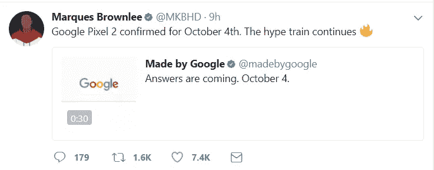
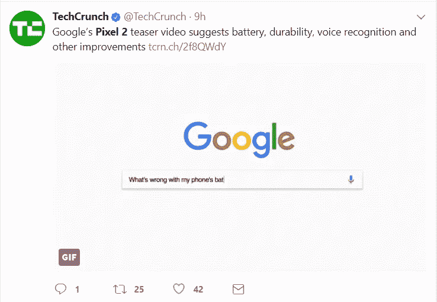

# 谷歌的 10 月 4 日。活动已宣布

> 原文：<https://medium.com/hackernoon/googles-oct-4-event-has-been-announced-9dbb932c0173>

我喜欢科技公司——你知道我比科技公司更喜欢什么吗？[谷歌](https://hackernoon.com/tagged/google)。你可能会想，嗯，谷歌是一家科技公司。是的……这对大多数人来说已经足够了。我相信谷歌是一场运动，谷歌是一场走向未来的运动。谷歌制造的产品会引起“哇！”和“哇！”以及“它真的能做到吗？”—另外一款产品将于 10 月 4 日发布。

他们已经告诉我们他们要宣布什么。它将会是一部电话。这款新手机可能会被称为“像素 2”或“像素 2 XL”Twitter 积极呼吁关注这一事件:

正如你在这篇文章的上方和左侧看到的，这里有一些来自一些广受关注的科技出版物和名人的推文。这是件大事。

最初的 Pixel 有一个很棒的摄像头，智能语音助手，以及独特的下一代 Android 软件。

我对新设备的期望是:更好的摄像头，更智能的语音助手，以及一直存在的谷歌下一代安卓系统。

谷歌强调的是:更好的电池寿命、更持久的耐用性和语音识别。

我们可能会从新设备中得到什么:更智能的语音助手，更好的摄像头，更耐用，以及无论这个“语音识别”功能是什么。等等…“语音识别”，这是不是意味着谷歌创造了一种用你的声音解锁你的[智能手机](https://hackernoon.com/tagged/smartphone)的方法？这安全吗？你的录音能通过锁屏吗？我想这与面部识别没什么不同，在面部识别中，可能会向传感器显示某人的面部照片，并使其解锁。除此之外，这听起来很令人兴奋！下面是他们精彩的预告视频:

朱利安像素 2 XL Zehr

附注:点击下面的鼓掌按钮可以让我知道我写的东西是否被欣赏。