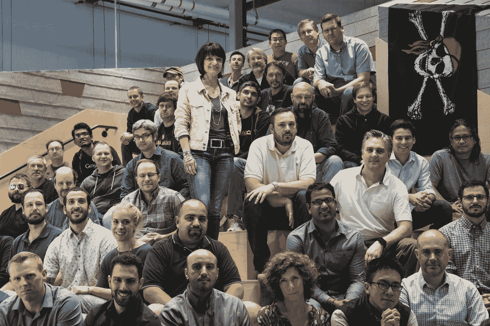
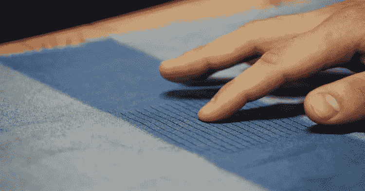
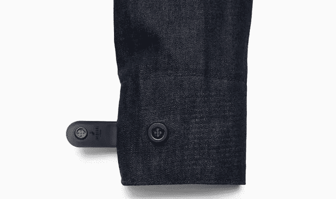
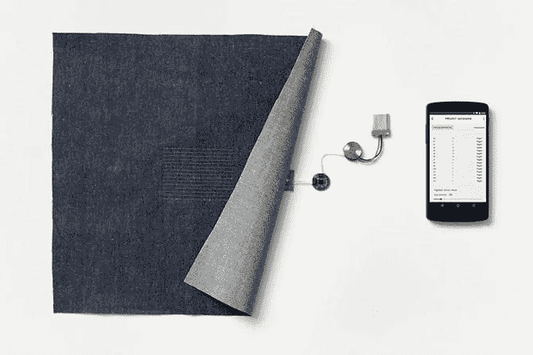

# 谷歌的“贾卡计划”:可以洗涤的可穿戴技术

> 原文：<https://medium.com/hackernoon/googles-project-jacquard-wearable-technology-you-can-wash-f0518931880>

谷歌在加州占地 200 万平方英尺的总部位于[的某处，是高级技术和项目组，简称 ATAP。这是一个](https://hackernoon.com/tagged/googles)[技术](https://hackernoon.com/tagged/technology)孵化器，与谷歌无人驾驶汽车项目背后的秘密研究实验室(Project X)没有什么不同，或者他们用飞行互联网路由器填充平流层的计划。

虽然 X 可能是该公司的“moonshot”部门——旨在将最疯狂、最不可思议的想法变成现实——但 ATAP 更接地气。项目负责人只有两年时间将概念转化为成品。在技术术语中，ATAP 团队被称为臭鼬工厂；一个在最小管理约束下快速开发某物的团队。

Regina Dugan and her band of pirates

它的前任首领里贾纳·杜根有一种有趣的说法:“我们是一小群试图做史诗般的事情的海盗。”比如制造一种手机，它的部件可以像后盖一样容易地更换，或者开发一种软件，使设备能够在真实空间中建造虚拟结构。该部门的最新产品是 Project Jacquard，这是与 Levi Strauss 合作的一个项目，它将一件普通的牛仔夹克变成了一种触摸感应面料。

该项目的灵感来自提花织物，这种织物将设计融入织物中，而不是印在织物上。在设计这些智能夹克时，使用了一种特殊的导电线，它与现有的织机兼容。再加上一个用标准手表电池运行的小蓝牙控制器，这种连接编织允许夹克与其他小工具配对，并实现互动。

今年春天发布的第一款是*通勤*系列，专为经常出行的城市骑行者设计。你可以点击、滑动或握住袖子的袖口来接听或阻止电话，访问语音导航或更改音乐曲目-所有必要的魔法都来自袖口周围的一条柔软的细带子。

ATAP Jacquard 团队的负责人 Ivan Poupyrev 表示，这种交互式面料是一个“平台”,并补充说谷歌将制作 API(代码包),允许开发者定制夹克功能。他补充道，“迄今为止，可穿戴设备只能做一件事，就我们的情况而言，衣服可以做你想让它做的事情。”用户可以完全控制他们的手势对夹克的意义；使用附带的应用程序，他们可以对界面进行编程，使其具有偏好的功能。

让 Project Jacquard 如此激动人心的不仅仅是增加几根导电纱线和触摸手势。谷歌和李维斯的愿景是做一件感觉和其他夹克一样的夹克，一件时尚耐用的夹克；李维斯全球产品创新副总裁保罗·迪林杰认为，这种技术并不“珍贵”。

Bluetooth, USB, and a battery — behind the Jacquard cuff

这种织物足够耐用，可以经常使用；脱下来的时候可以扔在椅子上，甚至可以放进洗衣机里。“真正的消息是，我们已经制造出可以扔进洗衣机的可穿戴设备，而且事后仍然具有功能性技术，”迪林杰解释道。唯一需要移除的是袖口带子。

根据 Poupyrev 的说法，这里的诀窍是从服装制造商的角度看待智能可穿戴技术，而不是作为一家“消费电子公司”。“如果我们真的想让技术成为世界上每件衣服的一部分，那么我们必须让李维斯或任何其他品牌的服装制造商能够制造智能服装。这意味着你必须与他们的供应链合作。”他补充道。从这个意义上说，提花夹克是真正的耐穿服装，科技只是对布料设计的补充。

The *Commuter goes on sale this spring*

李维斯通过自己的供应链制造这种夹克，像其他普通夹克一样将触摸传感器编织在其中，这意味着它可以很容易地扩大规模进行大规模生产。到 2023 年，可穿戴设备的市场预计将达到 1000 亿美元，而且预计还会继续增长。

虽然 350 美元(或 23000 印度卢比)的通勤车并不便宜，但它可能会改变 T2 消费者对智能服装的看法。Poupyrev 说，“在这一点上，新技术成为未来服装和时尚的另一个组成部分是非常自然的。”他指出尼龙等技术如何为服装增加新的功能，并希望智能服装变得像你夹克上的拉链一样无处不在。

> [黑客中午](http://bit.ly/Hackernoon)是黑客如何开始他们的下午。我们是 [@AMI](http://bit.ly/atAMIatAMI) 家庭的一员。我们现在[接受投稿](http://bit.ly/hackernoonsubmission)并乐意[讨论广告&赞助](mailto:partners@amipublications.com)机会。
> 
> 如果你喜欢这个故事，我们推荐你阅读我们的[最新科技故事](http://bit.ly/hackernoonlatestt)和[趋势科技故事](https://hackernoon.com/trending)。直到下一次，不要把世界的现实想当然！

