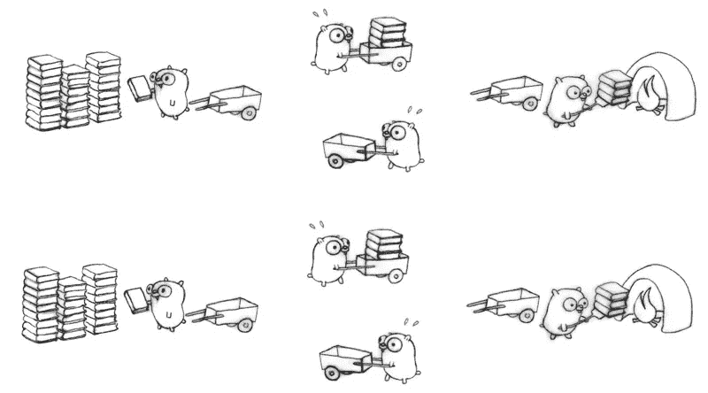

# 那么，goroutines 到底是什么？

> 原文：<https://medium.com/hackernoon/goroutines-a-general-introduction-49bed9812c94>


The image is no over exaggeration

对并发的本地支持是 Go 最受欢迎的特性之一，它允许开发人员轻松地创建并发应用程序。为了利用这种本地并发性，需要 goroutines。

Goroutines 可以被认为是 Go 的主干，在设计固有的并发应用程序时非常重要。

那么让我们来了解一下什么是 goroutines。

# **什么是 Goroutines**

Goroutines 可以比作轻量级线程。它们只是与其他函数或方法同时运行的函数或方法。

它们允许我们在同一个地址空间中同时创建和运行多个函数，并且没有显著的设置成本。

# **Goroutines vs Threads**

Go 使用 goroutines，而 Java 等其他语言使用线程。Goroutines 很便宜(大约 2 Kb ),其中 as 线程通常是内存密集型的(从 1 Mb 开始),因为它们需要更多的堆栈空间。这使得开发人员可以创建大量的 goroutines，这在线程中是不可能的。

所以你可能会问，为什么 goroutines 这么轻？

goroutines 之所以如此轻量级，是因为 Go 不使用传统的本地线程，而是使用绿色线程。本机线程或者更确切地说是 OS 线程具有单独的函数调用堆栈，并且它们的设置和拆卸成本很高。

让我们看看围棋如何做到这一点。

所以在运行时，调度器将 go routine 映射到线程上，但与 Java 线程中的 1:1 映射不同，一组 go routine 被映射到一个或一组线程上。此外，goroutines 具有灵活的堆栈大小，可以根据需要扩展和收缩。这大大减少了内存占用，并改善了 goroutines 的内存重新分配时间。

但是你根本不需要担心所有这些漂亮的细节。

所有这些任务都由 Go 在运行时负责，并从用户那里抽象出来。

因此，用户可以做他最擅长的事情，编写干净高效的代码，而不必担心堆栈分段和内存重新分配。



The gopher-books analogy from [Rob Pike’s talk](https://www.youtube.com/watch?v=cN_DpYBzKso)

# **如何启动 Goroutine**

一个 goroutine 启动起来相当简单，只需在函数或方法前面使用关键字 ***go*** 就可以完成，这样就可以让一个 goroutine 准备好并发工作。

```
package main

import (  
    "fmt"
)

func hello() {  
    fmt.Println("Hi, I'm a goroutine!")
}
func main() {  
    go hello()
    fmt.Println("Inside main function")
}
```

上面的代码将创建一个 goroutine，与执行自己的 goroutine(称为主 goroutine)的`func main()`同时运行。

goroutines 的创建非常简单，你不必担心后台的细节，因为它们都是由 Go 在运行时处理的。

# 但是等等..

在执行代码时，您会收到一个小小的惊喜！

```
Inside main function
```

该代码仅打印来自`func main()`的信息，而不打印来自`func hello()`的信息。这可以解释如下—

1.  当启动一个 goroutine 时，goroutine 调用会立即返回。这意味着控件不会为了继续下一个函数或 goroutine 而等待 goroutine 执行完毕。
2.  此外，主 goroutine 应该正在运行，以便运行任何其他 goroutine。它的终止将导致任何其他 goroutines 的终止，程序将结束。

这正是我们上面的代码所发生的情况。在调用`go hello`之后，控件在主函数中打印出消息，之后程序终止。`func hello()`没有得到执行的机会，因为主 goroutine 被终止，程序结束。

# 解决问题的方法

准确地说，这与其说是修复，不如说是破解，因为我们将程序的执行限制在现实世界的时间约束内，但这对于这个例子来说已经足够了。请注意，这是一种不好的做法，应该避免，因为在现实中，我们总是使用通道进行任何此类同步。

```
package main

import (  
    "fmt"
    "time"
)

func hello() {  
    fmt.Println("Hi, I'm a goroutine!")
}
func main() {  
    go hello()
    time.Sleep(1 * time.Second)
    fmt.Println("Inside main function")
}
```

`time.sleep(1 * time.Second)`行将当前的 goroutine 置于休眠状态，并给 hello goroutine 足够的时间来完成。

现在，当我们运行程序时，我们得到的两条消息有 1 秒钟的间隔。

```
Hi, I'm a goroutine! 
Inside main function
```

# 结束语

默认情况下，Go 使用的 CPU 线程数等于当前的 CPU 内核数。您可以通过下面的语句`runtime.GOMAXPROCS(-1)`得到线程的数量

可以通过将值从 1 更改为任何数字来更改线程的数量，但是在选择它们时必须小心。虽然更多的线程可以提高性能，但是太多的线程会降低进程速度，所以理想的数量应该在运行性能扫描之后决定。

Go 的本地并发模型使得它在创建真正的并发系统方面越来越受欢迎，而 goroutines 是其功能的重要组成部分。它们可以被认为是语言的心脏和灵魂，如果使用正确，它们可以提供巨大的性能提升。

# 并发不等于并行

我在这篇文章中多次使用并发性，但是如果你仍然想交替使用并发性和并行性这两个词，那么是时候看看 Rob Pike 关于这个话题的文章了。