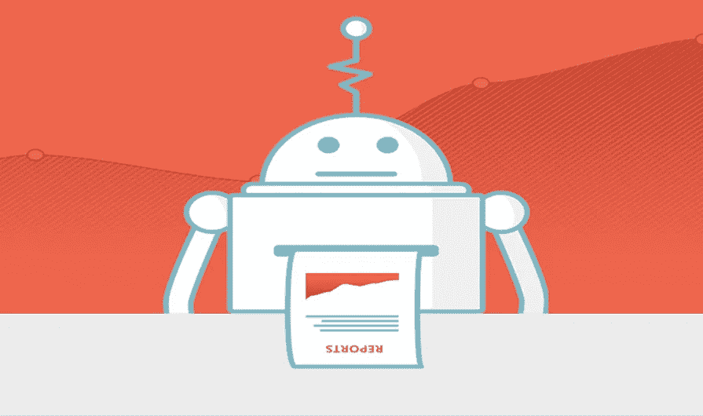

# 有数据吗？通过分析构建更好的机器人

> 原文：<https://medium.com/hackernoon/got-data-build-a-better-bot-with-analytics-6b06a211d9f6>

[Dashbot.io](http://dashbot.io/) 的联合创始人兼首席执行官阿尔特·梅里特将出席 1 月 26 日至 27 日在三藩市举行的[虚拟助理峰会](http://bit.ly/RE-WORK_VirtualAssistantSummit2017_Blog)，并将解释聊天机器人中的分析将如何不同于传统的网络和移动分析，以及如何使用分析来增加参与度、获取和货币化。此外，Arte 将分享从 Dashbot.io 捕获的数据中获得的见解和经验。

我在峰会前采访了 Arte，以了解是什么推动了他在虚拟助理方面的工作，他认为实现最近进步的主要因素是什么，以及他对未来 5 年对话代理的预测。

***你认为是什么主导因素推动了虚拟助手的最新发展和普及？***

对话式用户界面/UX 是人机交互的未来。亚马逊 Alexa 就是一个很好的例子。我的联合创始人[杰西](http://www.linkedin.com/in/jessefhull)经常讲述这个故事，我们过去常常看到两岁的孩子在 iPhones 和 iPads 上滑动的视频，现在他的两个年幼的孩子正在和 Alexa 说话——“Alexa 播放快乐的歌曲… Alexa 播放星球大战…”

所有的主要玩家都在开放他们的平台——脸书开放了 messenger，苹果开放了 iMessage，微软开放了 Skype，亚马逊开放了 Alexa，谷歌正在打造 Alexa 的竞争对手。这些品牌正在这些平台上构建机器人。用户也已经在那里了——脸书在 Messenger 上有近 10 亿用户。

***你觉得对未来进步至关重要的是什么？***

发现。特别是在脸书，很难找到僵尸工具或者知道已经存在的东西。有趣的是，我在脸书和 Kik 上都有一个演示机器人。在脸书的案例中，它在近两个月后只有大约 30 名用户，而在 Kik 上，两周之后就有了近 15000 名用户——Kik 有一个机器人商店，而脸书没有。

在使用 NLP 的情况下，这也需要随着时间的推移而改进——或者说机器人如何处理“我不知道”的响应。货币化的途径也很重要。在对话聊天机器人的情况下，能够完全通过机器人完成交易是很重要的。

***未来 5 年，我们可以期待看到虚拟助手的哪些发展？***

通过对话式界面，在短期内，我们应该会看到主要平台推出机器人商店(如果它们还没有)，添加货币化功能，并提供多用户机器人交互(如果它们还没有)。

多用户机器人互动特别有用——如果你在 messenger 平台上与朋友或同事交流，如果你能让机器人加入对话，而不是退出，那就更有用了。想象一下搜索一家餐馆——你可以把 Yelp 带进对话中，而不是蹦出 Yelp。

AI / NLP 也将获得更好的超时——使对话更自然，有更好的响应率和对实际意图的理解。我们很可能会看到更多的机器人之间的互操作——让机器人与其他机器人进行交互。

***你在 Dashbot.io 的主要目标是什么？***

Dashbot.io 是一个机器人分析平台，使企业和开发者能够增加用户参与度、获取量和货币化。除了参与度和保留率等标准指标之外，我们还有特定于机器人的指标，如对话分析、情感分析和完整的聊天会话记录。我们还提供对数据采取行动的工具，例如我们的真人接管会议，以帮助引导用户转化并提高参与度。

是什么驱使你从事虚拟助手的工作？

我们对这个领域感到非常兴奋，因为对话数据比传统的网络和移动分析更丰富，更具可操作性。我们可以基于这些数据做一些非常有趣的事情——比如在聊天会话中插入一个活生生的人，以提高参与度并导致转化、重新参与通知、人工智能测试等等。

**听取 Arte 和其他虚拟助手领域专家的意见，** [**现在就注册**](http://bit.ly/RE-WORK_VA_RegAnchor_Blog) **。名额有限！**

**确认发言人包括:**

*   **阿隆索·马丁内斯，皮克斯动画工作室的技术总监**
*   雷诺的创新项目经理 Lionel Cordesses
*   **(埃琳娜)科瑞娜·格里戈雷，耶鲁大学社会机器人实验室博士生**
*   **在 Slack 发展关系的主管 Amir she vat**
*   Next IT 企业总裁 Rick Collins
*   丹尼斯·莫滕森，x.ai 的创始人兼首席执行官
*   **谷歌软件工程师安祖利·坎南**

**虚拟助理峰会将与** [**深度学习峰会**](http://bit.ly/RE-WORK_DLSF_Blog) **同时举行，这意味着与会者可以享受额外的会议和交流机会。**

虚拟助理峰会欧洲版将于 9 月 21 日至 22 日在伦敦举行！查看事件 [**此处**](http://www.re-work.co/events/virtual-assistant-summit-london-2017) **。**

> [黑客中午](http://bit.ly/Hackernoon)是黑客如何开始他们的下午。我们是 [@AMI](http://bit.ly/atAMIatAMI) 家庭的一员。我们现在[接受投稿](http://bit.ly/hackernoonsubmission)并乐意[讨论广告&赞助](mailto:partners@amipublications.com)机会。
> 
> 如果你喜欢这个故事，我们推荐你阅读我们的[最新科技故事](http://bit.ly/hackernoonlatestt)和[趋势科技故事](https://hackernoon.com/trending)。直到下一次，不要把世界的现实想当然！

