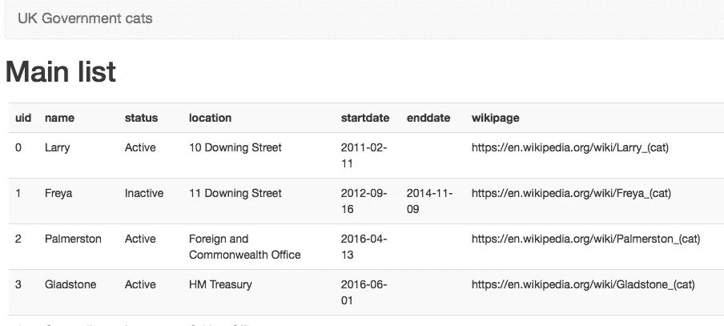
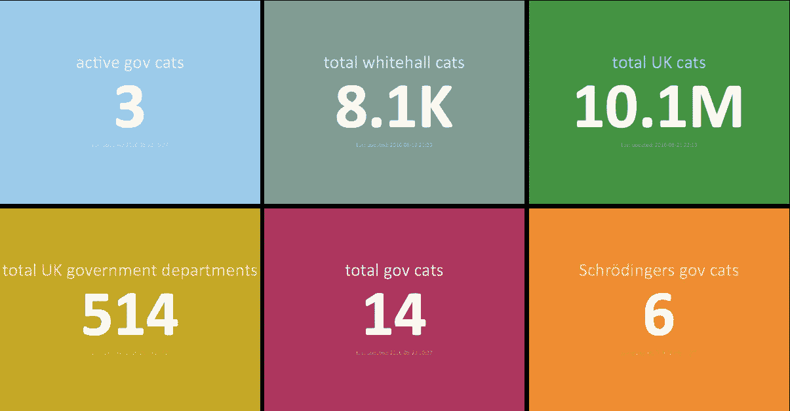
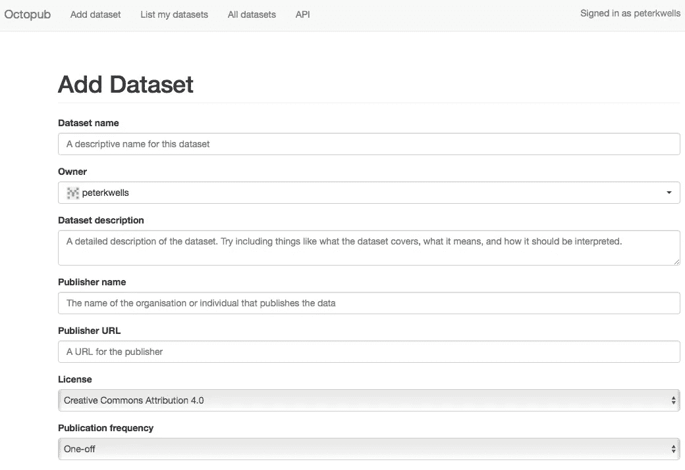
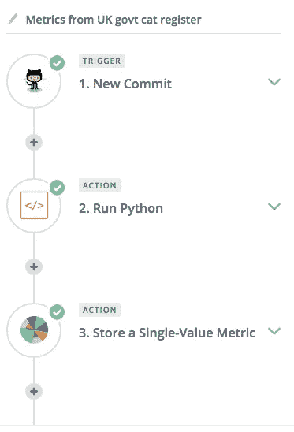
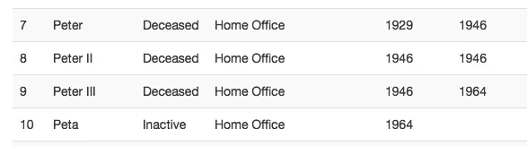

# 政府猫

> 原文：<https://medium.com/hackernoon/gov-cats-f143d4a7407b>

近年来，英国政府已经养成了宣布雇佣猫的习惯。唐宁街、[外交部](http://www.telegraph.co.uk/news/2016/04/13/palmerston-the-cat-arrives-for-work-at-the-foreign-office/)和[财政部](http://www.telegraph.co.uk/news/2016/08/05/the-telegraph-meets-gladstone-the-pampered-treasury-cat---who-is/)都有猫，而[内阁办公室](http://www.telegraph.co.uk/news/2016/08/03/cabinet-office-set-to-appoint-cat-called-cromwell-as-chief-mouse/)即将任命一只。对于一个政府来说，这是一个不寻常的习惯，但我想，生活应该充满陌生感。

一天下午，我同时感到无聊和异想天开，这是一种危险的组合，所以我花了 10 分钟建立了一个[英国政府猫登记册](https://peterkwells.github.io/uk-government-cats/)——这些猫的列表——我在网上发布了它。

the cat register

cat 寄存器是[开放数据](https://theodi.org/what-is-open-data)。任何人都可以出于任何目的使用它。它也对投稿开放。任何人都可以提出修改建议并帮助改进它。[有些](https://github.com/peterkwells/uk-government-cats/pull/2) [人](https://github.com/peterkwells/uk-government-cats/issues/12) [已经](https://github.com/peterkwells/uk-government-cats/pull/10)这么做了。

本周，我为猫登记簿创建了一个[仪表盘。这也应该是相对简单的，但是花费的时间要长一些。我的一些技能有点生疏了。](https://peterkwells.github.io/uk-govt-cat-dashboard/ukgovcats.html)

the [cat dashboard](https://peterkwells.github.io/uk-govt-cat-dashboard/ukgovcats.html)

为英国政府工作的猫的名单可能看起来像一个愚蠢的笑话——的确是:)——但它也给了我一个机会来使用由[开放数据研究所(ODI)的实验室团队](http://theodi.org/labs)开发的一些新的[工具](https://hackernoon.com/tagged/tools)，并给出反馈。

我是这么做的。它可能会帮助其他人发布一些公开数据或建立一个仪表板。如果你全部读完，你也会知道谁是薛定谔的猫…

## 我如何建立猫注册

我首先收集了一些可用的数据:姓名；猫工作的部门；他们开始(或结束)工作的日期；和社交媒体账户。是的，英国政府的猫有社交媒体账户:官方的和 T2 非官方的。数据被收集到[的电子表格应用程序](https://www.libreoffice.org/discover/calc/)中，并保存为 CSV 文件。

我很惭愧地承认，我没有过多考虑数据潜在用户的需求。毕竟，这是一个异想天开的实验，如果用户也想异想天开，他们可以帮助维护。我还得出结论，隐私不会是一个问题，因为根据一般数据保护条例，动物没有权利。在不太异想天开的情况下，我会建议在发布数据集之前完成 [**隐私评估**](https://en.wikipedia.org/wiki/Privacy_Impact_Assessment) 。

Octopub screen for adding a dataset

我使用 ODI Labs 的 [Octopub](https://octopub.io) 工具来发布 CSV 文件。Octopub 自动创建一个[开放数据证书](https://certificates.theodi.org/en/)，并使用 Github 提供的所有功能来存储和发布数据。

在这一步之后，数据可以在网上访问，公开许可，使人们可以使用它，并开放合作，使人们可以帮助改善它。[使用卡特彼勒数据](https://peterkwells.github.io/uk-government-cats/)，[阅读如何提交额外数据](https://github.com/peterkwells/uk-government-cats/blob/gh-pages/README.md)或[提出问题](https://github.com/peterkwells/uk-government-cats/issues)。

这一点很简单。仪表板有点难。

## 最低可行的卡特彼勒仪表板

为了帮助度量和仪表板，实验室团队创建了 [Bothan](http://bothan.io) :它以免费平台的形式为您提供信息，以 JSON 或简单的可视化形式存储和发布度量。这个功能建立在另一个网络工具 [Heroku](https://www.heroku.com/what) 之上，它允许新的应用程序快速部署到网络上。

Bothan’s name is inspired by [a pretty obscure line of dialogue](http://starwars.wikia.com/wiki/Bothan) about the many spies who died getting the plans for the death star in Return of the Jedi. I suspect the Labs team had many failures when building their tool…

ODI 的实验室团队还构建了一些[样本代码](https://github.com/theodi/bothan-dashboards)，可以复制并配置这些代码，使用 [Github 页面](https://pages.github.com)(另一个免费工具)将 Bothan 可视化呈现为仪表板。

建立一个 Bothan 实例并重新配置一个现有的仪表板相对容易，但是将数据(比如猫的总数)从注册表中获取到 Bothan 的过程自动化被证明更加困难。

该团队推荐了 Zapier，这是一款旨在帮助工作流程自动化的网络工具。它没有其他工具开放——我不能轻易分享我的配置，而且[定价计划](https://zapier.com/pricing/)似乎扩展得很快——但看起来它会完成任务，帮助更多的猫上网。该团队甚至将博森和扎皮尔整合在一起，使之变得更容易。不幸的是，我不得不掌握 Python 脚本语言，我上一次涉足类似的东西是在不久前。幸运的是，在网上和办公室都有人帮忙。

a bit of Zapier configuration which, to put it another way, says “if there’s a change to cat register, then run an algorithm and store the results in the Bothan metrics platform”

在让技术工作之后，我在 twitter 上分享了几份早期的草稿；得到了一些反馈(在这一点上，我知道谷歌给了我英国猫总数的错误答案(如果搜索数据像搜索文档一样简单就好了)并将其改进到我很乐意称之为[最小可行仪表板](https://en.wikipedia.org/wiki/Minimum_viable_product)。

有一点配置和代码寻找 cat 寄存器的变化，并为这些值计算新的度量；同时另一位正在寻找改变一些[英国政府关于猫的官方数据](https://data.gov.uk/dataset/cat-population-per-postcode-district)。一切都自动运行。

你会在 Github 上找到[更多的细节和仪表盘代码。请随意建议新功能。](https://github.com/peterkwells/uk-govt-cat-dashboard)

Peta is Schrödinger’s cat

## 薛定谔的猫

你可能已经注意到仪表板上有一个“薛定谔的猫”的条目。原因很简单，就像薛定谔[著名实验](https://en.wikipedia.org/wiki/Schrödinger%27s_cat)中的猫一样，我找不到数据来证实一些猫是死是活。我可以做一个有根据的假设，毕竟一只猫在 1964 年开始工作…，但是我认为这是值得的。我只是让它们标着“不活动”，想象一只退休的英国政府猫的生活。

some cats from the swinging 60’s. Picture courtesy of [National Archives](http://www.nationalarchives.gov.uk) via [Wikipedia](https://en.wikipedia.org/wiki/Swinging_London#/media/File:Londons_Carnaby_Street,_1969.jpg)

任何使用这些数据的人都可以对这些猫做出自己的假设，同时留下不清楚的信息，这可能会激励某人帮助寻找丢失的数据，也许会发现一只来自摇摆的 60 年代的老猫仍然在怀特霍尔的走廊和俱乐部巡逻。

这种激励很有趣。一个好的登记簿应该像任何数据基础设施一样，为人们提供一个建立服务和发现见解的基础，但一个好的仪表板应该激励符合特定目标或战略的行为。我的目标是让更多的猫出现在网络上。注册和仪表板是让其他人帮助我的一种方式。[提交更多猫](https://github.com/peterkwells/uk-government-cats/blob/gh-pages/README.md)。

## 发布您自己的数据或构建您自己的仪表板

不过，现在猫已经够多了。我的奇思妙想也帮助我探索了一点数据发布。 [Octopub](https://octopub.io) 、 [Bothan](https://bothan.io) 、 [Zapier](https://zapier.com) 和 Python 都相当容易使用，所以，如果你想尝试开放数据，为什么不发布自己的数据集或创建自己的仪表板呢？

this penguin would probably want its title recorded in a penguin register. standard you tube licence applies to the video.

你可以从一个异想天开的项目开始(企鹅登记任何人？)或者更有用的东西，比如这个欧洲数据科学课程列表，它是作为 [ODI 学习团队](http://theodi.org/team/emily-vacher)为[欧洲数据科学学院](https://edsa-project.eu/)工作的一部分而准备的。

如果每个工具的文档都不能帮助你解决问题，那么有很多人可以问[并且，一旦你知道了答案，你可以随时提出改进文档的方法来帮助下一个人。](https://twitter.com/search?q=opendata&src=typd)

发布(cat)数据最困难的部分是开始。像 [Octopub](https://octopub.io) 和 [Bothan](https://bothan.io) 这样的工具可以让它变得简单。

— — -

4 月 21 日更新:自从写了这篇博文，我在猫数据、隐私和复杂性方面做了更多的工作。

> 黑客中午是黑客如何开始他们的下午。我们是这个家庭的一员。我们现在[接受投稿](http://bit.ly/hackernoonsubmission)并乐意[讨论广告&赞助](mailto:partners@amipublications.com)机会。
> 
> 如果你喜欢这个故事，我们推荐你阅读我们的[最新科技故事](http://bit.ly/hackernoonlatestt)和[趋势科技故事](https://hackernoon.com/trending)。直到下一次，不要把世界的现实想当然！

