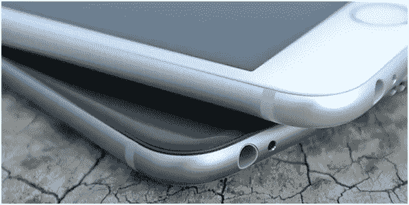
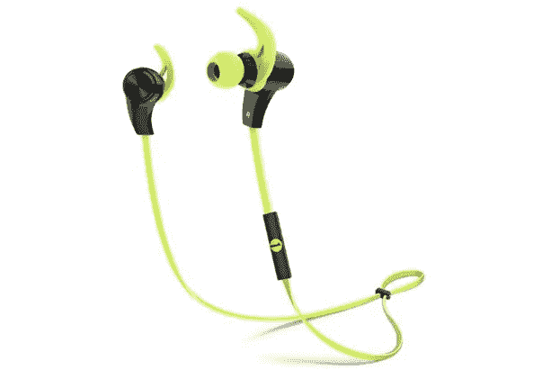
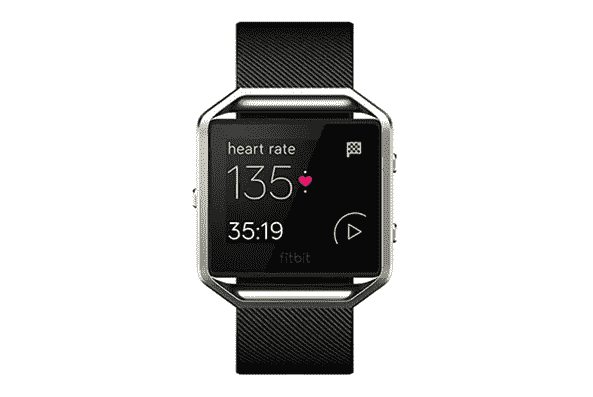
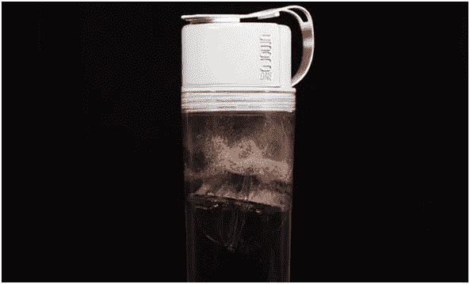

# 抓住这些小玩意和配件，为夏天塑身

> 原文：<https://medium.com/hackernoon/grab-these-gadgets-and-accessories-to-get-in-shape-for-summer-4bff34ace71c>

北半球的春天差不多一个月前就开始了，那么还有什么比现在更好的时间开始锻炼，这样你就可以以良好的状态迎接夏天了？为了帮助你完成这个任务，有一些小工具和附件可以使用——下面是其中的一些。

## 智能手机

这是一个显而易见的问题:今天我们几乎离不开我们的智能手机，当我们锻炼时也是如此。通过让你的智能手机一直在身边，你就可以保持联系，并且有一个工具来使用其他小工具和配件，其中一些将在下面提到。

## 蓝牙耳机

当你锻炼的时候，音乐总是一个极好的伴侣。要从智能手机上听音乐，最好的选择是使用无线蓝牙耳机，并确保它们具备所有需要的功能。首先，它们应该是入耳式耳机，因为它们更轻，更舒适。

此外，它们应该有内置的控制装置，以便于使用，它们应该防水防汗，并具有持久的电池寿命。 [**1byone 蓝牙 4.1 入耳式耳机**](http://www.amazon.com/1byone-Bluetooth-Headphones-Earphones-Sweat-Proof/dp/B013HEK7Q2/ref=sr_1_1?ie=UTF8&qid=1458702767&sr=8-1&keywords=1byone++0851) 具备这一切，并且可以同时连接两个设备，是一个绝佳的选择。

## 健身跟踪器

健身追踪器已经存在了一段时间——它们在 2012 年开始出现，并从第一天起就取得了巨大的成功，导致在接下来的几年里推出了大量的型号。今天，[健身市场](https://goo.gl/bpnmht)仍然很重要，一些[创业公司打算重新定义它](http://tech.co/hot-fitness-startups-2016-02)。

[**Fitbit Blaze**](https://www.fitbit.com/us/blaze) 被 [Wareable](http://www.wareable.com/fitness-trackers/the-best-fitness-tracker) 指定为最佳整体健身追踪器，这是因为它是目前市场上最好看的健身追踪器之一，它是可靠的，并提供了一个好的健身追踪器应该具备的所有功能。

任何想要一个不需要你向下看的健身追踪器的人都应该看看 [**Sportiiii**](http://4iiii.com/product/sportiiii/) ，这是一项附在运动眼镜上的惊人技术，它使用颜色代码向用户提供信息。

## 自动定量瓶

毫无疑问，这是去健身房的人应该得到的最好的补充之一。虽然其他任何人都可以使用它，但让 [**Umoro One**](http://www.umoro.com/) 如此特别的是，只需简单地按一下按钮，它就可以释放多达一勺半的补充剂，如蛋白质。谈方便！

> [黑客中午](http://bit.ly/Hackernoon)是黑客如何开始他们的下午。我们是 [@AMI](http://bit.ly/atAMIatAMI) 家庭的一员。我们现在[接受投稿](http://bit.ly/hackernoonsubmission)并乐意[讨论广告&赞助](mailto:partners@amipublications.com)机会。
> 
> 如果你喜欢这个故事，我们推荐你阅读我们的[最新科技故事](http://bit.ly/hackernoonlatestt)和[趋势科技故事](https://hackernoon.com/trending)。直到下一次，不要把世界的现实想当然！

