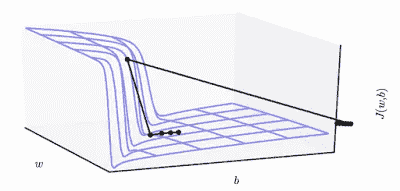

# 渐变剪辑

> 原文：<https://medium.com/hackernoon/gradient-clipping-57f04f0adae>

> 你可以在推特@bhutanisanyam1 上找到我

在深度[学习](https://hackernoon.com/tagged/learning)模型的“训练”过程中，我们通过网络的层反向传播我们的梯度。

在[实验](https://hackernoon.com/tagged/experimentation)期间，一旦梯度值变得非常大，就会导致溢出(即 NaN)，这在运行时很容易检测到，或者在不太极端的情况下，模型开始超过我们的最小值；这个问题叫做**渐变爆炸问题**。

这是指它们与大于 1 的数相乘而成指数级增长的情况，例如:



Source: Hinton’s Coursera Lecture Videos.

渐变裁剪将“裁剪”渐变或将其限制在某个阈值，以防止渐变变得过大。在上面的图像中，梯度被从过冲中截取，我们的成本函数遵循虚线值，而不是它的原始轨迹。

# L2 范数剪裁

存在各种方式来执行梯度裁剪，但是一种常见的方式是当参数向量的 L2 范数超过某个阈值时归一化参数向量的梯度:

```
new_gradients = gradients * threshold / l2_norm(gradients) 
```

我们可以在 Tensorflow 中使用函数来实现这一点

```
tf.clip_by_norm(t, clip_norm, axes=None, name=None)
```

这将使 *t* 标准化，从而使其 *L2 范数*小于或等于 *clip_norm*

此操作通常用于在使用优化器应用渐变之前对其进行裁剪。

> [你可以在 twitter @bhutanisanyam1 上找到我](https://twitter.com/bhutanisanyam1)
> 
> [订阅我的时事通讯，获取深度学习、计算机视觉文章的每周精选列表](https://tinyletter.com/sanyambhutani)
> 
> [这里的](https://becominghuman.ai/a-self-driving-new-year-33284e592f35)和[这里的](https://hackernoon.com/a-self-driving-new-year-2-d1bbc5a83570)是我学习自动驾驶汽车道路上的两篇文章