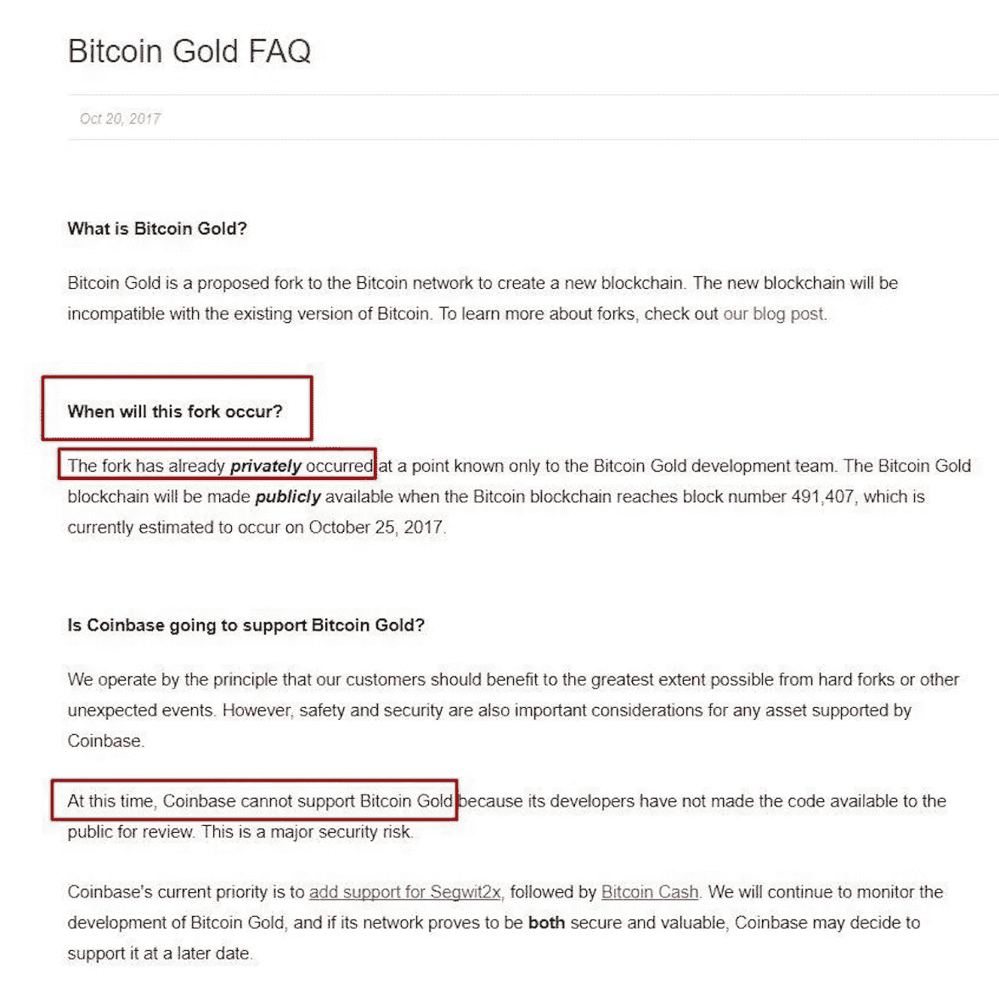
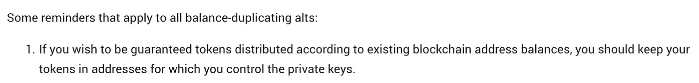

# 比特币黄金硬叉上的加密交易所分级。

> 原文：<https://medium.com/hackernoon/grading-the-customer-service-of-cryptoexchanges-on-the-bitcoin-gold-hard-fork-5a1c871d8dc6>

*比特币基地、比特雷克斯、北海巨妖、比特芬尼克斯、波洛涅克斯和双子座*

因为加密货币是如此之新，所以有很多成长的烦恼，客户服务就是其中之一。但是适可而止。我厌倦了糟糕的沟通和长达一个月的支持票，没有一个单一的回应。

[https://unsplash.com/photos/5otlbgWJlLs](https://unsplash.com/photos/5otlbgWJlLs)

因此，本着让这些交易所承担责任并希望它们加大努力为客户提供适当服务的精神，我决定写一份主要加密交易所的时间表，并根据它们在比特币黄金硬分叉方面的客户服务对它们进行评级。

# **1。比特币基地**

10 月 20 日，比特币基地错误地声称比特币黄金已经在他们的比特币黄金常见问题中分叉。

[Shout to my redditors everywhere!](https://www.reddit.com/r/LitecoinMarkets/comments/77szp7/confirmed_by_coinbase_bitcoin_gold_fork_privately/)

但是，你知道吗？我要给他们一张通行证。比特币黄金的开发团队不仅在他们的新闻稿中，而且在他们的 github 中，都令人难以置信地不清楚。很好，你试图在游戏中领先，并告诉你的客户你在 HF 背后的意图。

他们已经更新了他们的[比特币黄金常见问题](https://support.coinbase.com/customer/portal/articles/2892196-bitcoin-gold-faq)，并发布了[官方新闻稿](https://blog.coinbase.com/timeline-and-support-bitcoin-segwit2x-and-bitcoin-gold-eda72525efd)，声明他们将允许你提取比特币黄金，但前提是它是安全的(足够公平)。但或许更大的消息是，传统的比特币链将保留 BTC 的代码，比特币 SegWit 2X 将采用 B2X 的代码。(率先帮助缓解下一个比特币硬分叉的一些不确定性的方式！)

**等级:A-**

# **2。Bittrex**

10 月 21 日，Bittrex 做了一项出色的工作[通知他们的客户](https://support.bittrex.com/hc/en-us/articles/115002320451)他们计划做什么，同时准确评估形势:

*   快照将在 10 月 23 日晚上 11 点左右。
*   如果 BTG 团队真的创造出了一个功能性产品，你将会得到奖励，并且可以退出(这是一个非常合理的说法)。
*   为了拍摄快照，BTC 的存款和取款将被禁用 24 小时。(呃，不是粉丝，但你做你该做的)。
*   没有 BTG 交易，直到另行通知。

简短，甜蜜，切中要害。顾客被提前告知，以便他们能弄清楚他们想如何玩 BTG 福克。

**等级:A**

# **3。北海巨妖**

这是迄今为止所有交流中我最喜欢的一系列声明。部分原因是因为它在 twitter 上，但主要是因为这个:

*推特#1* 在分手的那天，北海巨妖第一次发推特(顺便说一句，这是新闻稿的完美平台)说他们无论如何都不会支持分叉。后来他们删除了这条微博，但谢天谢地，twitter 上到处都是专注的“巨魔”:

几个小时后，他们在推特上说他们改变了主意。(说真的？这是个东西吗？不管怎样，现在谁还需要公关经理呢？😂)

在让他们的客户再焦虑 7 个小时以确保他们的血压不会集体过低后，他们决定回到他们最初的立场，并声明他们无论如何都不会支持 BTG(我认为这意味着你不会得到任何比特币黄金\_(ツ)_/)。

**等级:C**

# **4。Bitfinex**

拆分当天，Bitfinex [发布了一份非常普通的声明](https://www.bitfinex.com/posts/230)，称用户可以交易 BTG/美元和 BTG/BTC，一旦比特币黄金区块链稳定，就可以提现。不骗你，我有点失望。期待更多的戏剧。

**等级:B** (你应该早点让你的客户知道)

# **5。波洛涅克斯**

别担心，波洛涅克斯，我们没有忘记你。我认为他们把龟兔赛跑的故事看得太重了。大约在**硬叉 4 小时后，** Poloniex 最终发布声明:

基本上，[他们告诉所有的顾客去他们的。算是吧。他们说不会支持比特币黄金，因为没有实现重播保护。也就是说，如果他们真的用比特币黄金给他们的用户信用，他们会用你在分叉时余额中的比特币数量来这么做。](https://poloniex.com/press-releases/2017.10.24-Notice-About-Bitcoin-Gold/)

**等级:F**

# 6。双子座

他们在硬分叉 一天后发布了一份声明，声明他们现在不会支持它，但一旦它成为一种可行的货币，他们可能会支持它。

等级:F

# 我的外卖

1.  在所有的交易中，我认为 Bittrex 处理得最好。然而，我很钦佩比特币基地最近的举措，即更快地发布声明，并为 BTC/B2X 报价机树立先例，以帮助平滑下一个硬分叉。
2.  对所有的加密交易所来说，你们将会赚到数百万(我猜)。请帮大家一个忙，雇佣一个体面的公关经理和更多的客户服务代理(大声喊出 coinbase 和第一个加密交易所的客户服务电话号码:[+1(888)908–7930](https://blog.coinbase.com/announcing-coinbase-phone-support-1-888-908-7930-5a7c8385b47d))。
3.  至于那些觉得自己被耍了的人，我给你留下波洛涅克斯的这些令人惊讶的至理名言:

[https://poloniex.com/press-releases/2017.10.24-Notice-About-Bitcoin-Gold/](https://poloniex.com/press-releases/2017.10.24-Notice-About-Bitcoin-Gold/)

# 记得给我左边的掌声，下面的捐款，和你的朋友分享！直到下一次，向前和向上。😁

**捐赠地址** BTC:35 lfsm 2 eupceip 5 zzcgwmx 7 sccf ZK 7 jqyg
LTC:lpz 923h 556 f 8 G8 mgwnsuhqhvudrd 7 ccqyhf

# 讨论问题

1.  你如何评价交易所的客户服务？
2.  比特币黄金硬叉是怎么玩的？