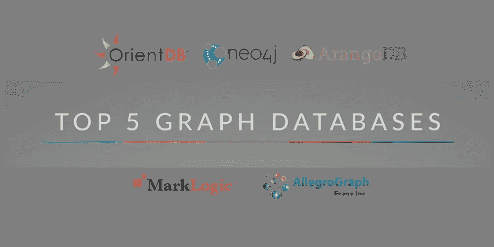
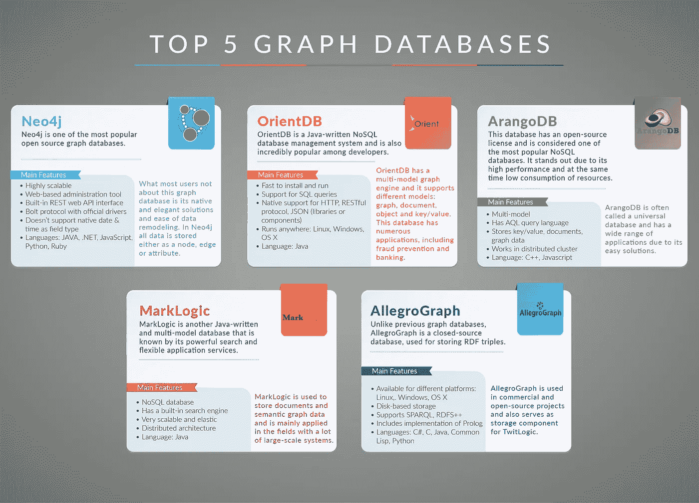

# 图表数据库评论

> 原文：<https://medium.com/hackernoon/graph-databases-review-b7be80e8c93a>

图形数据库对于处理大数据的公司来说是必不可少的，因为它们以清晰简单的视觉方式呈现数据。同时，图形数据库允许处理数据，提高公司的整体绩效并支持敏捷性，这在不断变化的商业环境中至关重要。然而，有各种各样的图形数据库，它们在语言、目的等方面有所不同。我们将看看最值得注意的几个及其核心特征。

这些图形数据库是最流行和最著名的数据库之一；然而，远不止如此。当选择一个图形数据库时，首先定义它的用途，然后检查它的特性是否符合您的要求。

我们还列出了一系列**图形数据库的优势**，您可能需要考虑:

## **性能:**

即使您的数据在增长，图形数据库的性能也保持不变，考虑到公司正在处理大量数据，这是一个巨大的优势

## 灵活性:

使用图形数据库，IT 和数据架构师团队可以跟上业务的发展，因为图形模型的结构和模式会随着应用程序和行业的变化而变化。数据团队可以在不危及其当前功能的情况下添加到现有的图结构中，而不是提前对域进行详尽的建模。

## 敏捷性:

使用图形数据库进行开发完全符合当今敏捷的、测试驱动的开发实践，允许您的图形数据库与应用程序的其余部分以及任何不断变化的业务需求同步发展。现代图形数据库是为无摩擦开发和优雅的系统维护而配备的。

此外，图形数据库允许比关系数据库更快的深度遍历。其中一些(Sparksee 高性能图形数据库)允许非常快速地执行复杂的模式匹配查询和数据的紧凑表示，将其实现基于位图。

[*安东·沙利尼科夫*写的](https://www.linkedin.com/in/anton-shaleynikov-45812a1/)

*想了解更多信息？* [*查看此处*](https://dashbouquet.com/blog)

> [黑客中午](http://bit.ly/Hackernoon)是黑客如何开始他们的下午。我们是阿妹家庭的一员。我们现在[接受投稿](http://bit.ly/hackernoonsubmission)并乐意[讨论广告&赞助](mailto:partners@amipublications.com)的机会。
> 
> 如果你喜欢这个故事，我们推荐你阅读我们的[最新科技故事](http://bit.ly/hackernoonlatestt)和[趋势科技故事](https://hackernoon.com/trending)。直到下一次，不要把世界的现实想当然！

