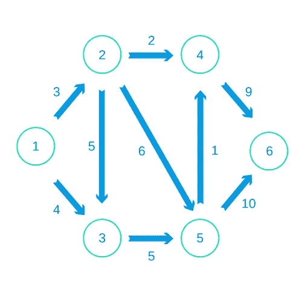
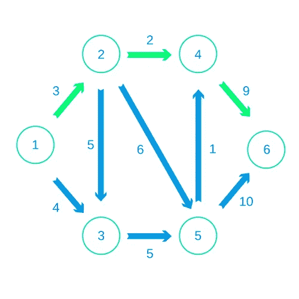
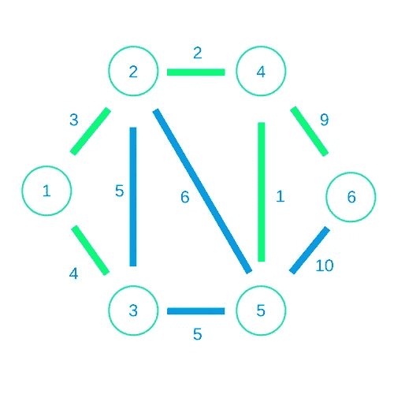

# 画出来！

> 原文：<https://medium.com/hackernoon/graphing-it-out-2e99f8948602>

在[的最后两篇文章](https://mmhaskell.com/blog/2017/6/19/profiling-in-haskell)中，我们处理了一些算法问题。我们只能通过改进代码中的数据结构来解决这些问题。首先，我们使用 Haskell 的内置数组类型进行快速索引。当我们需要一棵细分树时，我们决定从头开始做。但是我们不能对遇到的每个问题都滚动自己的数据结构。因此，拥有一些我们可以用于更多这些高级主题的系统是件好事。

算法需要的最重要的一类数据结构是图。在表示复杂问题时，图表非常有用。它们对于表达数据点之间的关系非常有用。在本文中，我们将看到两种类型的图问题。我们将了解一个叫做[功能图形库](https://hackage.haskell.org/package/fgl) (FGL)的库，它在 Hackage 上可供我们使用。然后，我们将尝试使用这个库来构建图形。最后，我们会看到，一旦我们做出了图形，使用这个库来解决这些算法是多么简单。

要获得我们将在本文中使用的完整代码集，请查看[Github 库](https://www.github.com/jhb563/HaskellGraphs)。它将向您展示如何使用 Stack 将函数图形库引入您的代码。

如果你以前从未使用过 [Stack](https://docs.haskellstack.org/en/stable/README/) ，它是在 Haskell 中创建程序不可或缺的工具。您应该尝试一下我们的 [Stack 迷你课程](https://academy.mondaymorninghaskell.com/)，了解更多相关信息。

# 图表 101

对于那些不熟悉图形和图形算法的人，我将在这里解释一些基础知识。如果你已经非常熟悉这些，你可以跳过这一节。图形包含一系列对象，并对这些对象之间的各种关系进行编码。对于集合中的每个对象，我们都有一个“节点”。这些就像数据点。然后，为了表示每个关系，我们在两个不同的节点之间创建一条“边”。我们经常给这条边赋予某种值，作为关于关系的一条信息。在本文中，我们将把节点想象成地图上的地点，边代表地点之间的合法路线。每条边的标签就是距离。

边可以是“有向的”也可以是“无向的”。有向边描述了节点之间的单向关系。无向边描述了一种双向关系。下面是一个有向边的图形示例:



# 用 FGL 制作图表

所以每当我们用 FGL 做图表时，我们会用两个步骤。首先，我们将创建图表的“节点”。然后我们会对边缘进行编码。假设我们正在读取一个输入流。该流将首先给出我们图中的节点数，然后是边数。然后我们将逐行读取一组三元组。前两个数字指的是“从”节点和“到”节点。第三个数字将代表距离。上图中的这条河流可能是这样的:

```
6
9
1 2 3
1 3 4
2 3 5
2 4 2
2 5 6
3 5 5
4 6 9
5 4 1
5 6 10
```

我们将这样阅读这个输入流:

```
import Control.Monad (replicateM)
import System.IO (Handle, hGetLine)data EdgeSpec = EdgeSpec
  { fromNode :: Int
  , toNode :: Int
  , distance :: Int
  }readInputs :: Handle -> IO (Int, [EdgeSpec])
readInputs handle = do
  numNodes <- read <$> hGetLine handle
  numEdges <- (read <$> hGetLine handle)
  edges <- replicateM numEdges (readEdge handle)
  return (numNodes, edges)readEdge :: Handle -> IO EdgeSpec
readEdge handle = do
  input <- hGetLine handle
  let [f_s, t_s, d_s] = words input
  return $ EdgeSpec (read f_s) (read t_s) (read d_s)
```

我们的目标是以 FGL 的格式来编码这个图表。在这个库中，每个节点都有一个整数标识符。节点既可以是“已标记的”，也可以是“未标记的”。这个标签，如果存在的话，是和整数标识符分开的。我们将使用的函数要求我们的节点有标签，但是我们不需要这些额外的信息。所以我们将使用 newtype 包装同一个整数标识符。

一旦我们知道了节点的数量，创建所有节点实际上是非常容易的。我们将从 1 到长度的每个数字做标签。然后我们用索引和标签的元组来表示每个节点。让我们启动一个函数来创建我们的图表:

```
import Data.Graph.Inductive.Graph (mkGraph)
import Data.Graph.Inductive.PatriciaTree (Gr)…newtype NodeLabel = NodeLabel Int 
type Distance = IntgenGraph :: (Int, [EdgeSpec]) -> Gr NodeLabel Distance
genGraph (numNodes, edgeSpecs) = mkGraph nodes edges
  where
    nodes = (\i -> (i, NodeLabel i)) 
      <$> [1..numNodes]
    edges = ...
```

我们制作的图表使用了“帕特里夏树”编码。关于这一点我们就不细说了。我们将只调用由库公开的一个简单的`mkGraph`函数。我们将使返回值成为由节点标签类型和边标签类型参数化的图类型`Gr`。正如我们所见，我们将使用整数的类型同义词`Distance`来标记我们的边。

现在让我们开始创造我们的优势。我们用`EdgeSpec`指定的格式证明我们不需要做很多工作。正如带标签的节点类型是元组的同义词一样，带标签的边是三元组。它包含“从”节点、“到”节点的索引，然后是距离标签。在这种情况下，我们将使用有向边。我们对每个边缘规格都这样做，然后就完成了！

```
genGraph :: (Int, [EdgeSpec]) -> Gr NodeLabel Distance
genGraph (numNodes, edgeSpecs) = mkGraph nodes edges
  where
    nodes = (\i -> (i, NodeLabel i)) 
      <$> [1..numNodes]
    edges = (\es -> (fromNode es, toNode es, distance es))
      <$> edgeSpecs
```

# 使用图形算法

现在假设我们想解决一个特定的图形问题。首先我们要解决最短路径问题。如果我们还记得上面的内容，我们图上从节点 1 到节点 6 的最短路径实际上是沿着顶部，从 1 到 2 到 4 到 6。



我们如何从 Haskell 解决这个问题？我们将首先使用上面的函数来读取图形。然后，我们将想象为开始和结束节点读入两个以上的数字。

```
solveSP :: Handle -> IO ()
solveSP handle = do
  inputs <- readInputs handle
  start <- read <$> hGetLine handle
  end <- read <$> hGetLine handle
  let gr = genGraph inputs
```

现在有了 FGL，我们可以简单地进行几次库调用，就可以得到结果了！我们将使用`Query.SP`模块，该模块公开了查找最短路径及其长度的函数:

```
import Data.Graph.Inductive.Query.SP (sp, spLength)solveSP :: Handle -> IO ()
solveSP handle = do
  inputs <- readInputs handle
  start <- read <$> hGetLine handle
  end <- read <$> hGetLine handle
  let gr = genGraph inputs
  print $ sp start end gr
  print $ spLength start end gr
```

我们将得到输出，其中包含路径和距离的表示。假设“input.txt”包含我们上面的示例输入，除了多两行用于开始和结束节点“1”和“6”:

```
>> find-shortest-path < input.txt
[1,2,4,6]
14
```

我们可以将文件从 3 改为 6，然后我们会得到:

```
>> find-shortest-path < input2.txt
[3,5,4,6]
15
```

酷！

# 最小生成树

现在让我们想象一个不同的问题。假设我们的节点是互联网枢纽。我们只想确定它们之间有某种联系。我们将选择边的子集来创建一棵“生成树”，连接我们所有的节点。当然，我们想以最便宜的方式做到这一点，通过使用到边的最小总“距离”。这将是我们的“最小生成树”。首先，让我们去掉所有箭头上的指示。我们可以通过查看这张图片来想象这个解决方案，我们会看到我们可以以 19 英镑的总成本连接我们的节点。



好消息是编写这些代码并不需要太多的工作！首先，我们将稍微调整一下我们的图形结构。为了在这个场景中得到一个“无向图”,我们可以将箭头做成双向的，如下所示:

```
genUndirectedGraph :: (Int, [EdgeSpec]) -> Gr NodeLabel Distance
genUndirectedGraph (numNodes, edgeSpecs) = mkGraph nodes edges
  where
    nodes = (\i -> (i, NodeLabel i)) 
      <$> [1..numNodes]
    edges = concatMap (\es -> 
      [(fromNode es, toNode es, distance es), (toNode es, fromNode es, distance es)])
      edgeSpecs
```

除此之外，我们现在要做的就是使用`MST`模块中的`msTree`函数！然后我们会得到我们的结果！

```
import Data.Graph.Inductive.Query.MST (msTree)...solveMST :: Handle -> IO ()
solveMST handle = do
  inputs <- readInputs handle
  let gr = genUndirectedGraph inputs
  print $ msTree gr{- GHC Output
>> find-mst < “input1.txt”
[[(1,0)],[(2,3),(1,0)],[(4,2),(2,3),(1,0)],[(5,1),(4,2),(2,3),(1,0)],[(3,4),(1,0)],[(6,9),(4,2),(2,3),(1,0)]]
-}
```

这个输出有点难以理解，但是它和我们上面看到的树是一样的。我们的输出是一个列表列表。每个子列表包含从一个节点到第一个节点的路径。路径列表有一系列元组，每个元组对应一条边。元组的第一个元素是起始节点，第二个元素是距离。

因此，第一个元素，`[(1,0)]`指的是节点 1 如何通过从 1 开始的距离为 0 的单条“边”连接到自身。如果我们查看最后一个条目，我们会看到节点 6 通过经过节点 4 和 2 的路径连接到节点 1，总距离为 9、2 和 3。

# 结论

图形问题在编程中无处不在，但是要解决它们可能有点棘手。从头开始编写自己的图形数据结构肯定会很痛苦。写出一个完整的算法可能更难，即使是像 Dijkstra 算法这样众所周知的算法。在 Haskell 中，您可以使用函数图形库来简化这个过程。它有一个内置的格式来表示图形本身。建立这种结构可能有点乏味。但是一旦你有了它，解决许多不同的常见问题实际上是非常容易的。

下周，我们将和 FGL 一起做更多的工作。我们将探索一个不像我们在这里看到的那样一成不变的问题。首先，我们将采取一个更抽象的问题，并确定我们想为它做什么图。然后我们用 FGL 来解决这个图形问题。所以下周回来看看哈斯克尔的博客！。

将 FGL 引入 Haskell 代码的最简单方法是使用`Stack`工具。如果您对此不熟悉，您应该参加我们免费的 [Stack 迷你课程](http://academy.mondaymorninghaskell.com/p/your-first-haskell-project)。您将了解如何在代码中引入依赖关系的重要步骤。您还将看到堆栈程序中的不同组件，以及可以运行来操作它们的命令。

如果你以前从未用 Haskell 编程，你应该试试！下载我们的[入门清单](https://www.mmhaskell.com/checklist)。它会指引你在早期 Haskell 教育中找到一些有价值的资源。

[](http://bit.ly/HackernoonFB)[](https://goo.gl/k7XYbx)[](https://goo.gl/4ofytp)

> [黑客中午](http://bit.ly/Hackernoon)是黑客们下午的开始。我们是 [@AMI](http://bit.ly/atAMIatAMI) 家庭的一员。我们现在[接受投稿](http://bit.ly/hackernoonsubmission)并乐意[讨论广告&赞助](mailto:partners@amipublications.com)机会。
> 
> 如果你喜欢这个故事，我们推荐你阅读我们的[最新科技故事](http://bit.ly/hackernoonlatestt)和[趋势科技故事](https://hackernoon.com/trending)。直到下一次，不要把世界的现实想当然！

