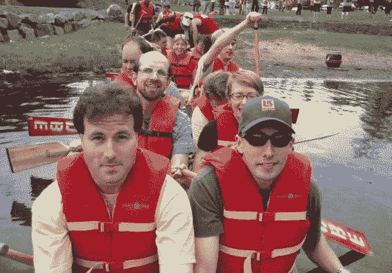
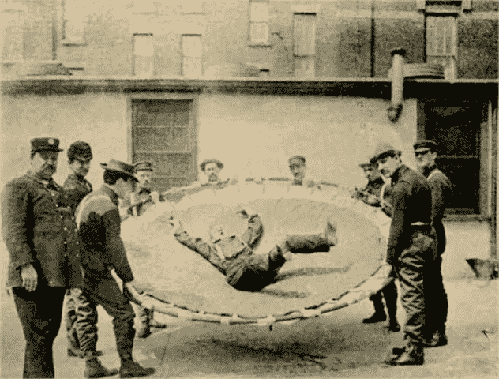
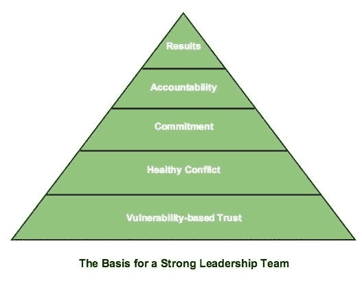
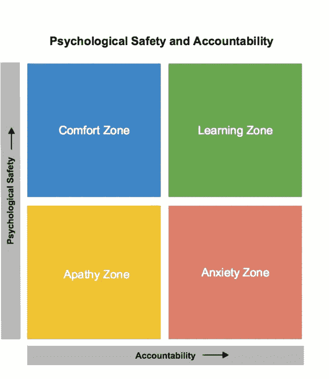

# 伟大的团队

> 原文：<https://medium.com/hackernoon/great-teams-5f15cb718c20>

你是否曾有幸加入一个伟大的团队？如果是这样，你肯定会知道，你会同意我的看法，这是一个美好的，令人满意的经历。这是我希望每个人都会有的经历。好消息是，创建和培养一个伟大的团队是可以实现的，而且一点也不神奇。

什么是伟大的团队？我的第一个想法是“我不确定，但当你经历时，这很明显。”幸运的是，我可以做得更好。谷歌已经花费了数百万研究促成高绩效团队的因素。我强烈推荐阅读《T2 纽约时报》报道他们工作的文章。他们观察了来自谷歌各地的 180 个团队，并煞费苦心地寻找将团队绩效与团队属性或行为联系起来的模式。这些模式很难理解。

他们没有发现团队的组成很重要的证据。“我们有大量的数据，但没有任何证据表明特定性格类型、技能或背景的混合会产生任何影响。等式中的‘谁’似乎并不重要。”对于那些试图改善现有团队的人来说，这是个好消息；对于那些希望空降摇滚明星来提高团队表现的人来说，这是个坏消息。

他们确实发现了一个优秀管理者一直都知道的模式:“在最好的团队中，成员相互倾听，并对感受和需求表现出敏感性。”在任何团队中，人们都可以努力建立和实践团队规范，鼓励和发展这两个成功的特性:让每个人都有发言权，关注和响应他人的需求。

[哈佛商学院的 Amy Edmondson](https://www.youtube.com/watch?v=LhoLuui9gX8) 创造了心理安全这个术语来捕捉这些特性。她将心理安全定义为“一种共同的信念，即团队对于人际风险承担是安全的。”

It’s a great feeling to know your team is there for you.

这一观点也是帕特里克·兰西奥尼关于组织健康著作的核心。在他的书《优势》(The Advantage )中，他提出了一个强有力的理由，即组织健康在决定一家公司的成功方面胜过所有其他属性。走向组织健康的第一步是拥有一个强大的、连贯的领导团队。他断言，该团队的第一个支柱是“基于脆弱性的信任”——这实际上与心理安全相同。

Lancioni 继续构建了一个金字塔，这是高绩效领导团队的基础:

当你有了心理安全感，你就可以有健康的冲突，因为人们可以专注于想法、事实和立场，而不会让其他人感到受到人身攻击。有了健康的冲突，团队可以对决策做出坚定的承诺，因为在做出决策之前，所有的观点都得到了表达和考虑。有了承诺，就有可能实现更高层次的责任，因为每个团队成员都承诺他们的行动源于一个决策。最后，金字塔的顶端是对结果的关注。公司的结果优先于个人或团队的议程。

同样，埃德蒙森将心理安全与责任交织在一起，她用四个象限来说明:

显然，学习区是我们想要的地方，有着高度的心理安全和责任感。如果你在这个区域呆过，你就会知道这是多么令人兴奋的感觉。也许，像我一样，在你职业生涯的某个时候，你也曾处于其他区域之一——这已经足够了！

我想描述一个受 Lancioni 启发的练习，这是我在上一个团队中进行的。这将有助于说明领导者的深思熟虑的行动可以推进团队变得伟大的条件。

围坐在桌子旁，每个团队成员都有一张索引卡，上面写着同事的名字。在卡片的一面，他们写下他们钦佩或欣赏的那个人的品质，在另一面写下改进的建议。他们为团队的每个成员做这件事。一旦每个人都有机会记录他们的想法，从团队领导作为主题开始，每个人依次阅读他们钦佩或欣赏的品质。受试者可以在听到下一个人之前感谢他们。当每个人都读完他们的卡片后，改进建议会在另一轮中被阅读。再说一次，主题可以说谢谢——不需要更多。所有的卡片都交给实验对象以备将来参考。然后，圈里的下一个人就成了主语。

在我确信团队足够成熟之前，我不会尝试和他们一起做这个练习。我可以告诉你，对我的团队来说，这个练习是一个巨大的时间投资，团队在合作中变得更加强大和有效。

我的经验告诉我，从心理安全开始，通过创建支持我所讨论的特质的群体规范，建立更强大的团队是可能的。结果不仅是更好的业务成果，而且团队成员感觉到更少的不健康压力，在工作中更快乐。

*本文原载于*[*【http://shoulders-of-giants.org】*](http://shoulders-of-giants.org)