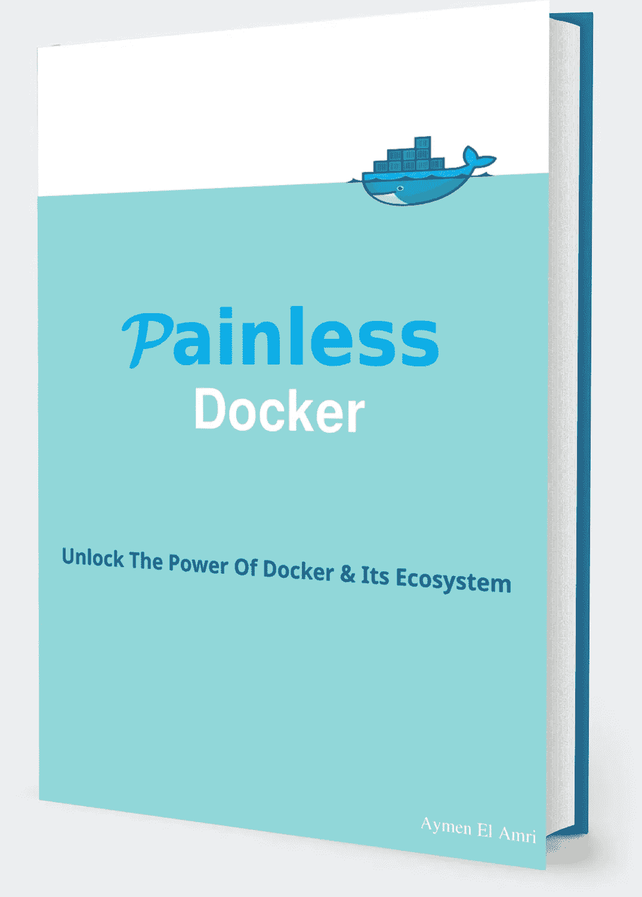

# 学习 Docker 的 10 大技巧

> 原文：<https://medium.com/hackernoon/great-tips-to-learn-docker-19181355150f>

学习不仅仅是关于**什么**而是**如何**不仅是关于**你应该拥有什么**技术技能，而且是关于**你应该如何**学习它们。

> 你可以在这里免费获得完整的指南**学习 Docker 的 10 大技巧** [。](http://10tips.painlessdocker.com)

在这篇博文中，我分享了一些学习 Docker 的技巧，这些技巧是我在创建[无痛 Docker 培训](http://painlessdocker.com)内容时遵循的。

# 你知道什么是虚拟化吗？

我猜想，许多在过去 2、3 年开始职业生涯的开发人员和运营工程师，在虚拟化成为热门词汇后就不再从事 IT 行业，他们对这项技术了解不多。

具有虚拟化技能的系统工程师曾经是(现在是？)比“普通”系统管理员工资高。

虚拟化是一项革命性的技术，并将继续如此。

> 了解虚拟化和容器化之间的区别，虚拟化的问题以及容器如何解决它，是一个非常好的开始。

# 从简单开始！

这个建议适用于你所有的学习道路！无论你是在学习 Docker 还是其他技术或技能。

从简单开始，暂时忘记 Kubernetes，Docker Swarm，可能还有 Docker Compose 这样的工具。换句话说，不要一开始就让你的学习之路变得复杂。

从推拉简单的容器开始，如 *hello world* 容器。将一些更改应用到这个容器并提交您的更改，标记它，然后推送它。

> 如果您的学习方法是从部署和使用 Kubernetes 集群开始的，那么您就错了！

# 网络，网络，网络

容器和编排系统中最困难的部分可能是网络。Docker 使用主机操作系统固有的相同网络基础设施。您可以在本地主机上运行 Docker 容器，而无需关心 SDN(软件定义网络)之类的东西。

一个你想进一步了解如何创建 Docker 集群和工作与编排系统，一些网络知识是必需的。

Docker 可以使用其默认网络，如

*   无网络
*   Docker 主机网络
*   桥接网络
*   docker_gwbridge 网络

它还可以使用软件定义的多主机网络，例如:

*   桥接网络
*   docker_gwbridge 网络
*   覆盖网络
*   法兰绒
*   织法
*   打开 vSwitch
*   印花布项目
*   管道工程
*   OpenVPN
*   ..等等

> 理解容器网络可能需要一些时间，但这是必须的！

# Docker 文件系统

Docker 兼容许多文件系统，每一个都有优点和缺点。为什么您会选择 aufs 而不是 devicemapper 或 overlay2？

你知道最上面的可写层是什么，以及图片和容器的区别吗？

你知道什么是牛策略吗？

> 像 Docker 网络一样，理解数据在 Docker 映像和容器中是如何存储和管理的也很重要

# 码头工人、装配工、机器

Docker 生态系统很大，而且每天都在变大。学习一些像 Docker Compose 和 Docker Machine 这样的工具会让你的生活变得更轻松，让你更有能力使用 Docker，优化你的交付和部署管道。

> 从学习 Docker 开始，然后转到 Docker Compose & Docker Machine。

# CLI

学习 CLI 很重要。Docker 有一些图形用户界面，但是如果你想掌握一项技术，最好的方法是使用它的命令行界面。

> 看看[无痛码头](http://painlessdocker.com)小抄库:【https://github.com/eon01/DockerCheatSheet】T2

# 编排是必须的

一旦掌握了基本的 Docker 概念和工具，就可以转向编排了。
没有流程编排的 Docker 不是一个可扩展的解决方案

编排将允许您从事务(容器)转移到抽象(服务)。它允许您简化和优化部署。

> 如果你刚刚开始学习，你应该从使用 Docker Swarm 开始，然后转移到更复杂的系统，如 K8S。

# 逐渐转向其他技能和服务

获取新技能是一条途径，你必须从技能 A 转移到技能 B，所以要有耐心和有条理。

你会在学习过程中发现问题，但如果你坚持下去，你会找到问题的答案。

> "通往成功的道路是采取大规模的、坚定的行动。"托尼·罗宾斯

# 像黑客一样逆向工程

[尝试用 Docker API](/devopslinks/d-ealer-auto-healing-docker-containers-using-python-docker-api-ce6d5269dcd1) 开发东西。

[使用 Docker](/statuscode/prototyping-a-parallel-computing-cluster-using-docker-25ea836a269b) 原型化并行计算集群

[使用 Docker](https://hackernoon.com/creating-an-army-of-docker-containers-using-saltstack-boto3-cloudinit-on-aws-cfd048e9c116) 制作无服务器系统原型

> 了解如何使用 Docker API，原型化您的 orchestrator 或您的自我修复系统..

# 不要羞于问

我知道一个初学者可能会有一些问题，这些问题可能被认为不是什么大问题。但是任何专家在成为专家之前都是从 00b 开始的！

> 求助！

在一些论坛上，你可能会得到像“让我谷歌一下”这样的答案，但这并不意味着你不应该问。当然，在没有任何帮助的情况下找到答案比在论坛上问你想到的第一个问题更好，也更有帮助，但是如果你需要的话，不要羞于问。

[DevOpsLinks](http://devopslinks.com) 社区有一个[专门讨论 DevOps 生态系统的讨论板。](https://discuss.devopslinks.com)加入它，提出你的问题，你会得到不带任何偏见的答案——我们很友好，乐于助人:-)

# 在线社区

社交学习会更好，你会找到来自各个层次的志同道合的人，你会及时了解你感兴趣的话题！

> 加入我的简讯 [DevOpsLinks](http://devopslinks.com) & [发货](http://shipped.devopslinks.com)！

# 连接更深！

我最近发表了一篇风格相同的博文。如果你有兴趣学习 AWS，[你应该查看一下](https://hackernoon.com/8-great-tips-to-learn-aws-c4e1e0de4682)！

我们努力工作是为了给你我们所掌握的最好的东西。我们正在为每个人和每个层次的人建立在线课程:新手，中级和熟练的人。

我们的目标是让人们有机会通过优质的课程和实用的学习途径进入 DevOps 世界。

> 如果你喜欢这篇文章或者想发现类似的教程，你会喜欢阅读[无痛码头课程](http://painlessdocker.com)。

您还可以注册 [DevOpsLinks](http://devopslinks.com) ，一个 DevOps 专业网络和我们的 [DevOps 讨论板](http://discuss.devopslinks.com)，在这里您可以提问和回答 DevOps 相关问题！

> 我们还开始了[发货简讯](http://shipped.devopslinks.com):一个关注容器&编排的独立简讯。

黑客快乐:-)