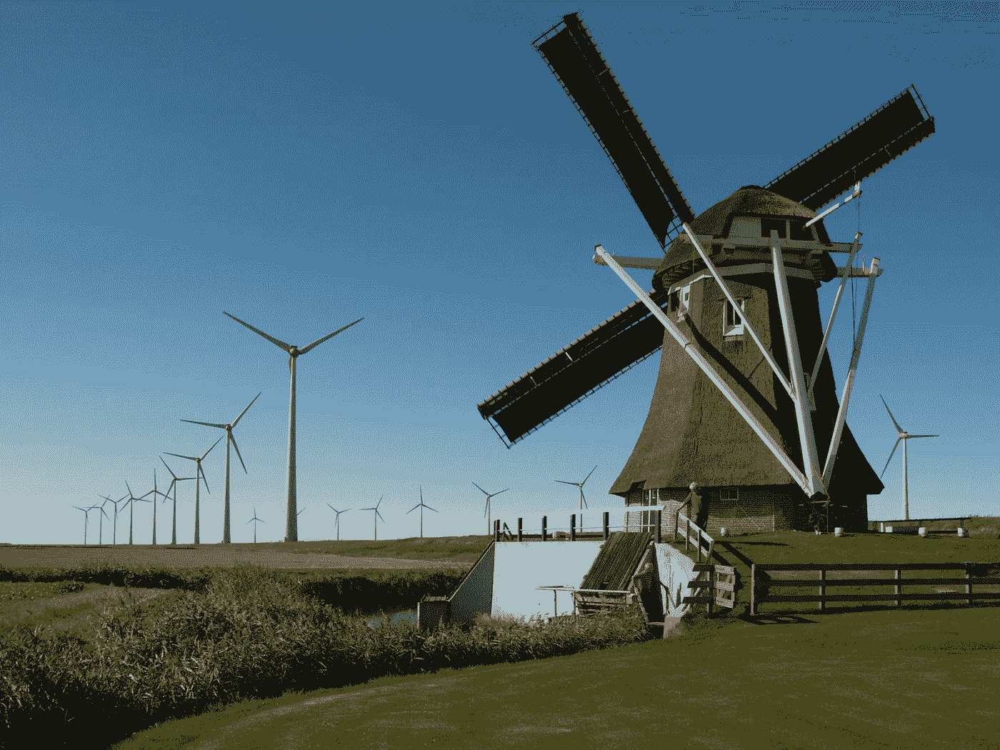

# 绿色能源和比特币

> 原文：<https://medium.com/hackernoon/green-energy-and-bitcoin-eb7961f38382>

人们普遍担心比特币，尤其是比特币开采对环境的影响。最常见的批评是比特币采矿需要大量的电力。一笔比特币交易消耗的电力相当于一栋普通别墅一周的用电量。这显然是一种巨大的浪费。是吗？有没有另一种看待这件事的方式？让我们来研究一下这个问题。

首先，让我们记住最初是什么引发了比特币革命——我们当前货币体系的破坏性。几乎地球上的每一种法定货币都不再与金本位挂钩，因此由于通货膨胀现象，它们每天都在贬值。这刺激了消费。开销很大。全球各地的公民和民族国家似乎都同样渴望将自己淹没在债务中，试图在这场逐底竞赛结束前囤积尽可能多的无聊废话。事实证明这对地球是灾难性的。由于我们都渴望越来越高的生活水平，不管我们是否负担得起，能源消耗增加，二氧化碳水平上升。

另一方面，比特币鼓励储蓄你的财富，并将其投资于有用的东西。这是通过一个可控的、可预测的、不断减速的通货膨胀率来实现的。这可以比作一个新的金本位制。最近，比特币社区的一个子集“分叉”了。他们这样做是因为他们认为网络费用已经变得太高，比特币如果不是一种廉价的交易媒介就无法运作，他们愿意牺牲一些去中心化机制，以降低网络交易费用。在这样做的时候，他们实际上将可交易代币的数量增加了一倍，以便企业继续接受加密作为法定货币的可行替代方案，但是…

*这不是比特币。*

比特币，原始的链条，高昂的费用，缓慢的确认时间和巨大的能源消耗才是最重要的。这是充当新黄金标准的标志，这是有可能挑战我们看待全球经济以及与全球经济互动的方式的技术。代用币、叉币和金融科技术语牛链代币不是。关键是比特币不会刺激无意义的消费。

当比特币的反对者把用比特币购买一杯咖啡比作让别墅温暖一周时，他们忽略了几点。首先，比特币的主要用途不是为世界提供一种购买咖啡的新方式。在过去，比特币可能被宣传成这样，但所有指标都表明了另一种情况——比特币主要是一种价值储存手段。随着价格和费用的上涨，使用比特币作为可行替代方案的场景变得越来越少。一个比咖啡更准确的比喻是，在不到一个小时的时间里，将一根金条从斯堪的纳维亚安全地送到澳大利亚需要多少能量。这就是比特币的作用，无论你如何努力，都需要大量的能量。

与传统发电厂相比，风能、太阳能和水能等可再生能源有很大的劣势。它们不那么容易预测。有时他们生产太少，有时他们生产太多的电力。当能量过剩时，储存能量的方式是有限的。但是现在有了一种新的方式将多余的权力货币化。采矿。每当你的风车或太阳能电池板产生太多能量时，你可以把它连接到采矿设备上，从而平衡你的利润。此外，如果你的太阳能电池板安装在你别墅的屋顶上，你可以用你的采矿设备产生的热量来加热你的房子，你的水或者其他任何需要加热的东西。

这里的要点是，所有这些技术结合起来可能是完全自给自足的房屋的转折点。如果你通过让你的家完全与除互联网以外的所有电网断开来获利，没有理由不这样做。我们需要做的就是让用户界面更友好一点。政客们使用华丽的辞藻，试图迫使人们使用可再生能源，但唯一能真正在更大范围内改变人们行为的事情是，如果技术让这样做在经济上真正可行。