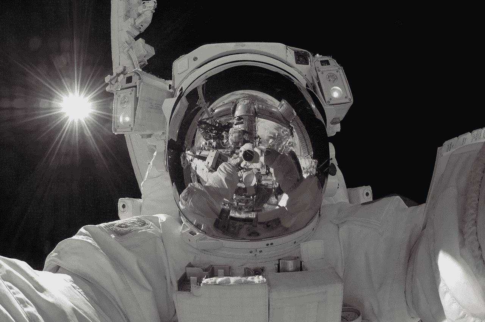

# 地面控制呼叫汤姆少校:NASA 如何使用 Node.js

> 原文：<https://medium.com/hackernoon/ground-control-to-major-tom-how-nasa-uses-node-js-8d011e167436>

Image from Pixabay.

在 2013 年的一次太空行走中，意大利宇航员卢卡·帕米塔诺发现自己处于极度危险之中——水正渗入他的头盔。

水在零重力状态下迅速迁移到他的眼睛、耳朵和鼻子。很快，卢卡开始努力听和看，他开始呼吸困难。幸运的是，他的太空行走伙伴克里斯·卡西迪就在附近，并引导卢卡进入气闸室和安全地带。

没有装满水的头盔，太空是很难生存的，所以美国宇航局停止了所有非紧急太空行走，并展开了一项调查，以查明到底发生了什么。进入系统的污染物导致水分离器发生故障，在本应是 6.5 小时太空行走的 30 分钟后，水又回到了头盔中。

宇航服规格、维护时间表和之前的旅行数据分散在太多不同的位置。作为调查的一部分，当美国宇航局去收集所有可能的数据时，结果证明这是一项天文数字级的任务。

Collin Estes 是数学研究所技术公司(MRI Technologies)的软件工程总监兼首席架构师，他与联合技术公司航空航天系统公司(United Technologies Corporation Aerospace Systems)合作，该公司为美国宇航局的舱外活动(EVA)任务制作和维护宇航服。一旦数据问题的范围被揭示，他和他的团队就接受了为宇航服整个生命周期的数据创建端到端系统的挑战。但是请记住，这是政府的工作，所以必须做得又好又快，并且尽可能地省钱。

他选择 Node.js 来让它工作。

如果你想了解更多关于 NASA 如何使用 Node.js 来实现数据可访问性和其他方面的信息，请阅读这个案例研究。

> [黑客中午](http://bit.ly/Hackernoon)是黑客如何开始他们的下午。我们是 [@AMI](http://bit.ly/atAMIatAMI) 家庭的一员。我们现在[接受投稿](http://bit.ly/hackernoonsubmission)并乐意[讨论广告&赞助](mailto:partners@amipublications.com)机会。
> 
> 如果你喜欢这个故事，我们推荐你阅读我们的[最新科技故事](http://bit.ly/hackernoonlatestt)和[趋势科技故事](https://hackernoon.com/trending)。直到下一次，不要把世界的现实想当然！

