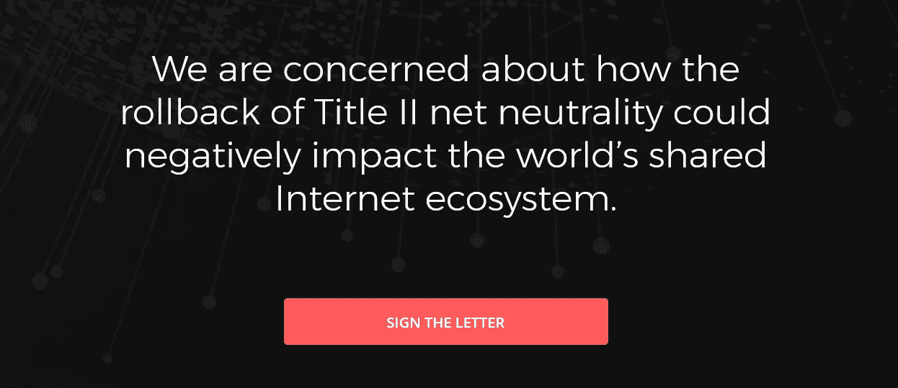
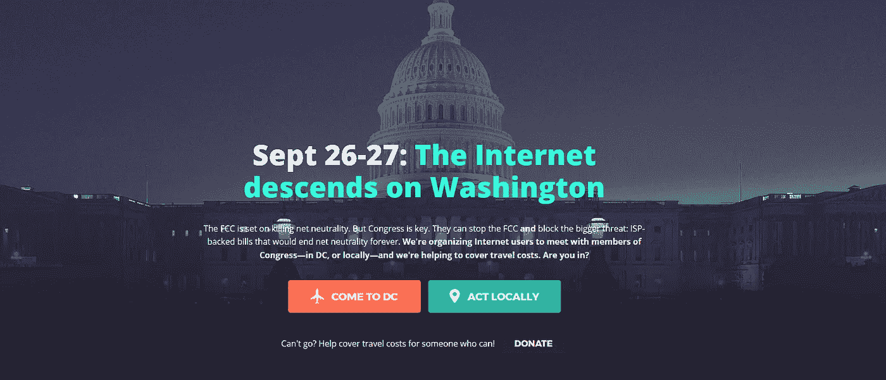

# 国际公开信警告美国:撤销网络中立规则可能会造成“重大的社会和经济伤害”

> 原文：<https://medium.com/hackernoon/growing-international-network-warns-the-us-rolling-back-net-neutrality-rules-could-create-20be77ae6c5f>

一个由国际企业和组织组成的越来越多的[网络](https://hackernoon.com/tagged/network)警告美国联邦通信委员会(FCC ),撤销 Title II 网络中立规则可能会造成“重大的社会和经济伤害”今年早些时候，联邦通信委员会主席 Ajit Pai 宣布了取消这些规则的计划，这些规则目前要求美国互联网服务提供商(ISP)平等对待所有[互联网](https://hackernoon.com/tagged/internet)流量——甚至是来自海外的流量。

在美国以外运营的企业和组织，包括[欧洲数字版权](https://edri.org/)(EDRi)[立即访问](https://www.accessnow.org/)、[网络中立创业公司](http://www.startupsfornetneutrality.eu/)和荷兰搜索引擎[StartPage.com](https://www.startpage.com/)在给 Pai 和美国国会的新信件中总结了他们对回滚计划的担忧。

鼓励美国以外的公司和组织尽快签署这封公开信。

虽然 Pai 似乎忽视了超过 2000 万由他的国家自己的公民提出的支持网络中立的评论，但这并没有阻止 StartPage.com 首席执行官 Robert Beens 加入进来。

“互联网是一个共享的世界市场和论坛，需要国际合作和外交，”Beens 说。“美国应该征求所有可能受到影响的各方的意见。这是应该做的事情，我们希望白主席认真考虑我们的关切。”

该组织计划在 9 月 26 日 FCC 公开会议前将这封信递交给 Pai，这是国会山大规模行动的前一天。

签名者在信中警告称，如果美国废除网络中立规则，它可能会损害或摧毁全球企业和组织，因为它允许美国互联网服务提供商决定他们的美国客户在使用他们的服务时可以在网上看到什么和做什么，甚至歧视国际流量。互联网服务提供商将有权屏蔽网站和应用程序，甚至迫使网站支付昂贵的“优先排序”费用来吸引客户。

他们在这里贴了以下字母****:****

***亲爱的 FCC 主席 Ajit Pai 和国会议员们，***

***我们是总部位于美国境外的公司和组织，我们担心美国 Title II 网络中立规则的撤销会对全球共享互联网生态系统产生负面影响。***

***互联网之所以在社会和经济上如此成功，是因为其核心是未经许可的任何对任何的通信。网络中立性允许在线商业或任何社会运动平等地接触全球受众——破坏这一原则将造成重大的社会和经济伤害。***

***接入整个互联网不仅对美国的商业和社会至关重要，对美国以外的商业和个人也至关重要。我们还依靠强大的竞争框架和法律基础来确保互联网服务提供商(ISP)不会通过歧视网站、服务和应用程序，或者通过征收损害企业和消费者的新费用，对商业和言论自由设置障碍。***

***开放的互联网让我们所有人都有可能把自己最好的商业想法带到世界各地，而不会受到干扰，也不需要事先征得任何看门人的许可。这是可能的，因为网络中立的原则确保每个人，无论他们在哪里，都可以不受阻碍地获得互联网的机会。***

***FCC 长期以来致力于保护开放的互联网，这是互联网在美国及其境外仍然是企业家精神和经济增长引擎的主要原因。我们深感担忧的是，对网络中立性的监管改革提议将损害互联网上的言论自由和竞争。尽管有相反的保证，联邦通信委员会提出的变化将消除现有的唯一足够强大的法律基础，以确保美国将继续遵守网络中立的原则。***

**联邦通信委员会撤销网络中立条款将赋予美国互联网服务提供商如 AT T、康卡斯特和威瑞森控制互联网的新权力。最终，这些变化将允许美国互联网接入提供商要求在线服务付费，以获得优先访问该提供商客户群的权利，从而创造出一个新的垄断市场，取代现有的开放市场。这将分割市场，破坏规模经济，降低创新激励，破坏社会运动，撕裂互联网的灵魂。**

***我们敦促你们维持强有力的网络中立规则，关注鼓励部署新网络基础设施的政策，并在互联网服务提供商之间创造更多的选择和竞争。***

***感谢您考虑我们的观点。***