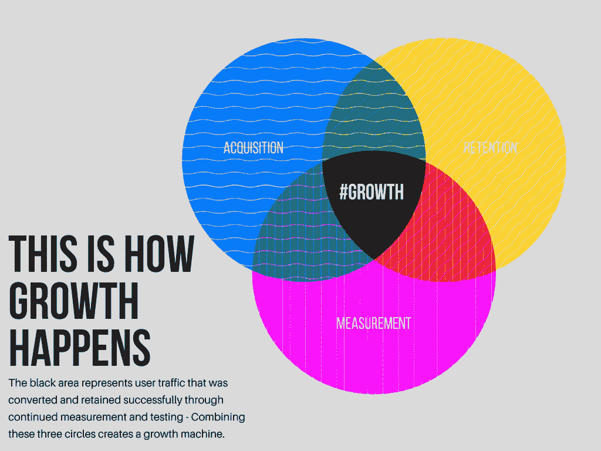

# 增长黑客不是万能的

> 原文：<https://medium.com/hackernoon/growth-hacking-is-not-one-size-fits-all-d0d771f14275>

> 在出版社工作的海姆·佩克尔。[原载](https://www.quora.com/Is-there-a-growth-hacking-consultancy-agency-for-hire-for-startups/answer/Haim-Pekel)于 [Quora](http://quora.com?ref=hackernoon) 。

> “但你为什么称之为增长黑客呢？”

作为一个既做增长黑客又做营销的人，我经常被问到这个问题。我通常用下面的心理形象来解释这种区别:

> 鸡“生长”下蛋，它坐在蛋上“营销”，结果，鸡和小鸡都能够“孵化销售”

不幸的是，生长黑客比你标准的 21 天孵化过程需要更多的时间。

增长黑客并不像 SEO、Social 和 SEM 解决方案那样是一刀切的解决方案。许多营销机构将自己重新标榜为增长黑客机构，因为这是一个“热门话题”

但结果通常是一个标准的营销活动，营销活动很棒，不要误会我的意思，但它们只是增长黑客所涉及的所有过程的一小部分。

数字营销机构将自己标榜为增长黑客机构，因为人们正在积极寻找以增长为导向的机构，让我们面对它，谁不想在一个新的细分市场中占有一席之地，对吗？

这些机构依赖于 SEO 和 SEM，有时依赖于社交和 PR，这需要一套特定的技能，需要数年才能掌握，当然，这不是增长黑客。

上面提到的技术可以促进公司的发展，但只是作为更大战略的一部分。

不要误解我，行业经验和知识有助于这些机构为初创公司和公司提供高度有针对性的受众，让他们获得所需的曝光率，但增长黑客？没有那么多。

成长黑客并不专注于某个特定的技术，它是关于应用所有与以下三个相关的最好的技术，并随着时间的推移成功地应用:

1.  **用户获取**
2.  **用户留存**
3.  **有效测量值**

将以上三者结合起来会产生增长，甚至是长期增长。但是你需要在盒子之外添加许多思维**和技术**+添加组合**工具**或**特定方法**来实现增长。****

**SEO 和 SEM 可能是你成长战略的一部分。我的代理公司[Press It](https://pressonit.com/)广泛使用这些技术来帮助我们的客户实现上述三位一体，但这只是他们增长战略的一部分。**

**是的，有一条规则总是在提醒你…**

> **没有战略=没有长期增长**

**这就是为什么你需要增长黑客，这是一个终极战略，让你可以设计增长。**

**我看到了几个维恩图，解释了在优秀的营销、数据分析(或分析)和开发之间的空间中发生的增长。**

# **恕我不敢苟同，这些是成长黑客工具或技能**

**当你能够获得用户，留住他们，并衡量这是如何发生的时候，增长就发生了，如下文所示:**

****

**营销、数据分析和开发只是达到上述目的的手段的一部分。**

**现在你知道区别了，这里有一些提示可以帮助你找到适合你的代理。**

**我建议寻找这样的人:**

*   **知道如何创造惊人的营销活动，并将其与转化技术相结合。**
*   **拥有丰富的用户维系/客户体验知识。**
*   **根据数据评估假设，并根据评估得出结论。**

**如果有人告诉你，他们开发了一个公式，试着远离…**

**不是因为他们的公式不起作用，公式起作用，只是对你起作用，而不是对你。**

> **在出版社工作的海姆·佩克尔。[原载](https://www.quora.com/Is-there-a-growth-hacking-consultancy-agency-for-hire-for-startups/answer/Haim-Pekel)于[Quora](http://quora.com?ref=hackernoon)&[LinkedIn](https://www.linkedin.com/pulse/growth-hacking-really-different-from-marketing-haim-pekel/)。**
> 
> **更多来自 Quora[的趋势科技答案，请访问](https://medium.com/u/3853f85f7d5e?source=post_page-----d0d771f14275--------------------------------)[HackerNoon.com/quora](https://hackernoon.com/quora/home)。**