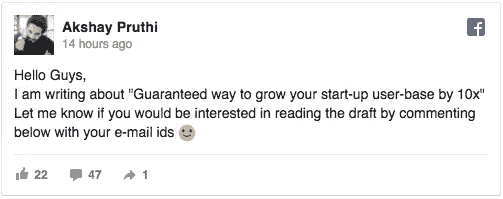
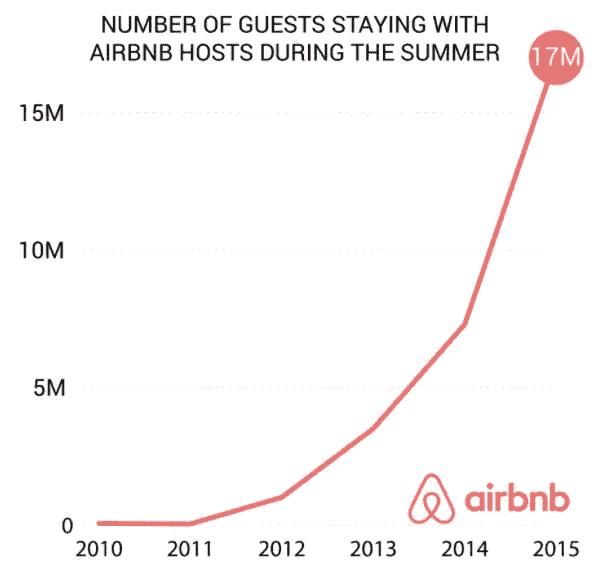
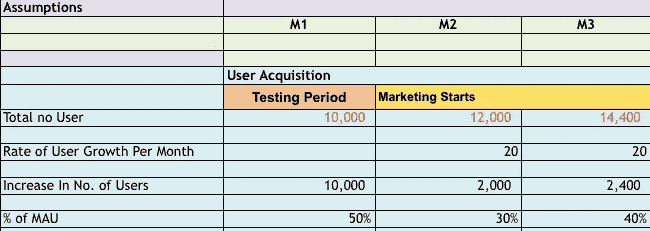
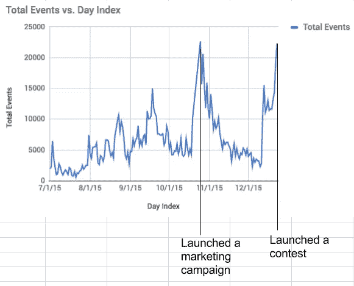
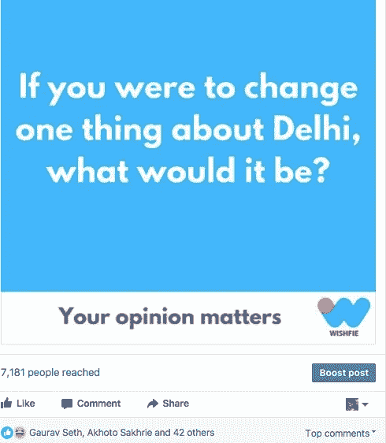
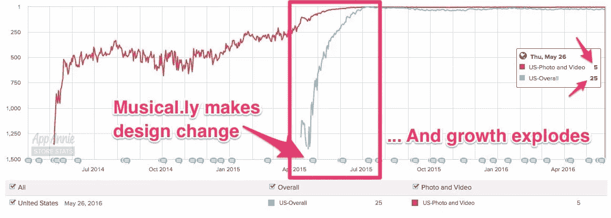

# 保证您的初创用户群增长 10 倍的方法

> 原文：<https://medium.com/hackernoon/guaranteed-way-to-grow-your-start-up-user-base-by-10x-7b6390d7493e>

Don’t get lost

几周前，我在脸书上发布了这个:

Facebook post

正如你所看到的，在 14 小时内，有 47 条评论，我收到了 12 条来自有兴趣阅读这篇文章的人的个人信息。最终，这个帖子有了 63 条评论和 20 条个人信息。

你认为是什么驱使人们做出这种行为，让他们对迎合小众群体的帖子发表评论？

> **价值观—** 一个人对生活中什么是重要的判断

有人曾经告诉我，到目前为止，这个世界上的每个人都属于好人的范畴，这个世界通过向个人提供或从个人身上榨取价值来运转。

> 结论 1:总有观众在寻找真正的价值。

**背景**

Akshay Pruthi

我是德里大学 NSIT 分校的电子工程毕业生。在 **17** 岁的时候，我和[**Lost Beat**](https://yourstory.com/2013/03/lost-beat-an-online-network-for-music-lovers/)**、w** 开始了我的**第一次创业之旅，参加了几个 B 计划竞赛，获得了 10，000 美元的收入，最终意识到——无法扩大规模。因此，放弃了这个想法，**开始着手**另一个有趣的项目——[**Reach**](https://www.techinasia.com/mobile-file-sharing-app-reach)。Reach 是一个内容发现平台，可以让你发现朋友手机上的内容。我们**从顶级风投和天使投资人**那里筹集了**大约**50 万美元，最后 [**被 ixigo** 收购。然后我领导了 ixigo 的特别项目团队，拥有出租车和人工智能旅行机器人的产品。在那里工作了一段时间后，我决定离开 ixigo，和 Durgesh Kaushik](http://www.livemint.com/Companies/eF9dOiTlIHynxWJqoaqE5L/Ixigo-acquires-mobile-contentsharing-app-Reach.html) 一起重新开始。**

好吧，那么你真的认为有一种“保证”的方法可以让一家初创公司增长 10 倍？如果有，而且我知道方法——我会成为亿万富翁，因为我会知道长生不老药背后的配方。

> 结论 2:人生没有捷径

先不要做判断，我会尽力公正地对待我所做的事情，并帮助你理解什么是真正的增长，为什么大多数初创公司都停留在大约 10，000 次下载，并最终使用一些不正当的方法来证明他们希望实现的增长，并最终欺骗自己。

让我们从一些数据点开始

Airbnb Growth Curve

2010 年至 2011 年，几乎没有任何增长。这里需要注意的重要一点是，整整一年，他们都在努力寻找合适的产品市场，尝试了很多东西，同时也失败了很多东西。

> 结论 3:耐心对成长非常重要

The result is sweet :)

# 什么是成长？

保罗·格拉厄姆科学地宣称，如果一个企业的增长率是每周 5%到 7 %,而异常的增长率是每周 10 %,那么这个企业就具有生存能力。

在创业世界里，认识到成长就像氧气一样对生命至关重要，这一点非常重要。设定正确的增长目标非常重要，同样重要的是实现这些增长目标——这是你决定公司生命周期的一个指标。

# **落在数字的粘性圆圈下**

现在你已经设定了公司的发展目标，有合适的团队来执行，一切都准备好了，你只需要执行计划，然后开始！

它是这样工作的吗？
在许多公司，我目睹了管理层的严重不匹配，领导者自己陷入了黄金数字(顶线指标)的陷阱

**当月业务目标:** $2xxxxx
**本月 20 日状态:**$ 1 x2 xx
**营销预算剩余:** $xxxx
**活动:**折扣&优惠(给公司造成全面损失)
**假真相:**快乐经理；快乐 ceo 快乐的员工

最糟糕的是，这成了每隔一个月的习惯。为了实现这些商业目标，你最终会导致公司在“营销预算”中遭受巨大的损失

> 结论 4:对你的企业透明和诚实是真正的北极星标准

# 设定正确的目标

**当前流程** 1。打开 excel 表
2。查看你的公司类型的 mom/wow 增长的市场标准
4。根据你对市场状况的了解，稍微调整一下数字——不多，但足以让你获得另一轮融资。复制粘贴

Current method of proposing/assuming growth

万岁！

**提出过程** 成长不应该由假设成长来雕琢。哦，你已经知道了？但是我们实际实现它怎么样？

1.  确定对你的数字最重要的一个指标。你一定在很多博客上多次读到过这句话，但事实是，我们很容易偏离，并不断改变我们最重要的指标，再次陷入数字的陷阱。
2.  理智地对自己诚实，假设你的公司围绕这个标准成长。尝试逆向工程来实现这一点。
3.  当我在运行我的 start-Reach 时，我们在开始时在设置我们想要关注的正确指标时面临着多个问题。我们不能对不断增长的指标说不。

Reach growth Curves

最终，我们把它归结为:

> 用户拥有的朋友数量= 5

这在某种程度上照顾了我们所有的其他指标，参与度，内容等。

4.永远不要低估一个渠道:在规划你的增长渠道以达到这个神奇的数字时，你可能会对执行一些渠道感到悲观，因为执行这些渠道需要每天付出痛苦的努力。例如，在我的新公司 Wishfie 工作时，我们最初认为每天在脸书上发布一些东西，每天创建新的图形可能会导致很多努力但没有结果。

尽管如此，我们还是想试试。

61 comments, 7000 people reached

惊喜！惊喜！一个简单整洁的设计，几乎不需要一分钟，一个令人惊叹的内容——嘣！你所需要做的只是尝试不同的渠道，不断尝试你永远不会知道的东西——一个渠道可能会给你一个曲棍球棒。

> 结论 5:设定正确的北极星度量标准。跟着那个！
> 
> 结论六:永远不要低估任何一个渠道。把它们都列出来。继续实验

# **案例分析**

1.  **脸书案**

做出微小的改变并衡量结果是快速前进的关键。许多公司甚至在扩展到 5000 万以上的用户后也悲惨地失败了，仅仅因为他们从来没有建立一个正确的测试环境。没有多少人知道，但脸书规模扩大并仍在增长的主要原因是，他们有数千个不同版本的脸书在不同的用户群中运行，不断测试哪些对哪些受众有效，密切分析数据，然后推出变化。下面是一个非常有趣的帖子，来自脸书的一名员工，关于他们是如何测试的:

> [https://www . Facebook . com/notes/Facebook-engineering/building-and-testing-at-Facebook/10151004157328920/](https://www.facebook.com/notes/facebook-engineering/building-and-testing-at-facebook/10151004157328920/)

> 结论 5:为你的公司设置合适的测试环境。

## 2.**肌肉发达**

Musical.ly 从未以最传统的方式处理事情。他们相信形成一个非常强大的团体，他们称之为穆斯林，并经常与他们会面。Musical.ly 没有采用 follows 和 followers，而是提出了 BFFs 或“永远最好的粉丝”。音乐上，然后设计了一些只有他们才能做到的特殊功能，例如；像二重唱一样表演。

> “尤其是在社交媒体领域，通常都是赢家通吃。你必须想出一些全新的东西。你不应该是一个模仿的产品，”朱说。

这些想法很多都是来自社区的人，他们几乎每天都在使用这个应用，并把想法推给团队。Mysical.ly 与这些社区成员建立了各种聊天群，围绕不同的想法展开激烈的讨论。这一点的影响是巨大的:

1.  沉思者感到自己在公司里很重要
2.  了解他们的 TG 是怎么想的

永远不要低估内容的力量。我们中的许多人不太喜欢我们在应用程序/小设计变化上使用的文本，我们认为这可能不会影响增长。请看下面的图表，它清楚地描述了他们设计中的一个小变化是如何显著增加他们的人数的。

Source: Business Insider

同样，Instagram 在发布好看照片的方式上做了一点小小的改变，就增加了数千人。

> 结论 6:更加重视“你认为是脏活”永远不要低估小变化的力量

# 换位思考是关键！

试着设身处地为客户着想。按照客户希望的方式了解他们。

怎么会？

*   围绕用户的日常事务来编写用户故事。一无所知？与你的目标受众交谈，一天 20 个电话。询问他们的日常事务是什么样的，他们在什么情况下打开所有应用程序？试着确定他们什么时候会打开你的应用。坐在某人的手机里是一笔巨大的财富。看看你的产品如何做到这一点。
*   开始画模式，观察趋势。一旦你给 100 多个人打电话，你就会开始观察一些模式。这时你就开始下结论，并决定下一步该做什么。

分享一些可能有帮助的资源和备忘单:)

1.  [创建人物角色](https://blog.prototypr.io/personas-74c4e1c12ee2)
2.  [成长黑客工具](https://www.producthunt.com/posts/growth-hacking-tools-2)
3.  [如何给顶级出版物写信](https://www.matthewbarby.com/how-to-write-for-publications/)
4.  [中国最大的社交视频分享应用快手成功的背后](http://technode.com/2017/05/17/kwai-kuaishou-chinas-biggest-social-video-sharing-app/)
5.  [顶级出版物列表](https://toppub.xyz/)
6.  [成长行动手册](http://digintent.com/growth-playbooks/)
7.  [2017 年成长秘籍——免费电子书](https://www.producthunt.com/posts/growth-hacks-for-2017-free-ebook)
8.  [终极脸书广告小抄](https://www.producthunt.com/posts/the-ultimate-facebook-ads-cheat-sheet)

如果你喜欢这个帖子，请点击“喜欢”按钮。接下来我在写《性高潮理论》。敬请关注。