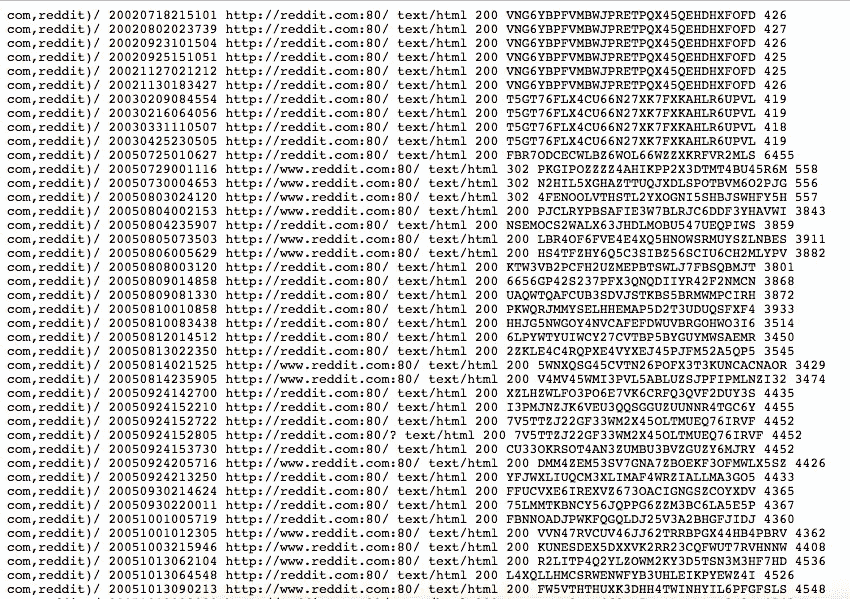

# 处理 Internet Archive 的 CDX 服务器 API 响应指南

> 原文：<https://medium.com/hackernoon/guide-to-handling-internet-archives-cdx-server-api-response-c469df5b81f4>

## 访问网页的数字档案


Photo credit: [Adra](http://www.adra.com/uk/products/balancer-balance-sheet-reconciliation-software/digital-archive/)

对于那些还不知道的人来说，[时光倒流机](https://archive.org/web/web.php)是互联网上网页的综合数字[档案库](https://hackernoon.com/tagged/archive)——自 2001 年以来已经收集了超过 2860 亿个网页。

Wayback 使用 [CDX 服务器 API](https://github.com/internetarchive/wayback/blob/master/wayback-cdx-server/README.md) 来查找捕获——它允许对 Wayback 捕获数据进行复杂的查询、过滤和分析。我最近用这个 API 用 d3 的径向树形图可视化了一个网站。你可以在这里看到结果[。](http://juliageist.com/internet-archive-website-visualization/)

因为我的项目中最困难的部分是弄清楚如何将 CDX API 的响应转换成我可以抓取的 HTML 页面，所以这篇文章是向 [API](https://hackernoon.com/tagged/api) 发出请求并处理来自它的响应的指南。

## 提出请求

发出请求只是对[http://web.archive.org/cdx/search/cdx.](http://web.archive.org/cdx/search/cdx.)的一个`GET`请求，一个网站是通过一个查询字符串指定的——这是唯一需要的查询字符串参数。(要查看还可以指定哪些查询字符串，[查看文档](https://github.com/internetarchive/wayback/blob/master/wayback-cdx-server/README.md))。

要获得 reddit.com 的所有存档版本或截图，你可以向 http://web.archive.org/cdx/search/cdx?url=reddit.com.发出一个请求

太棒了。让我们重温一下目标——从 CDX API 获取网页的所有捕获，这样我就可以通过存档的 HTML 发送我的爬虫。好吧，接下来该怎么办？



Ummmmmm…

## 处理响应

响应的`Content-Type`是`text/plain`——所以我们将自己进行解析。如[文档](https://github.com/internetarchive/wayback/blob/master/wayback-cdx-server/README.md)中所述，由空格分开的列依次对应于:`urlkey`、`timestamp`、`original url`、`mimetype`、`status code`、`digest`和`length`。

我创建了一个数据模型对象来表示一次捕获。

```
// snapshot.pyclass Snapshot(dict):
   def __init__(self, urlkey=None, timestamp=None, original=None, mimetype=None, statuscode=None, digest=None, length=None):
       super(Snapshot, self).__init__()
       self[‘urlkey’] = urlkey
       self[‘timestamp’] = timestamp
       self[‘original’] = original
       self[‘mimetype’] = mimetype
       self[‘statuscode’] = statuscode
       self[‘digest’] = digest
       self[‘length’] = length
       self[‘snapshot_url’] = ‘http://web.archive.org/web/%s/%s/’ % (timestamp, original)
```

我所做的只是在一个字典对象上设置键。请注意，我为我的`Snapshot`模型— `snapshot_url`添加了一个 CDX 响应中没有提供的键。

任何给定捕获的 HTML 页面位于一个 URL 中，该 URL 由捕获的`timestamp`和`original URL`格式化。格式为`http://web.archive.org/web/</TIMESTAMP>/</URL>`。

如果您希望恢复原始页面(不需要 Wayback 机器重写页面上的 URL 以指向存档)，您应该使用这种格式:`http://web.archive.org/web/</TIMESTAMP>id_/</URL>`。

太棒了。现在我们已经建立了数据模型(即`Snapshot`类),我们可以向 CDX API 发出请求，并使用响应创建`Snapshot`类的实例。

因为我们得到了一个文本文件，我们将首先通过`\n`或者新行来分割，以得到一个捕获字符串的列表。对于每个捕获，我们将按空格(“”)进行分割，以获得以列表格式返回的各个列。完成后，我们将有一个列表列表，代表从 API 返回的捕获。

```
// reddit.pyfrom snapshot import Snapshot
import requests as reqres = req.get(“http://web.archive.org/cdx/search/cdx?url=reddit.com")snapshots = res.text.split(‘\n’)for snapshot in snapshots:
    snapshot_items = snapshot.split(‘ ‘)
```

接下来，我们将为 API 返回的每个快照实例化一个新的快照对象。

```
// reddit.pyfrom snapshot import Snapshot
import requests as reqres = req.get("http://web.archive.org/cdx/search/cdx?url=reddit.com")snapshots = res.text.split('\n')
snapshot_list = []for snapshot in snapshots:
    snapshot_items = snapshot.split(' ')
    if len(snapshot_items) == 7:
        snap = Snapshot(snapshot_items[0], snapshot_items[1], snapshot_items[2], snapshot_items[3], snapshot_items[4], snapshot_items[5], snapshot_items[6])
    snapshot_list.append(snap)
```

现在`snapshot_list`变量包含了您可以使用的`Snapshot`对象！在向那个特定的`snapshot_url`发出请求之前，确保你检查了那个`statuscode == 200`。

希望这篇文章有所帮助！如果有任何问题，请告诉我！

[](http://bit.ly/HackernoonFB)[](https://goo.gl/k7XYbx)[](https://goo.gl/4ofytp)

> [黑客中午](http://bit.ly/Hackernoon)是黑客如何开始他们的下午。我们是 [@AMI](http://bit.ly/atAMIatAMI) 家庭的一员。我们现在[接受投稿](http://bit.ly/hackernoonsubmission)，并乐意[讨论广告&赞助](mailto:partners@amipublications.com)机会。
> 
> 如果你喜欢这个故事，我们推荐你阅读我们的[最新科技故事](http://bit.ly/hackernoonlatestt)和[趋势科技故事](https://hackernoon.com/trending)。直到下一次，不要把世界的现实想当然！

