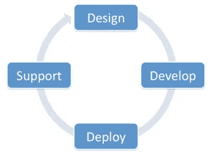
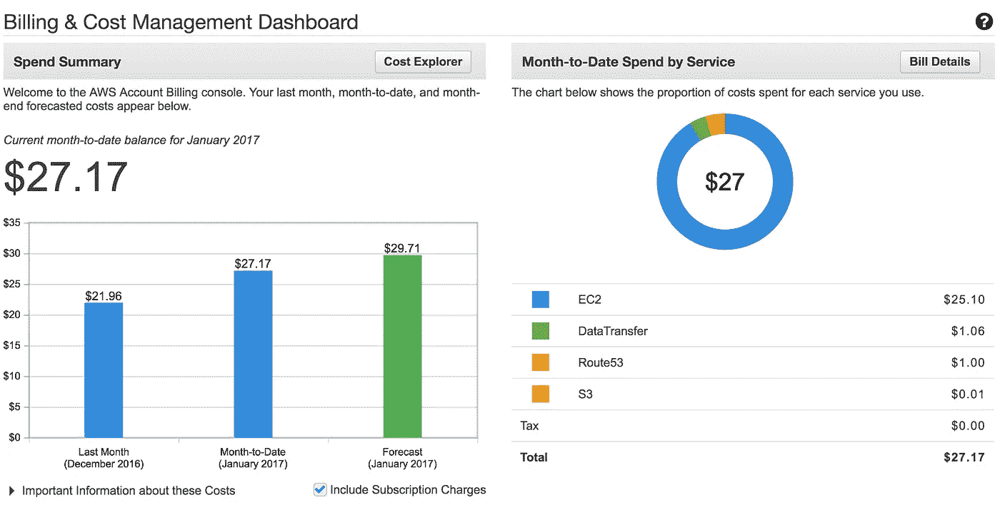
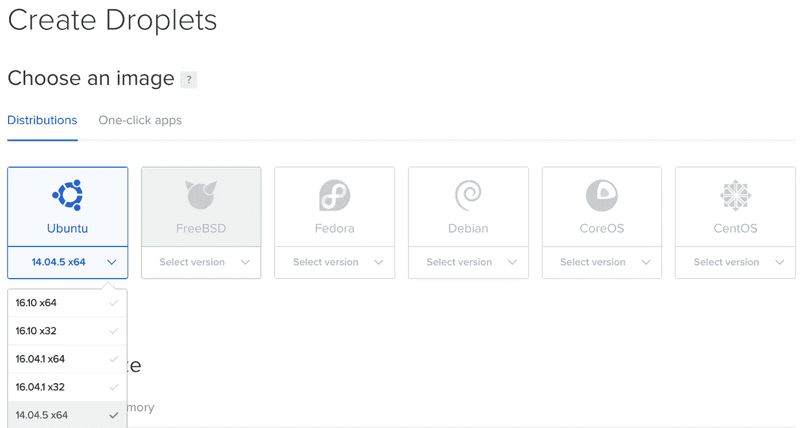
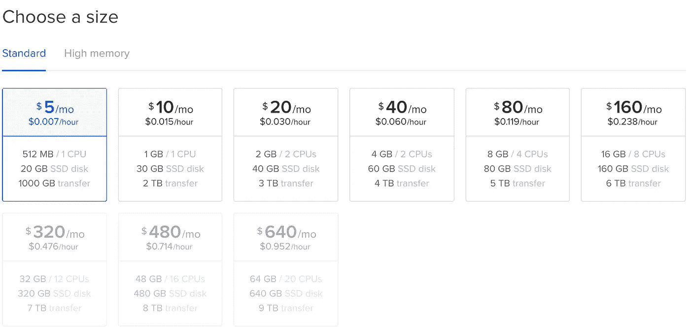
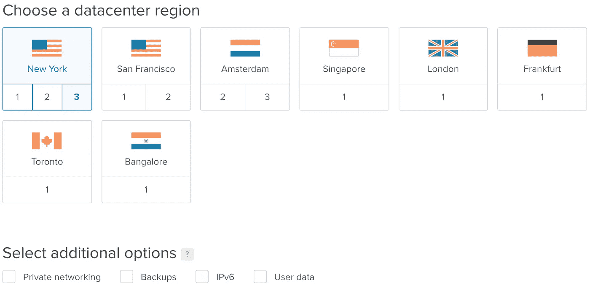
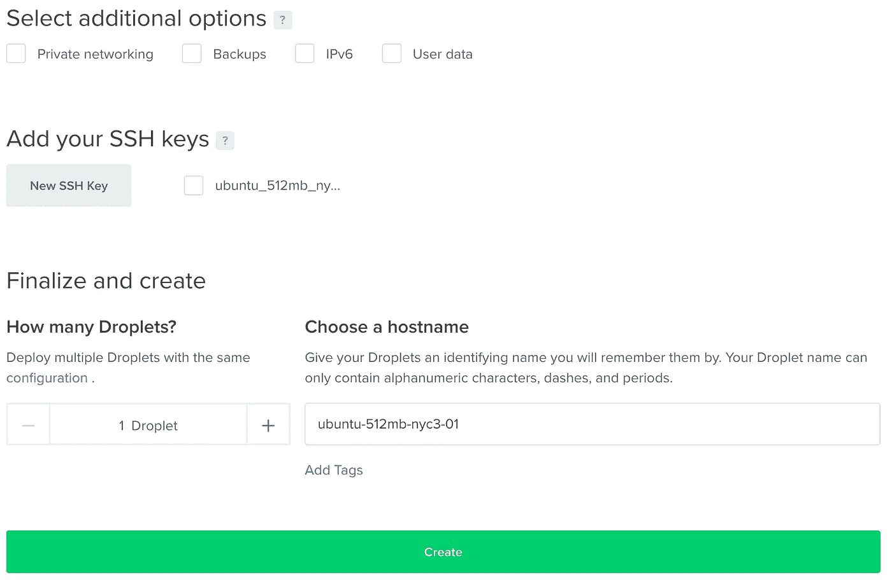
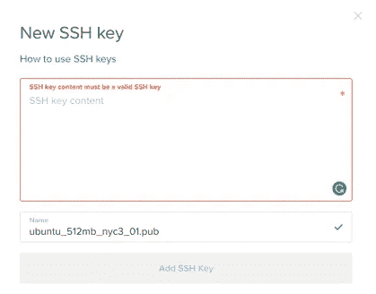
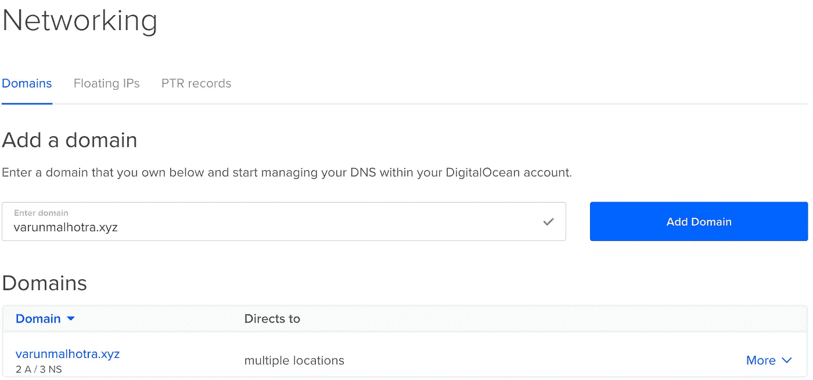
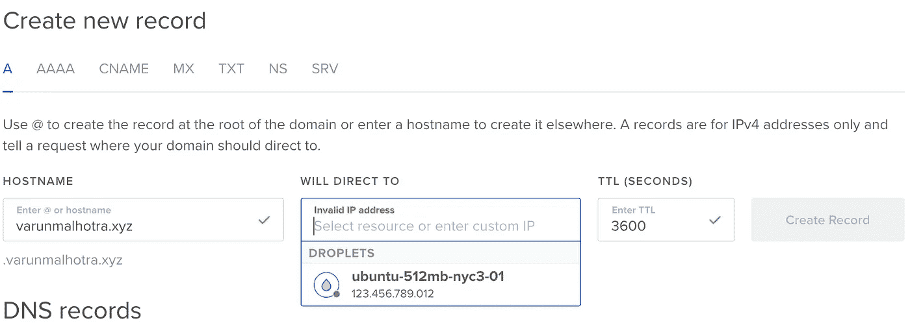
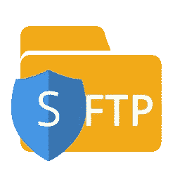

# 从 EC2 迁移到液滴的指南

> 原文：<https://medium.com/hackernoon/guide-to-migrate-from-ec2-to-droplets-ec29337e7616>


*注意:本文不是要比较亚马逊 EC2 和 DigitalOcean Droplet。这就是为什么我决定改变，这是多么容易。*

嘿，伙计们！我梦想自己成为一名软件工程师，热爱软件设计和开发，为人类创造有用的东西。开发一个软件不仅包括编程，还包括部署它(在本文中假设它是一个*网络应用*)，使其可以通过互联网随时随地轻松访问。这种部署工作显然需要一台服务器来托管站点，并且*对其进行适当的配置*，以便为用户发起的呼叫提供服务。在人机交互的背后，服务器上有很多模糊的东西。静态网站，就像投资组合网站一样，只是为了显示信息而构建的，易于托管，通常不需要专用的服务器。市场上有很多好的选择，比如 Github 的免费主机，操作方便，最近非常流行。
当需要处理用户输入、保存数据并从数据库中检索数据，或者执行一些计算工作时，服务器是必不可少的。下面是简约的软件生命周期图。



这篇文章很长，因为它实际上解释了从一个服务器转移到另一个服务器的一步一步的过程。你为什么不喝杯咖啡来欣赏表演呢？

时光倒流，我开发了两个背对背的 web 应用，正式命名为[***JSON 2 html***](http://json2html.varunmalhotra.xyz)和[***translator***](http://translatr.varunmalhotra.xyz)。[ *点击姓名查看现场演示*

Json2Html 有助于将 Json 结构转换成定义良好的表格结构，而[translator](http://translatr.varunmalhotra.xyz)则试图帮助(多语言)读者将文本或段落一次翻译成多种语言。请给这两个应用一个机会，并提供一些反馈。谢谢大家！🙏

我选择 Python 作为这两个应用的编程语言，只是因为我更喜欢它的易用性。一旦应用程序被编程并准备好公开发布，就到了部署它们的时候了。由于这是我第一次部署一些真正的东西，我选择了 *H* [*eroku*](https://www.heroku.com/) ，它提供了一个丰富的预集成扩展和服务的生态系统，可以用很少的配置大规模部署优秀的应用程序。但是我一点也不开心。我观察到 *Heroukuapp* 到比较慢加上我总是喜欢事情以我自己的方式管理。此外，我认为*尝试事情*而不是用现成的解决方案完成事情，在任何领域都是一种很好的自学经历。我通常通过自己动手来学习技术。实践经验是知识的宝库。
不久之后，我选择了亚马逊 Ec2，原因很明显。

> **亚马逊**弹性计算云(**亚马逊 EC2** )是一种在云中提供可调整计算能力的 web 服务。它旨在使开发人员更容易进行网络规模的云计算。亚马逊 EC2 的简单网络服务接口允许你以最小的摩擦获得和配置容量。

它是市场上非常受欢迎的云托管提供商，是一家可靠、安全、完全可控且易于上手的提供商。此外，它还为初学者提供了为期一年的免费层计划，以获得 AWS 云服务的实践经验。谁不喜欢如此自由地玩耍呢？😎

所以，我浏览了相关的 [AWS 亚马逊在线文档](https://aws.amazon.com/documentation/ec2/)，必须承认文档的质量非常非常令人印象深刻。它们以一种组织良好的方式编写，准确地涵盖了用户真正想要的内容。我认为亚马逊在这里也使用了机器学习。😜

我的 EC2 t2.micro 实例在经历了大量的配置工作之后，已经准备好进行统治了。这个服务员是个菜鸟，很好地服从了我的命令，并为观众服务。这是一个令人欣慰的时刻。

啊！时间正好在一年后，提醒我免费等级计划的到期。我开始收到电子邮件来支付额外一个月的账单。成本，正如它所显示的，大约是 22 美元/月。我不敢相信我的个人投资组合兼博客网站，仅仅运行两个 python 应用程序就能赚这么多钱。我完全被弄糊涂了，但是当下一封邮件到达我的收件箱时，它清楚地指示我支付下个月的账单，预计大约是 25 美元，否则该实例将被强制关闭；我决定寻找其他选择。



一时间，我无法理解自己所处的困境；我是否应该开始从有机交通中获得真正的价值，这可以从我的裤子中节省几美元，或者我应该首先准备好自己切换到一些较低范围的选项，然后再考虑货币化。

这让我很难明智地思考。最后，在与我的同事研究和讨论之后，我认为 DigitalOcean 最适合我的个人需求。

# 数字海洋设置

> DigitalOcean 是一个为开发者打造的简单云托管提供商。每一滴旋转起来的水滴都是我们个人使用的新 VPS。在一个易于使用的控制面板中，只需 55 秒就可以非常轻松地部署超快的固态硬盘云服务器。计划起价为每月 5 美元，包括 512MB 内存、20GB 固态硬盘和 1TB 传输容量。

的确是笔好买卖。

我立即注册了一个新账户。在输入账单信息之前，检查这些[促销代码](http://www.newcoupons.info/digitalocean-coupon-codes/)，以获得一些*优惠* [*折扣*](https://m.do.co/c/b9b0f1f34c56) 。使用[此链接](https://m.do.co/c/b9b0f1f34c56)获得 10 美元的统一折扣。一旦帐户被创建，验证和计费信息被提供，我继续创建一个新的 droplet。

> **第一步:选择图像**

我考虑使用 Ubuntu 14.04 ，因为我对这个操作系统更熟悉。此外，大多数数字海洋博客都只考虑了这个操作系统。



> **第二步:选择液滴尺寸**

我选择了***【5 美元】计划*** ，因为它以较小的成本获得了明显的收益。



> **第三步:选择数据中心**

我选择 ***纽约 3*** 是基于我的网站流量历史。我浏览了与我的网站相关的谷歌分析账户，发现大多数访问者来自美国。因此，最好选择离大多数访问者的地理位置最近的数据中心，以享受减少延迟的好处。



> **第四步:其他信息**



我为 droplet 创建了一个新的 ssh 密钥。

```
cd ~/.ssh
ssh-keygen -t rsa -f ubuntu_512mb_nyc3_01 -C “[myemail@gmail.com](mailto:varun2902@gmail.com)”
ssh-add ~/.ssh/ubuntu_512mb_nyc3_01
cat ubuntu_512mb_nyc3_01.pub
```

我复制并粘贴了下面方框中的内容。SSH 密钥非常隐私，所以请不要公开分享或发布。



> 第五步:完成了！

我点击*创建*按钮，瞧！我有自己的服务器，上面安装了我喜欢的操作系统。

# 添加域

现在，将服务器的 IP 指向域名。我输入了我的个人网站 URL，开始在我新创建的 DigitalOcean 帐户中管理我的 DNS。



要创建新的主机名，我只需要填写 A 记录。如果您使用 IPv6 地址，您应该将其输入到 AAAA 记录中。

**A 记录**:我输入了我的服务器的 IP 地址和主机名本身。主机名将被添加到域名的前面。我的屏幕看起来像这样:



详细阅读[数字海洋博客](https://www.digitalocean.com/community/tutorials/how-to-set-up-a-host-name-with-digitalocean)。

## 指向通用域名注册商的数字海洋域名服务器

我使用 Namecheap 作为我的默认注册商。简直太棒了。我通过改变域名注册商的域名服务器，将我的域名绑定到其中一个水滴上。
详细阅读[数字海洋博客](https://www.digitalocean.com/community/tutorials/how-to-point-to-digitalocean-nameservers-from-common-domain-registrars)。

# 安装 apache 并启动和运行静态站点


我通常更喜欢 Apache 而不是 Nginx，因为我已经使用它很长时间了，而且我不太习惯 Nginx。Apache 是一个免费的开源软件，运行在世界上超过 50%的网络服务器上。Apache web 服务器是在互联网上提供 web 内容的最流行的方式。

为了安装 apache，我使用 ssh 连接到我的服务器。

```
ssh root@12.34.56.789
```

并通过以下命令安装了 apache。

```
sudo apt-get update
sudo apt-get install apache2
```

就是这样。要检查是否安装了 Apache，请将浏览器指向服务器的 IP 地址(例如 [http://12.34.56.789)。页面应该显示“它工作了！”像](http://12.34.56.789).)[这个](https://assets.digitalocean.com/tutorial_images/333VJ.png)。

**如何找到您的服务器的 IP 地址**

以下命令有助于揭示服务器的 IP 地址。

```
ifconfig eth0 | grep inet | awk '{ print $2 }'
```

# 安全地将文件从服务器传输到远程设备，反之亦然

我使用 sftp 在远程服务器和本地服务器之间传输文件。



> SFTP，代表 SSH 文件传输协议或安全文件传输协议，是一个与 SSH 打包在一起的独立协议，在安全连接上以类似的方式工作。其优点是能够利用安全连接在本地和远程系统上传输文件和遍历文件系统。

阅读更多关于[数字海洋博客](https://www.digitalocean.com/community/tutorials/how-to-use-sftp-to-securely-transfer-files-with-a-remote-server)的详细内容，这是一个关于如何将文件从一个服务器(例如:A *mazon EC2* )传输到本地服务器(例如:*个人系统*)然后传输到另一个服务器(例如: *DO droplet* )的终极指南。

这种转移方式本质上显然是非常啰嗦的。你可以选择像“赛博鸭”那样简单易用的界面。我用过它，有时很有用。

# 部署 Python 应用程序


我之前提到的两个 web app:[**JSON 2 html**](http://json2html.varunmalhotra.xyz/)**和**[**translator**](http://translatr.varunmalhotra.xyz)，都使用了 ***Flask*** ，一个基于 *Werkzeug* 的 ***Python*** 的微框架。****

****我的下一步是将它们成功地部署在服务器上，以便观众可以通过互联网访问它们。****

> ******第一步**:安装 mod_wsgi****

```
**sudo apt-get install libapache2-mod-wsgi python-dev**
```

> ******第二步:**启用 mod_wsgi****

```
**sudo a2enmod wsgi**
```

> ******第三步**:创建**砂箱** app****

****查看以下应用程序及其源代码，构建一个基本的 Flask 应用程序。
1。 [Json2Html](http://json2html.varunmalhotra.xyz/) — [查看源代码](https://github.com/softvar/json2html-flask)
2。[翻译器](http://translatr.varunmalhotra.xyz) — [查看源代码](https://github.com/softvar/translatr)****

****总是把你所有的需求放在一个文件里。姑且称之为:
***requirements . txt .***其内容可以手工编写或者运行 ***pip freeze*** 会列出虚拟环境中到目前为止已经安装的所有模块。例如:****

```
**Flask==0.10.1
requests**
```

> ******步骤 4** :使用 **virtualenv** 设置 Python 环境****

****使用 pip 安装 virtualenv 和 Flask。通过 apt-get 安装了 pip。****

```
**sudo apt-get install python-pip**
```

****使用 pip 安装 ***virtualenv*** 使用以下命令:****

```
**sudo pip install virtualenv**
```

****我创建了一个虚拟的 Python 环境( ***VENV*** 是我给我的临时环境起的名字)。****

```
**sudo virtualenv ***VENV*****
```

****现在，我通过使用以下命令激活虚拟环境，在该环境中安装了 Flask:****

```
**source ***VENV***/bin/activate**
```

****现在，我安装了上面***requirements . txt***中列出的我的 app 的所有依赖项。****

```
**pip install -r requirements.txt**
```

****我通过运行以下命令来验证一切是否正常:****

```
**python __init__.py**
```

****我得到一个消息，我的服务器运行在[***127 . 0 . 0 . 1:5000***](http://127.0.0.1:5000)***。它保证了一切工作正常。*******

****我为不同的应用程序创建了虚拟主机，并指向不同的域。创建虚拟主机将在下一节中介绍。****

****详细阅读数字海洋博客。****

# ****设置 Apache 虚拟主机****

> ****虚拟主机是基本单元，它允许管理员通过使用匹配机制，使用一台服务器托管单个接口或 IP 上的多个域或站点。这与任何希望在一个 VPS 上托管多个站点的人都有关系。****

> ******步骤 1:** 按如下方式更改目录:****

```
**cd /etc/apache2/sites-enabled**
```

> ******第二步:**示例虚拟主机文件，姑且称之为 **example.conf******

```
**vim *example.conf*# Content of *example.conf*<VirtualHost *:80>
    ServerAdmin admin@example.com
    ServerName example.com
    ServerAlias [www.example.com](http://www.example.com)
    DocumentRoot /var/www/example.com/public_html
    ErrorLog ${APACHE_LOG_DIR}/error.log
    CustomLog ${APACHE_LOG_DIR}/access.log combined
</VirtualHost>**
```

> ******第三步:**启用虚拟主机****

```
**sudo a2ensite *example.conf***
```

****步骤 4:重启 apache 服务器****

```
**sudo service apache2 restart**
```

****阅读更多关于数字海洋博客的详细内容。****

****希望你能在这篇文章中学到一些新东西。如有任何疑问，请在 varun2902@gmail.com 给我留言。请推荐、发推文和分享，以增强我写更多文章的信心。非常感谢！****

****我是一个社会人。我希望能在以下网站上联系到你: [网站](http://varunmalhotra.xyz/)|[Github](https://github.com/softvar)|[Twitter](https://twitter.com/s0ftvar)|[LinkedIn](https://www.linkedin.com/in/softvar)|[stack overflow](http://stackoverflow.com/users/2494535/softvar)****

****[](http://bit.ly/HackernoonFB)********[](https://goo.gl/k7XYbx)********[](https://goo.gl/4ofytp)****

> ****[黑客中午](http://bit.ly/Hackernoon)是黑客如何开始他们的下午。我们是 [@AMI](http://bit.ly/atAMIatAMI) 家庭的一员。我们现在[接受投稿](http://bit.ly/hackernoonsubmission)并乐意[讨论广告&赞助](mailto:partners@amipublications.com)机会。****
> 
> ****如果你喜欢这个故事，我们推荐你阅读我们的[最新科技故事](http://bit.ly/hackernoonlatestt)和[趋势科技故事](https://hackernoon.com/trending)。直到下一次，不要把世界的现实想当然！****

********